## 목표
- C# 언어를 학습합니다.

## 목적 
- C# 언어를 학습합니다.

 

## 과정
- [1. 프로그래밍을 시작합시다](https://github.com/SagiK-Repository/C-_Study/blob/main/Chapter01.md)
- [2. 처음 만드는 C# 프로그램](https://github.com/SagiK-Repository/C-_Study/blob/main/Chapter02.md)
- [3. 데이터 보관하기(01)](https://github.com/SagiK-Repository/C-_Study/blob/main/Chapter03.md)
- [4. 데이터를 가공하는 연산자](https://github.com/SagiK-Repository/C-_Study/blob/main/Chapter04.md)
- [5. 코드의 흐름 제어하기](https://github.com/SagiK-Repository/C-_Study/blob/main/Chapter05.md)
- [6. 메소드로 코드 간추리기](https://github.com/SagiK-Repository/C-_Study/blob/main/Chapter06.md)
- [7. 클래스](https://github.com/SagiK-Repository/C-_Study/blob/main/Chapter07.md)
- [8. 인터페이스와 추상 클래스](https://github.com/SagiK-Repository/C-_Study/blob/main/Chapter08.md)
- [9. 프로퍼티](https://github.com/SagiK-Repository/C-_Study/blob/main/Chapter09.md)
- [10. 배열과 컬렉션, 그리고 인덱서](https://github.com/SagiK-Repository/C-_Study/blob/main/Chapter10.md)
- [11. 일반화 프로그래밍](https://github.com/SagiK-Repository/C-_Study/blob/main/Chapter11.md)
- [12. 예외 처리하기](https://github.com/SagiK-Repository/C-_Study/blob/main/Chapter12.md)
- [13. 대리자와 이벤트](https://github.com/SagiK-Repository/C-_Study/blob/main/Chapter13.md)
- [14. 람다식](https://github.com/SagiK-Repository/C-_Study/blob/main/Chapter14.md)
- [15. LINQ](https://github.com/SagiK-Repository/C-_Study/blob/main/Chapter15.md)
- [16. 리플레션과 애트리뷰트](https://github.com/SagiK-Repository/C-_Study/blob/main/Chapter16.md)
- [17. dynamic 형식](https://github.com/SagiK-Repository/C-_Study/blob/main/Chapter17.md)
- [18. 파일 다루기](https://github.com/SagiK-Repository/C-_Study/blob/main/Chapter18.md)
- [19. 스레드와 태스크](https://github.com/SagiK-Repository/C-_Study/blob/main/Chapter19.md)
- [20. WinForm으로 만드는 사용자 인터페이스](https://github.com/SagiK-Repository/C-_Study/blob/main/Chapter20.md)
- [21. 네트워크 프로그래밍](https://github.com/SagiK-Repository/C-_Study/blob/main/Chapter21.md)
- [22. 가비지 컬렉션](https://github.com/SagiK-Repository/C-_Study/blob/main/Chapter22.md)

# 00. 이것이 C#이다. 학습 로드맵

```mermaid
flowchart TD
    subgraph G_4[.NET 프레임 워크를 이용한 프로그래밍]
      D_1("18. 파일 다루기")-->D_2("19. 스레드와 태스크")-->D_3("20. WinForm으로 만든는 사용자 인터페이스")-->D_4("21. 네트워크 프로그래밍")-->D_5("22. 가비지 컬렉션")
    end

    subgraph G_3 [고급 문법 익히기]
      C_1("13. 대리자와 이벤트")-->C_2("14. 람다식")-->C_3("15. LINQ")-->C_4("16. 리플렉션과 애트리뷰트")-->C_5("17. dynamic 형식")
    end

    subgraph G_2 [객체지향 프로그래밍 이해하기]
      B_1("7. 클래스")-->B_2("8. 인터페이스와 추상 클래스")-->B_3("9. 프로퍼티")-->B_4("10. 배열과 컬렉션 그리고 인덱서")-->B_5("11. 일반화 프로그래밍")-->B_6("12. 예외 처리하기")
    end


    subgraph G_1 [기초구문 익히기]
      A_1("1. 프로그래밍을 시작합시다")-->A_2("2. 처음 만드는 C# 프로그램")-->A_3("3. 데이터 보관하기")-->A_4("4. 데이터를 가공하는 연산자")-->A_5("5. 코드의 흐름 제어하기")-->A_6("6. 메소드로 코드 간추리기")
    end
```

  

- **이것이 C#이다** 입문자에게 가장 탄탄한 기본기를 다져줄 C# 입문서
- 저자 : 박상현, 배포 : 한빛미디어
