## 목표
- C# 언어를 학습합니다.

## 목적 
- C# 언어를 학습합니다.

 

## 과정
- 01. 프로그래밍을 시작합시다
- 02. 처음 만드는 C# 프로그램
- 03. 데이터 보관하기(01)
- 03. 데이터 보관하기(02)
- 04. 데이터를 가공하는 연산자
- 05. 코드의 흐름 제어하기
- 06. 메소드로 코드 간추리기
- 07. 클래스(1)
- 07. 클래스(2)
- 08. 인터페이스와 추상 클래스
- 09. 프로퍼티
- 10. 배열과 컬렉션, 그리고 인덱서
- 11. 일반화 프로그래밍
- 12. 예외 처리하기
- 13. 대리자와 이벤트
- 14. 람다식
- 15. LINQ
- 16. 리플레션과 애트리뷰트
- 17. dynamic 형식
- 18. 파일 다루기
- 19. 스레드와 태스크
- 20. WinForm으로 만드는 사용자 인터페이스
- 21. 네트워크 프로그래밍
- 22. 가비지 컬렉션

# 00. 이것이 C#이다. 학습 로드맵

```mermaid
flowchart TD
    subgraph G_4[.NET 프레임 워크를 이용한 프로그래밍]
      D_1("18. 파일 다루기")-->D_2("19. 스레드와 태스크")-->D_3("20. WinForm으로 만든는 사용자 인터페이스")-->D_4("21. 네트워크 프로그래밍")-->D_5("22. 가비지 컬렉션")
    end

    subgraph G_3 [고급 문법 익히기]
      C_1("13. 대리자와 이벤트")-->C_2("14. 람다식")-->C_3("15. LINQ")-->C_4("16. 리플렉션과 애트리뷰트")-->C_5("17. dynamic 형식")
    end

    subgraph G_2 [객체지향 프로그래밍 이해하기]
      B_1("7. 클래스")-->B_2("8. 인터페이스와 추상 클래스")-->B_3("9. 프로퍼티")-->B_4("10. 배열과 컬렉션 그리고 인덱서")-->B_5("11. 일반화 프로그래밍")-->B_6("12. 예외 처리하기")
    end


    subgraph G_1 [기초구문 익히기]
      A_1("1. 프로그래밍을 시작합시다")-->A_2("2. 처음 만드는 C# 프로그램")-->A_3("3. 데이터 보관하기")-->A_4("4. 데이터를 가공하는 연산자")-->A_5("5. 코드의 흐름 제어하기")-->A_6("6. 메소드로 코드 간추리기")
    end
```

  

- **이것이 C#이다** 입문자에게 가장 탄탄한 기본기를 다져줄 C# 입문서
- 저자 : 박상현, 배포 : 한빛미디어
