# 목적
- C# 내용에 대해서 전체 검색하고자 할 때 쓴다.

---
---
<br><br><br>

## 목적 
- C# 언어를 학습합니다.

<br>

## 과정
- [1. 프로그래밍을 시작합시다](https://github.com/SagiK-Repository/C-_Study/blob/main/Chapter01.md)
- [2. 처음 만드는 C# 프로그램](https://github.com/SagiK-Repository/C-_Study/blob/main/Chapter02.md)
- [3. 데이터 보관하기(01)](https://github.com/SagiK-Repository/C-_Study/blob/main/Chapter03.md)
- [4. 데이터를 가공하는 연산자](https://github.com/SagiK-Repository/C-_Study/blob/main/Chapter04.md)
- [5. 코드의 흐름 제어하기](https://github.com/SagiK-Repository/C-_Study/blob/main/Chapter05.md)
- [6. 메소드로 코드 간추리기](https://github.com/SagiK-Repository/C-_Study/blob/main/Chapter06.md)
- [7. 클래스](https://github.com/SagiK-Repository/C-_Study/blob/main/Chapter07.md)
- [8. 인터페이스와 추상 클래스](https://github.com/SagiK-Repository/C-_Study/blob/main/Chapter08.md)
- [9. 프로퍼티](https://github.com/SagiK-Repository/C-_Study/blob/main/Chapter09.md)
- [10. 배열과 컬렉션, 그리고 인덱서](https://github.com/SagiK-Repository/C-_Study/blob/main/Chapter10.md)
- [11. 일반화 프로그래밍](https://github.com/SagiK-Repository/C-_Study/blob/main/Chapter11.md)
- [12. 예외 처리하기](https://github.com/SagiK-Repository/C-_Study/blob/main/Chapter12.md)
- [13. 대리자와 이벤트](https://github.com/SagiK-Repository/C-_Study/blob/main/Chapter13.md)
- [14. 람다식](https://github.com/SagiK-Repository/C-_Study/blob/main/Chapter14.md)
- [15. LINQ](https://github.com/SagiK-Repository/C-_Study/blob/main/Chapter15.md)
- [16. 리플레션과 애트리뷰트](https://github.com/SagiK-Repository/C-_Study/blob/main/Chapter16.md)
- [17. dynamic 형식](https://github.com/SagiK-Repository/C-_Study/blob/main/Chapter17.md)
- [18. 파일 다루기](https://github.com/SagiK-Repository/C-_Study/blob/main/Chapter18.md)
- [19. 스레드와 태스크](https://github.com/SagiK-Repository/C-_Study/blob/main/Chapter19.md)
- [20. WinForm으로 만드는 사용자 인터페이스](https://github.com/SagiK-Repository/C-_Study/blob/main/Chapter20.md)
- [21. 네트워크 프로그래밍](https://github.com/SagiK-Repository/C-_Study/blob/main/Chapter21.md)
- [22. 가비지 컬렉션](https://github.com/SagiK-Repository/C-_Study/blob/main/Chapter22.md)


# 00. 이것이 C#이다. 학습 로드맵

```mermaid
flowchart TD
    subgraph G_4[.NET 프레임 워크를 이용한 프로그래밍]
      D_1("18. 파일 다루기")-->D_2("19. 스레드와 태스크")-->D_3("20. WinForm으로 만든는 사용자 인터페이스")-->D_4("21. 네트워크 프로그래밍")-->D_5("22. 가비지 컬렉션")
    end

    subgraph G_3 [고급 문법 익히기]
      C_1("13. 대리자와 이벤트")-->C_2("14. 람다식")-->C_3("15. LINQ")-->C_4("16. 리플렉션과 애트리뷰트")-->C_5("17. dynamic 형식")
    end

    subgraph G_2 [객체지향 프로그래밍 이해하기]
      B_1("7. 클래스")-->B_2("8. 인터페이스와 추상 클래스")-->B_3("9. 프로퍼티")-->B_4("10. 배열과 컬렉션 그리고 인덱서")-->B_5("11. 일반화 프로그래밍")-->B_6("12. 예외 처리하기")
    end


    subgraph G_1 [기초구문 익히기]
      A_1("1. 프로그래밍을 시작합시다")-->A_2("2. 처음 만드는 C# 프로그램")-->A_3("3. 데이터 보관하기")-->A_4("4. 데이터를 가공하는 연산자")-->A_5("5. 코드의 흐름 제어하기")-->A_6("6. 메소드로 코드 간추리기")
    end
```



  

- **이것이 C#이다** 입문자에게 가장 탄탄한 기본기를 다져줄 C# 입문서
- 저자 : 박상현, 배포 : 한빛미디어

<br><br><br>

# 01. 프로그래밍을 시작합시다.

## 1.1 프로그래밍 언어의 역사

### 1.1.1 컴퓨터의 시작, 프로그래밍의 시작

- 최초의 컴퓨터 에니악(ENIAC)
  - 전기배선이 에니악이 계산할 때 사용하는 회로로, 현대의 프로그래밍과 같다.
  - 전기배선작업 : 프로그래밍 이었다 할 수 있다.
  - 프로그래밍을 변경하려면 6,000개에 이르는 배선을 교체해야 한다.
- 애드박(EDVAC)
  - 에니악에서 천재 과학자 존 포이만(Jhon von Neumann)의 손에 거쳐 개선된 구조와 신뢰성을 갖춤
  - 중앙처리장치, 기억장치, 프로그램, 데이터로 이루어진 현대의 모든 컴퓨터의 조상이 되었다.
- 에드박 이후 1950년대 전까지는 하드웨어 중심으로 발전하였다.
- 이 때에도 0과 1로 이루어진 기계어를 조합하여 프로그래밍을 하였다.
- 전선을 바꿔 끼우는 대신 카드에 구멍을 뚫어 비트를 기록하는 방식으로 바뀐 정도이다.
- 어셈블리어(Assembly)
  - 0과 1로 이루어진 복잡한 기계어 명령어를 사람이 이해할 수 있는 기호나 단어로 바꿔 만들었다.
- 컴파일(Compile)
  - 어셈블리어 코드를, 일종의 번역의 과정(컴파일)을 거쳐, 컴퓨터가 이해하는 기계어로 변환한다.
- 프로그래머가 어셈블리어로 프로그래밈 코드를 작성한 후에는 컴파일러라는 소프트웨어를 이용하여 실행 파일을 만들어낸다.
- 프로그래밍 언어(Programming Languege) : 어셈블리어처럼 프로그래밍을 작성하기 위해 만들어진 인공 언어체계

>>>
### 컴파일러와 인터프리터
컴파일러는 소스코드를 컴파일 과정을 거친 후 해석해 실행 파일로 만든다.
인터프리터는 소스코드를 실시간으로 기계어로 해석해 실행해준다.
인터프리터 방식의 프로그래밍 언어는 PHP, 파이썬, 루비, 펄(Perl)등이 있다.
>>>

### 1.1.2 포트란의 탄생
- 1948년 컴퓨터는 트랜지스터의 등장으로 비약적으로 기술 도약을 한다.
- 또한 수만 개의 트랜지스터를 하나의 칩에 집적한 마니크로 칩이 발명되면서 급속도로 발전하였다.
- 존 배커스(Hohn Backus)는 IBM에 입사하자마자 어셈블리어의 번역기의 일종인 스피드 코딩 프로젝트에 참여한 후, 1957년 사람의 언어에 가까운 최초의 프로그래밍 언어, **포트란(Fortran)**과 컴파일러를 개발했다.
- 어셈블리어
```bash
Data
var1 DWORD 1
var2 DWORd 5
.code
mov eax, var1
add eax, var2
```
- 포트란
```cpp
a = 5 + 1
```
- 이러한 포트란의 성공은 다른 컴퓨터 과학자들을 자극했고, 1천여 가지가 넘는 프로그래밍 언어들이 탄생하고 사라져 갔다.

### 1.1.3 초등학생도 프로그래밍 할 수 있게 한 베이직
- 1967년 베이직(BASIC)언어가 미국 다트머스 대학의 존 케머니(John Kemeny)와 토머스 커츠(Thomas Kurtz) 교수에 의해 탄생했다.
- 누구라도 배워 사용할 수 있는 언어를 고안한 결과가 베이직이다.
- 빌 게이츠와 폴 앨런도 프로그래밍에 이끌려, 마이크로소프트를 창업하고, 베이직 인터프리터(BASIC Interpreter) 제품을 출시했다.
- 1990년대에 들어 윈도우 출시했을 때 비주얼 베이직(Visual Basic)으로 새롭게 거듭하였다.
- 현대도 Visual Basic 2022(Visual Studio 2022)로 많은 사랑을 받고 있다.

### 1.1.4 유닉스의, 유닉스에 의한, 유닉스를 위한 C
- 1964년 MIT공대, AT&Td의 벨 연구소, GE는 먹틱스(Multics)라는 운영체제 개발을 시작했다.
- 멀틱스는 우수한 연구진과 막대한 비용을 투입했지만 실패했다.
- 이 프로젝터에 참여했던 벨 연구소의 데니스 리치(Dennis Ritchie)와 켄 톰슨(Ken Thompson)은 운영체제 개발이라는 경험을 얻었다.
  - 미니 컴퓨터(냉장고만한) PDP-7d을 활용한 <우주 여행>이라는 게임을 제작
  - 켐 톤슨과 데니스 리치는 유닉스(UNIX)라는 운영체제를 개발했다.
  - 유닉스 PDP-11 버전도 만들었다. 이후 새로운 언어를 만들기로 결심했다.
  - 어셈블리어는 코드 생산성이 너무 낮고 당시 사용하던 B언어(켄 톰슨 제작)은 PDP-11의 새로운 기능을 활용하기 역부족했다.
- 데니스 리치는 B언어의 특징을 물려받은 ,B언어를 계승한다 하여 C언어가 만들어졌다.
- C언어를 개발한 뒤, 유닉스를 통채로 C언어로 재작성 했다.
- 이러한 내용을, AT%T의 벨 연구소는 모든 것을 공개하여 대학과 기업에 공급했다.
- 유닉스가 많은 사람들에게 활용되어 주류 운영체제가 되었고, C로 만들어진 유닉스도 자연스럽게 프로그래머의 언어로 자리잡았다.

### 1.1.5 C+1 == C++
- C++는 AT&T 벨 연구소의 비야네 스트로스트럽(Bjame Stroustrup)교수가 객체지향 프로그래밍(Object Oriented Programming)이 가능하도록 C를 개선시킨 프로그래밍 언어이다.
- 포토샵, 윈도우, 마이크로소프트 오피스를 비롯한 많은 상용 소프트웨어가 이 언어로 작성되었다.


### 1.1.6 더 나은 세상을 위한 C#
- ++ 밑에 ++이 붙으면 #이 된다.
- C#은 마이크로소프트의 앤더스 헤일스버그(Anders Hejisberg)가 만들었다.
- C언어로 작성된 소스코드는 C++ 컴파일러가 컴파일 할 수 있지만, C나 C++로 작성된 소스코드는 C#에서 컴파일 되지 않는다.
- 이름은 다르지만 실제로 완전히 다른 언어이다.
- 1990년대 말, 마이크로소프트는 .NET 비전을 발표했다. 인터넷 서비스를 위한 플랫폼이다.
  - 비록 많은 투자에 비해 사업적인 면에서는 실패했다.
  - 하지만 .NET 클래스 라이브러리와 C# 프로그래밍 언어라는 큰 선물을 주었다.
- .NET 클래스 라이브러리 : 콘솔, 데스크톱, 웹, 모바일 등에서 동작하는 애플리케이션을 쉽개 개발할 수 있는 API를 제공 (베이직, 포트란, 코볼, 파이썬, C++, C#등 다양한 언어를 통해 사용할 수 있다.)
- C# 프로그래밍 언어 : .NET에 최적화된 언어로써, 프로그래머의 생산성을 보다 높은 수준으로 끌어올렸다. C++로도 .NET 클래스 라이브러리를 사용하여 소프트웨어를 작성할 수 있지만, C#을 이용하면 훨씬 수월하게 할 수 있다.
- C#은 파이썬을 제외하면 어떤 언어보다 배우기가 쉽다.(Java 포함)


<br><br>

## 1.2 C#의 기본 파일과 환경 설정

### 1.2.1 프로그램을 이루는 소스 파일과 프로젝트
- 컴파일로는 소스파일을 입력받아 프로그램, 즉 실행파일을 만든다.
- C#은 .cs 소스파일을 이요해 실행파일을 만든다.(C컴파일러는 .c를 받고, Java 컴파일러는 .java)

- 비주얼 스튜디오는 복수의 소스 파일과 기타 부속 정보를 함께 묶어 관리하는 '프로젝트(Project)'라는 개념을 도입했다.
- C# 프로젝트 파일은 확장자가 .csproj이다.
- 그리고 관련 프로젝트를 여러개 관리할 수 있는 단위인 '솔루션(Solution)'이 존재한다.
- 솔루션 > C# 프로젝트 > C# 소스 코드

### 1.2.2 비주얼 스튜디오로 환경 설정
- C# 프로그래밍을 하기 위해 비주얼 스튜디오를 설치한다. (.NET 데스크톱 개발을 포함하여 설치한다.)

<br><br><br>

# 2. 처음 만드는 C# 프로그램

## 2.1 Hellow, World!
- 간단한 프로그램 하나 만들어 본다.
  1. Visual Studio 실행
  2. 새프로젝트 만들기
  3. `C# 콘솔앱(.NET Core)` 선택 > 프로젝트 이름 지정 > `만들기`
  4. 프로젝트가 생성되며, 코드 편집기와 솔루션 탐색기가 나타난다.
  5. `프로젝트` > `속성` > `애플리케이션` > `대상프레임워크` > `.NET 5.0`으로 지정
  6. 솔루션 탐색기 > "Program.cs"를 "MainApp.cs"로 이름 변경
  7. 소스 코드 작성
    ```cs
    using System;
    using static Sysyem.Console;
    namespace Hello
    {
        class MainApp{

            //프로그램이 시작되는 곳
            static void Main(string[] args){
                if (args.Length == 0) {
                    Console.WriteLine("사용법 : Hello.exe <이름>");
                    return;
                }
                
                WriteLine("Hello, {0}!", args[0]);
            } 
        }
    }
    ```
  8. <kbd>Ctrl</kbd> + <kbd>Shift</kbd> + <kbd>B</kbd> 를 입력하거나 `빌드` > `솔루션 빌드` 를 눌러 컴파일을 진행한다. 문제가 없으면 bin\Debug 폴더에 .exe가 생성된다.
  9.  cmd를 통해 .exe파일 위치로 이동한다.
  10.  `Hellow.exe World` 또는 `Hellow World`를 입력한다. (.exe 생략 가능)

<br><br>  

## 2.2 첫 번째 프로그램 뜯어보기
- `using System;`
  - using
    - C#의 키워드 중 하나.
    - C# 언어의 규격에 미리 정의되어 있는 특별한 단어이다.
    - using namespace, 네임스페이스 내의 클래스를 사용하겠다고 컴파일러에게 알리는 뜻이다.
  - System
    - C# 코드가 기본적으로 필요로 하는 클래스를 담고있는 네임스페이스
    - System.Console.WriteLine(); > Console.WriteLine();을 사용하기 위함
  - `;`
    - 컴파일러에게 문장의 끝을 알리는 기호이다.
    - 세미클론을 없엘수도 있었지만, 세미클론으로 인해 얻는 장점이 더 많다고 판단하여 사용한다.
       ```cs
       a = 1; b = 2; c = 3; d = 4; e = 5; //한 문장에 몰아넣을 수 있다.
       Text = "Hello, World !!"
       + "Hello, World !!"
       + "Hello World" ;
       ```
- `using static System.Console;`
  - 이는 System.Console.WriteLine(); > Console.WriteLine(); > WriteLine(); 으로 줄여준다.
  - `using static` : 어떤 데이터 형식(예 : 클래스)의 **정적 맴버**를 데이터 형식의 이름을 명시하지 않고 참조하겠다고 선언하는 기능이다.

- `namespace Hello{}`
  - 네임스페이스는 성격이나 하는 일이 비슷한 클래스, 구조체, 인터페이스, 대리자, 열거 형식 등을 하나의 이름 아래 묶는 일을 한다.
  - 다른 네임스페이스에서 MainApp 클래스를 사용하려면 `using Hello;`문장을 이용해서 네임스페이스를 참조하거나 Hello.MainApp 처럼 클래스가 소속되어 있ㄴ느 네임스페이스와 클래스의 이름을 붙여줘야 한다.

- `class MainApp{}`
  - MainApp라는 클래스를 만든다.
  - 클래스는 C# 프로그램을 구성하는 기본 단위로서 데이터와 데이터를 처리하는 기능(메소드 Method)으로 이루어 진다.
  - 이 클래스 코드블록 안에는 Main() 메소드가 담겨 있다.

- `//` : 주석이다. `/* ~ */`로 여러줄을 주석처리할 수 있다.
- `static void Main(string[] args) {}`
  - 프로그램의 진입점으로 프로그램이 시작하면 실행되고, 이 메소드가 종료되면 프로그램도 종료된다.
  - 모든 프로그램은 Main이라는 이름을 가진 메소드를 하나 가지고 있어야 한다.
  - `static`은 한정자(modifier)로서 메소드나 변수 등을 수식한다.
    - C# 프로그램의 각 요소는 `코드가 실행되는 시점에 메모리가 할당`된다.
    - 그러나 `static 키워드`로 수식되는 코드는 `프로그램이 처음 구동될 때 부터 진작에 메모리에 할당된다는 특성`이 있다.
    - static이 없다면, CLR(Common Languege Runtime)은 프로그램을 메모리에 올린 후 진입점을 찾을 때 못 찾는다.
  - `void`는 메소드의 반환 형식이다. void는 영어로 "비어 있는"이라는 뜻이다.
  - `string[] args` : Hello.exe C# 이라 실행했을 때, args에는 C#이라는 파라미터를 받아온다.

<br><br>  

## 2.3 CLR에 대하여
- C#으로 만든 프로ㅡ램은 CLR(Common Languege Runtime)위에서 실행된다.
  ```mermaid
  flowchart TB
  subgraph T1["하드웨어(x86/x64, ARM, ...)"]
    subgraph T2["운영체제(Windows, Linux. OS X, ...)"]
      subgraph T3["Common Languege Runtime"]
        subgraph T4[".NET 라이브러리"]
          A_1["C# 애플리케이션"]
          A_2["VB.NET 애플리케이션"]
          A_3["C++ 애플리케이션"]
          A_4["..."]
        end
      end
    end
  end
  ```
  - CLR은 자바의 실행환경인 자바 가상머신과 비슷한역할을 한다.
  - C# 컴파일러는 C# 소스코드를 컴파일 해서 IL(Intermediate Language)라는 중간 언어로 작성된 실행파일을 만들어 낸다. 사용자가 이 파일을 실행시키면 CLR이 중간코드를 읽어들여 다시 하드웨어가 이해할 수 있는 네이티브 코드로 컴파일 한 후 실행시킨다. 이것을 JIT(Just In Time)컴파일이라고 불린다. (실시간 컴파일 실행)
  - 이와 같이 IL을 통해 중간과정을 거치는 이유는, 다른 언어도 지원하기 위해서이다. IL의 중간언어에서 자신이 설치된 플랫폼에 최적화시켜서 컴파일 한 후 실행하는 것이다.
  - CLR은 언어들을 동작시키는 것 외에도, 프로그램 오류를 처리하도록 도와주는 기능, 언어간의 상속 지원, COM과의 상호 운영성 지원, 자동 메모리 관리 기능(가비지 컬렉션)을 제공한다.

<br><br><br>

# 3. 데이터 보관하기

## 3.1 다양한 데이터 종류
- 모든 데이터의 형식의 근간을 이루는 "기본 데이터 형식(Primitive Type)"과 상수(Constants), 열거형(Enumerator)를 배운다.
- "기본 데이터 형식(Primitive Type)"과 "복합 데이터 형식(Complex Data Type)"이 있다.
  ```mermaid
  flowchart LR
  subgraph T1["데이터 형식"]
    A["기본 데이터 형식"]
    B["복합 데이터 형식"]
  end
  ```
- 복합 데이터 형식에는 구조체와 클래스, 배열 등이 있다.
- 데이터 형식은 기본 데이터 형식과 복합 데이터 형식, 값 형식과 참조 형식으로 분류할 수 있다.

<br><br>

## 3.2 변수
- 제일 먼저 데이터의 형식을 명시하고 변수 식별자(이름)을 명시한 후 `;`로 문장을 종결하여 변수를 선언한다. 예) `int x;`
  - 이렇게 하면 컴파일러는 int 형식을 위해 메모리 공간을 할당하고 x라는 실별자가 사용할 수 있도록 준비한다.
- 선언된 변수 x는 대입 연산자를 통해 데이터를 입력할 수 있다. 예) `x = 100;`
  - 이를 통해 x에 할당된 메모리 공간에 데이터 100이 기록된다.
  - 초기화란, 변수에 최초의 데이터를 할당하는 것을 의미한다.
```cs
int x; x = 100;
int y = 100;
int a = 30, b, c = 0, d;
```

<br><br>

## 3.3 값 형식과 참조 형식
- 값 형식(Value Type)은 변수가 값을 담는 데이터 형식을 말한다.
- 참조 형식(Reference Type)은 변수가 값 대신 값이 있는 곳의 위치를 담는 데이터 형식이다.
- C#에서 사용하는 두 가지 메모리 영역인 스택(Stack), 힙(Heap)
- 값 형식과 관련있는 것은 스택 메모리 영역, 참조 형식과 관련있는 것은 힙 메모리 영역이다.

### 3.3.1 스택과 값 형식

```cs
{// 코드 블록 시작
  int a = 100;
  int b = 200;
  int c = 300;
} // 코드 블록 끝
```
- 코드에 선언된 세 변수 a, b, c는 차례로 스택에 쌓였다가 코드블록이 끝나면서 스택에 걷혀 제거된다. a > b > c 순으로 스택에 쌓였다가, c > b > a 순으로 스택에 빠져 나간다.
- 코드블록 안에 생성된 모든 값 형식의 변수들은 프로그램 실행이 중괄호"}"를 만나면 메모리에서 제거 된다.
- 아래 표는 스택 메모리에 할당되는 과정을 보여준다.

| { | int a = 10; | int b=20; | int c=30; |    }   |        |   |
|:-:|:-----------:|:---------:|:---------:|:------:|:------:|---|
|   |             |           | c : 30    |        |        |   |
|   |             | b : 20    | b : 20    | b : 20 |        |   |
|   | a : 10      | a : 10    | a : 10    | a : 10 | a : 10 |   |

<br>

### 3.3.2 힙과 참조 형식

- 힙은 저장된 `데이터를 스스로 제거하는 매커니즘을 갖고 있지 않다.`
- 대신 CLR 가비지 컬렉터(Garbage Collector)가 제거한다.
  - 가비지 컬렉터는 프로그램 뒤에 숨어서 동작하면서, 힙에 더 이상 사용하지 않는 객체가 있으면 그 객체를 쓰레기로 간주하고 수거하는 기능을 한다.
- 힙은 코드블록이 끝나는 시점에 상돤없이 데이터를 유지한다.
- 다라서 CLR에 메모리 영역을 제공한다.
- 힙 영역에는 데이터를 저장하고, 스택 영역에는 데이터가 저장된 힙 메모리의 주소를 저장한다.
- 이를 "참조"한다고 한다.
  ```cs
  {
    object a = 10;
    object b = 20;
  }
  ```
- CLR이 이 코드를 실행하면, 실제 값은 힙에 저장되고, a와 b는 값이 저장된 힙 주소만 스택에 저장된다.

| 스택      |   | 힙 | 메모리 주소 |
|-----------|---|----|--------|
|           |   |    | 1000   |
|           |   | 20 | 2000   |
|           |   |    | 3000   |
| b : &2000 |   | 10 | 4000   |
| a : &4000 |   |    | …      |

- 코드가 마치는 "}"에 스택 메모리 데이터는 삭제된다. 하지만 힙에는 여전히 데이터가 저장되어 있다.
- 이후 가비지 컬렉터가 더이상 참조하는 곳이 없을 때 데이터를 정리한다.


<br><br>

## 3.4 기본 데이터 형식

- C#에 제공하는 기본 데이터 형식에는 모두 15가지가 있다.
- 숫자, 논리, 문자열, 오브젝트 형식으로 나뉘어진다.

<br>

### 3.4.1 숫자 데이터 형식

#### 정수 계열 형식

| 데이터 형식 | 설명    | 크기(바이트) | 값의 범위    |
|:------:|:------------:|:-----------:|:-------------|
| byte   | 부호x 정수                 | 1(8비트)  | 0~255                                          |
| sbyte  | signed byte<br>정수         | 1(8비트)  | -128~127                                       |
| short  | 정수                     | 2(16비트) | 0~65,535                                       |
| ushort | unsigned short<br>부호없는 정수 | 2(16비트) | -32,768~32767                                  |
| int    | 정수                     | 4(32비트) | -2,147,483,648~2,147,483,647                   |
| usint  | 부호없는 정수                | 4(32비트) | 0~4,294,967,295                                |
| long   | 정수                     | 8(64비트) | -922,337,203685,477,58~922,337,203,685,477,507 |
| ulong  | 부호없는 정수                | 8(64비트) | 0~18,446,744,073,709,551,615                   |
| char   | 유니코드 문자                | 2(16비트) |        |

#### 정수 예제 프로그램

```cs
using System;
using static System.Console;

namespace IntegralTypes
{
    class MainApp
    {
        static void Main(string[] args)
        {
            sbyte a = -10;
            byte b = 40;
            WriteLine($"a={a}, b={b}");

            short c = -3000;
            ushort d = 6000;
            WriteLine($"c={c}, d={d}");

            int e = -100_0000; // 0이 7개
            uint f = 3_0000_0000; // 0이 8개
            WriteLine($"e={e}, f={f}");

            long g = -5000_0000_0000; // 0이 11개
            ulong h = 200_0000_0000_0000_0000; // 0이 18개
            WriteLine($"g={g}, h={h}");
        }
    }
}
```

>>>
### 실행 결과
a=-10, b=40  
c=-3000, d=6000  
e=-1000000, f=300000000  
g=-500000000000, h=2000000000000000000
>>>


#### 2진수, 10진수, 16진수 리터럴

```cs
using System;
using static System.Console;

namespace Hello
{
    class MainApp
    {
        static void Main(string[] args)
        {

            byte a = 240; //10진수 리터럴
            byte b = 0b1111_0000; //2진수 리터럴
            byte c = 0XF0; // 16진수 리터럴
            uint d = 0x1234_abcd; // 16진수 이터럴

            WriteLine($"a={a}"); WriteLine($"b={b}");
            WriteLine($"c={c}");WriteLine($"d={d}");
        }
    }
}
```

>>>
### 실행 결과
a=240  
b=240  
c=240  
d=305441741
>>>

#### 부호 있는 정수와 부호 없는 정수
- byte의 경우 1바이트, 8비트로 이루어진 값이다. 이는 8개의 0과 1로 이루어진 값이다.
- 1은 0000_0001, 3은 0000_0010, 127은 0111_1111 이다.
- 음수는 가장 첫 번째 비트를 통해 나타내며, 부호비트(Sigh Bit)라고 한다.
- 음수 비트는 다음 과정을 거쳐 이루어진다.
  1. 먼저 수 부분 비트를 채운다.
  2. 그 후 전체 비트를 반전 시킨다.
  3. 반전된 비트에 1을 더한다.
- 즉, -1은 1111_1111이다.

```cs
using System;
using static System.Console;

namespace SignedUnsigned
{
    class MainApp
    {
        static void Main(string[] args)
        {
            byte a = 255; // 0b1111_1111
            sbyte b = (sbyte)a;

            WriteLine(a);WriteLine(b);
        }
    }
}
```

>>>
### 실행 결과
255  
-1
>>>

#### 데이터가 넘쳐 흘러요
- 데이터 형식의 크기를 넘어선 값을 담으면 넘친다.
- 이를 오버플로우(Overflow)라고 한다.

```cs
using System;
using static System.Console;

namespace Overflow
{
    class MainApp
    {
        static void Main(string[] args)
        {
            uint a = uint.MaxValue; // 4294967295
            WriteLine(a);
            a = a + 1;
            WriteLine(a);
        }
    }
}
```
>>>
### 실행 결과
4294967295  
0
>>>

<br>

### 3.4.2 부동 소수점 형식

- 부동 : 뜰 부 + 움직일 동, 떠서 움직인다는 뜻으로, 소수점이 고정 되지 않고 움직이면서 수를 표현한다는 뜻에서 지어진 이름이다.

| 데이터 형식 | 설명               | 크기(바이트) | 값의 범위                                    |
|:------:|:----------------:|:-------:|------------------------------------------|
| float  | 단일 정밀도 부동 소수점 형식 | 4(32비트) | -3.402823e38~3.402823e38                 |
| double | 복수 정밀도 부동 소수점 형식 | 8(64비트) | -1.7976313486232e308~1.7976313486232e308 |
| decimal | 복수 정밀도 부동 소수점 형식 | 16(128비트) | -1.0x10e~ ±7.9x10e28 |

- float라는 이름은 Floating Point
- double은 Double Precision Floating Point Format 이다.
- C#의 float 와 double은 IEEE754라는 표준 알고리즘에 기반한 데이터 형식이다.
- IEEE754에 따르면 4바이트(32비트)의 float를 표현할 때, 앞 1비트는 부호전용, 가수부 23비트는 수를 표현할 때, 나머지 지수부 8비트는 소수점의 위치를 나타내기 위해 사용한다.
- flaot의 유효숫자는 7자리이다.
- double의 유효숫자는 15~16자리이다.
- decimal도 실수를 다루는 데이터 형식이지만, 부동소수점과는 다른 방식으로 소수를 다루며 정밀도가 훨씬 높다.

```cs
using System;
using static System.Console;

namespace FloatingPoint_Decimal
{
    class MainApp
    {
        static void Main(string[] args)
        {
            float a = 3.1415_9265_3589_7932_3846_2643_3832_79f;
            double b = 3.1415_9265_3589_7932_3846_2643_3832_79;
            decimal c = 3.1415_9265_3589_7932_3846_2643_3832_79m;
            
            WriteLine(a); WriteLine(b); WriteLine(c);
        }
    }
}
```
>>>
### 실행 결과
3.1415927  
3.141592653589793  
3.1415926535897932384626433833
>>>

<br>

### 3.4.3 문자형식과 문자열 형식

- char 형식의 변수에 문자 데이터를 담는다. ' '로 표현한다.
- string 형식은 여러개의 문자를 묶어서 처리한다. " " 로 표현한다.

```cs
using System;
using static System.Console;

namespace Char_String
{
    class MainApp
    {
        static void Main(string[] args)
        {
            char a = '안';
            char b = '녕';
            char c = '하';
            char d = '세';
            char e = '요';
            
            Write(a); Write(b); Write(c); Write(d); Write(e);
            WriteLine(); // 줄 바꾸기

            string f = "안녕하세요?";
            WriteLine(f);

        }
    }
}
```
>>>
### 실행 결과
안녕하세요
안녕하세요?
>>>

<br>

### 3.4.4 논리 형식

- 논리 형식이 다루는 데이터는 참(True)와 거짓(False) 두 가지 이다.

| 데이터 형식 | 설명 | 크기(바이트) | 값의 범위 |
|:------:|:------:|:-------:|-------|
| bool  | 논리 형식 | 1(8비트) | true,false |

- ` if (result == 0)`와 같이 0이 어떤 의미인지를 헷갈릴 수 있기 때문에 ` if (result)`와 같이 사용한다.

```cs
using System;
using static System.Console;
namespace Bool {
    class MainApp {
        static void Main(string[] args)
        {
            bool a = true;
            bool b = false;

            WriteLine(a); WriteLine(b);
        }
    }
}
```
>>>
### 실행 결과
True
False
>>>

<br>

### 3.4.5 object 형식

- object는 물건, 객체라는 뜻이다. 어떤 데이터든지 다룰 수 있는 데이터이다.
- 이는 "상속"의 효과를 활용할 수 있다.
- C#에서는 object 형식으로부터 상속받게 하여, 모든 데이터 형식을 담아 처리할 수 있다.
- object 형식은 참조 형식이기 때문에 힙에 데이터를 저장한다.
- 
```cs
using System;
using static System.Console;
namespace Object {
    class MainApp {
        static void Main(string[] args)
        {
            object a = 123;
            object b = 3.14159265358973238462643383279m;
            object c = true;
            object d = "안녕하세요!";

            WriteLine(a); WriteLine(b);
            WriteLine(c); WriteLine(d);
        }
    }
}
```
>>>
### 실행 결과
123
3.141592653589732384626433833
True
안녕하세요!
>>>


### 3.4.6 박싱과 언박싱

- object 형식은 값 형식의 데이터를 할당하기 위한 "박싱(Boxing)" 기능을 제공한다.
- object 형식에 값 형식의 데이터를 할당하려는 시도가 이루어지면 object 형식은 박싱을 수행해서 해장 데이터를 힙에 할당한다.
- `object a = 20;` 이 코드에서 20을 박스에 담아 힙에 할당된다. a는 그 주소를 참조한다.
- 힙에 있던 값 형식의 데이터를 값 형식 객체에 다시 할당해야 하는 경우, `int b = (int)a;`와 같은 경우, b는 a가 참조하고 있는 메모리로 부터 값을 복사한다.
- 이때 박싱된 값을 건 값 형식 변수에 저장하는 과정을 "언박싱(Unboxing)"이라고 한다.

```cs
using System;
using static System.Console;
namespace BoxingUnboxing {
    class MainApp {
        static void Main(string[] args)
        {
            int a = 123;
            object b = (object)a; // a에 담긴 값을 박싱해서 힙에 저장
            int c = (int)b; // b에 담긴 갑슬 언박싱해서 스택에 저장

            WriteLine(a); WriteLine(b); WriteLine(c);
        }
    }
}
```
>>>
### 실행 결과
123
123
123
>>>

<br>

### 3.4.7 데이터 형식 바꾸기
- 변수를 다른 데이터 형식의 변수에 옮겨 답는 것을 형식변환(Type Conversion)이라고 한다.
- 박싱과 언박싱도 값 형식과 참조 형식간의 형식 변환이라 할 수 있다.
- 다음과 같은 5가지 형식변환을 공부한다.
    1. 크기(표현범위)가 서로 다른 정수 형식 사이의 변환
       - 작은 정수 형식의 변수에 있는 데이터를 큰 정수로 옮길때는 문제 없다.
       - 반대의 경우 데이터 형식 변환하려는 대상 변수의 용량보다 큰 경우에는 오버플로우가 발생한다. (특별한 메시지는 없다.)
    2. 크기가 서로 다른 부동 소수점 형식 사이의 변환
       - 부동 소수점 형식의 특성상 오버플로가 존재하지 않는다.
       - 정밀성에 손상이 이루어진다.
       - 2진수로는 소수를 완전히 다루지 않는다. 따라서 손상이 발생할 수 있다.
    3. 부동이 있는 정수 형식과 부호 없는 정수 형식 사이의 변환
    4. 부동 소수점 형식과 정수 형식 사이의 변환
       - 소수점에서 정수로 변환 될 때 반올림은 존재하지 않는다. 예) 0.9 > 0
    5. 문자열과 숫자 사이늬 변환
       - 문자-숫자의 변환은 자주 이루어진다.
       - 숫자 > 문자는 변수.ToString()을 통해 이루어 진다.
       - 문자 > 숫자는 형식.Prase(문자)를 통해 이루어진다.

```cs
using System;
using static System.Console;
namespace ChangeDataType {
    class MainApp {
        static void Main(string[] args)
        {
            int a = 128;
            sbyte b = (sbyte)a; // 오버플로우 발생
            WriteLine(a); WriteLine(b); WriteLine();

            float c = 0.1f;
            double d = (double)c;
            WriteLine(c); WriteLine(d); WriteLine();

            int e = -30;
            uint f = (uint)e; // 언더플로우 발생
            WriteLine(e); WriteLine(f); WriteLine();

            int g = (int)c;
            WriteLine(g); WriteLine();

            string h = a.ToString();
            string i = c.ToString();
            int j = Convert.ToInt32(h); // int.Parse(h); 도 가능
            float k = float.Parse(i);
            WriteLine(h); WriteLine(i); WriteLine(j); WriteLine(k); WriteLine();

        }
    }
}
```
>>>
### 실행 결과
128   
-128

0.1
0.0000000149011612

-30
4294967266

0

128
128
0.1
0.1
>>>

<br><br>

## 3.5 상수와 열거 형식

- 변수는 담고 있는 데이터를 얼마든지 변결할 수 있는 메모리 공간이다.
- 상수(Constants)와 열거 형식(Enumerator)은 변수와 달리 안에 담긴 데이터를 절대 바꿀 수 없는 메모리 공간이다.
- 이는 값을 바구지 말아야 할 변수를 실수로 건드리는 것을 방지해준다.

<br>

### 3.5.1 상수 - 언제나 변하지 않을 거에요

- 데이터 형식 앞에 const 키워드가 위치하고, 반드시 상수가 가져야 하는 데이터를 반드시 대입해주어야 한다.
- `const 자료형 상수명 = 값;`
- 한 번 선언한 뒤로는 바꿀 수 없다. 바꾸려고 하면 에러 메시지를 쏟아낸다.

<br>

### 3.5.2 열거 형식 - 여러 개의 상수를 정리합니다.

- 종류는 같지만 다른 값을 갖는 상수를 선언해야 할 때가 가끔 있다.
  ```cs
  const int RESULT_YES = 1;
  const int RESULT_NO = 2;
  const int RESULT_CONFIRM = 3;
  const int RESULT_CANCLE = 4;
  const int RESULT_OK = 5;
  ```
  실수를 방지하기 우해 enum 이라는 키워드를 사용한다. (첫번째 요소는 0이다)  
  `enum 열거 형식명 : 기반자료형 { 상수1, 상수2, 상수3, ...}`  
  `enum DialogReslt { Yes, No, Cancle, Confirm, OK };`  
  `DialogResult result = DialogReslt.Yes;`와 같은 형태가 더 보기 좋다.
- 열거형식에서 각 요소별 특별한 값을 직접 할당할 수 있다. 할당 안하게 되면 컴파일러가 자동으로 값을 할당한다. 이전 요소로부터 1씩 더한 값이다.

```cs
using System;
using static System.Console;
namespace Const_Enum {
    class MainApp {

        enum DialogReslt { Yes, No, Cancle, Confirm = 50, OK };

        static void Main(string[] args)
        {
            const int a = 128;
            DialogResult result = DialogReslt.Yes;
            WriteLine(a);
            WriteLine(result == DialogReslt.Yes);
            WriteLine(DialogReslt.Yes);
            WriteLine(DialogReslt.No);
            WriteLine(DialogReslt.Cancle);
            WriteLine(DialogReslt.Confirm);
            WriteLine(DialogReslt.Ok);


        }
    }
}
```
>>>
### 실행 결과
128   
0
True
1
2
50
51
>>>


<br><br>

## 3.6 Nullable 형식

- 어떤 값도 아닌 비어있는 상태를 저장해야 할때, Nullable 형식을 사용한다.
- Nullable 형식의 변수를 선언할 때는 형식 이름 뒤에 '?'만 붙여주면 된다.
- `데이터 형식 ? 변수 이름;`
- `int? a = null;` `float? b = null;`
- 이는 `int a`와는 다른 의미이다. `int?`와 달리 `int`는 비워둘 수 없는 데이터 형식이다.
- Nullable의 형식은 HasValue와 Value 속성을 지니고 있다. 이를 통해 변수가 있는지 없는지, 그 값이 무엇인지 나타낼 수 있다.

```cs
using System;
using static System.Console;
namespace Const_Enum {
    class MainApp {
        static void Main(string[] args) {
            int? a = null;
            WriteLine(a.HasValue);
            WriteLine(a != null);
            a = 3;
            WriteLine(a.HasValue);
            WriteLine(a != null);
            WriteLine(a.Value);
        }
    }
}
```
>>>
### 실행 결과
False  
False  
True  
True  
3
>>>

<br><br>

## 3.7 var : 데이터 형식을 알아서 파악하는 똑똑한 C# 컴파일러
- C#은 변수나 상수에 대해 깐깐하게 형식 검사를 하는 강력한 형신의 언어(Strong Typed Language)이다.
- 강력한 형식의 검사는 프로그래머의 실수를 줄여주는 장점이 있다.
- 하지만 귀찮게 모든 형식을 알아야 하고 지정해주는 단점이 존재한다.
- 이러한 문제를 var 키워드를 통해 해결한다.
- 단, var 키워드를 이용해 변수를 선언할 때는 반드시 선언과 동시에 초기화를 해줘야 한다.
- `var a = 3; var b = "Hello";`
- var는 암시적 형식으로써 지역 변수로만 사용할 수 있다.(코드 블록 내에서만 존재 가능)
- object는 힙에 메로리를 저장하면, var는 스택에 메모리를 저장한다.

```cs
using System;
using static System.Console;
namespace UsingVar {
    class MainApp {
        static void Main(string[] args) {
            var a = 20;
            WriteLine("Type: {0}, Value: {1}", a.GetType(), a);
            var c = "Hello, World!";
            WriteLine("Type: {0}, Value: {1}", c.GetType(), c);
        }
    }
}
```
>>>
### 실행 결과
Type : System.Int32, Value : 20  
Type : System.String, Value : Hello, World!
>>>

<br><br>

## 3.8 공용 형식 시스템

- C#의 모든 데이터 형식 체계는 공용 형식 시스템(Common Type System)이라는 .NET의 형식 체계 표준을 그대로 따르고 있다.
- 공용 형식 시스템은 "모두가 함께 사용하는 데이터 형식 체계"라는 의미이다.
- "모두"는 C#을 비롯한 .NET을 지원하는 모든 언어들끼리 서로 호환성을 갖도록 하기 위한 범위이다.
- "C#의 데이터 형식 체계가 CTS 표준을 따르고 있다."
- 다음은 각 요소별 형식의 차이를 몇가지 보이는 표이다.
[책 : 92쪽](https://books.google.co.kr/books?id=VQoUEAAAQBAJ&pg=PA91&lpg=PA91&dq=%EA%B3%B5%EC%9A%A9+%ED%98%95%EC%8B%9D+%EC%8B%9C%EC%8A%A4%ED%85%9C+%ED%91%9C&source=bl&ots=8Inxtut0t1&sig=ACfU3U3Xazi8yY7igzVR4V43cx3AtNq1xw&hl=ko&sa=X&ved=2ahUKEwi7zr-xyM_5AhVlGaYKHWvaBEkQ6AF6BAgoEAM#v=onepage&q=%EA%B3%B5%EC%9A%A9%20%ED%98%95%EC%8B%9D%20%EC%8B%9C%EC%8A%A4%ED%85%9C%20%ED%91%9C&f=false)

| 클래스 이름         | C# 형식  | C++ 형식          | 비주얼 베이직 형식 |
|----------------|--------|-----------------|------------|
| System.Byte    | byte   | unsigned char   | Bute       |
| System.Sbyte   | sbyte  | char            | Sbyte      |
| System.Int16   | short  | short           | Short      |
| System.UInt64  | ulong  | unsigned__int64 | Ulong      |
| System.Single  | float  | float           | Single     |
| System.Boolean | bool   | bool            | Boolean    |
| System.Object  | object | Object*         | Object     |
| System.String  | string | String*         | String     |


<br><br>

# 3.9 문자열 다루기

- string은 단순히 문자열을 담는 것 뿐만 아니라, 문자열을 가공하기 위한 다양한 기능도 제공된다.

<br>

### 문자열 안에서 찾기

- string 형식이 제공하는 탐색 메소드의 종류와 역할은 다음과 같다.
  - IndexOf() : 현재 문자열 내에서 찾고자 하는 지정된 문자 또는 문자열의 위치를 찾는다. 위치하는 문자 순번를 반환한다.
  - LastIndexOf() : IndexOf()를 뒤에서 부터 찾는다. 위치하는 문자 순번를 반환한다.
  - StartsWith() : 현재 문자열이 지정된 문자열로 시작하는지 평가한다. Ture, False를 반한한다.
  - EndsWith() : 현재 문자열이 지정된 문자열로 끝나는지를 평가한다. (True, False)
  - Contains() : 현재 문자열이 지정된 문자열을 포함하는지 평가한다. (True, False)
  - Replace() : 현재 문자열에서 지전된 문자열이 다른 지정된 문자열로 모두 바뀐 새 문자열을 반환한다. `문자열.Replace("A","B");` : A를 B로 바꾼다.

<br>

### 3.9.3 문자열 분할하기

- "MSFT,GOOG,AMZN,AAPL,RHT"와 같은 문자열이 있을때, 콤마(,)로 구분된 부분을 제외한 내용을 단번에 배열로 만들 수 있다.
  - Split() : 지정된 문자를 기준으로 현재 문자열을 분리한 다음, 분리한 문자열의 배열을 반환한다. `string[] arr = 문자열.Split( new string[] {" "}, StringSplitOptions.None);`
  - SubString() : 현재 문자열의 지정된 위치로부터 지정된 수만큼 문자로 이루어진 새 문자열을 반환한다. `문자열.Substring(a, b);` 문자열의 a번재부터 b번째를 반환한다.


### 3.9.4 문자열 서식 맞추기

- 여기에서 서식은 글꼴, 색상, 모양새와 달리, 문자열이 일정한 틀과 모양을 갖추는 것을 의미한다.
  - Format() : 문자열 틀에 입력하는 {0}, {1} .. 를 "서식항목(Format Item)" 이라 한다.
    - `{첨자, 맞춤 : 서식 문자열}`
    - 왼쪽/오른쪽 맞춤  
      `string.Format("{0,-10}DEF","ABC"); // "ABC.......DEF" D가 10번째부터 시작  
      `string.Format("{0,-10}DEF","ABC"); // ".......ABCDEF" "ABC"가 뒤로 쌓임
    - 숫자 서식화 : 서식 문자열이 D(10진수), X(16진수), N(콤마(,)로 묶어 표현한 수), F(고정 소수점), E(지수), `"{0:F5}",123.45` >  123.45600
    - 날짜 및 시간 서식화 (h : 1~12시, H : 1~23시, ddd : 토, dddd : 토요일)
      `DataTime dt = ner DataTime(2018, 11, 3, 23, 18, 22); Write("{0:yyyy-MM-dd tt hh:mm:ss (ddd)}", dt);` > 2018-11-03 오후 11:18:22 (토)
      `CultureInfo 명 = new CultureInfo("ko-KR");` > 한글형식 시간, "en-US"는 영어 표현
  - 문자열 보간 : $"텍스트{<보간식>[,길이] [:서식]}텍스트{...}..."
    - 길이 = 맞춤과 같음, 서식 = 서식 문자열과 같음

```cs
WriteLine("{0}, {1}", 123, "안녕");
WriteLine($"{123}, {"안녕"}"); // 같은 결과를 나타내는 다른 두 방법의 Format과 문자열 보간법
```

<br><br><br>

# 04. 데이터를 가공하는 연산자

## 4.1 C#에서 제공하는 연산자(Operation)

- C# 프로그래밍에서는 데이터를 자유자재로 다둘 수 있도록 사칙연산을 수행하는 산술 연산자부터, 데이터 비트를 다룰 수 있는 비트 연산자 등등 다양한 연산자를 제공한다.
- 산술 연산자
  - +, -, *, / ,%로 각각 덧셈, 뺄셈, 곱셈, 나눈 몫, 나머지를 구한다.  
  - 예) `int a = 3 + 4`  
  - 우선순위로는 *, /, % 다음으로 +, - 가 진행된다.  
  - 괄호를 통해 연산 순서를 지정할 수 있다.
- 증가 연산자와 감소 연산자
  - ('++' / '--')  
  - 피 연산자 앞 또는 뒤에 붙느냐에 따라 "전위, 후위 증가/감소 연산자"라 한다.
  - 문자열 결합 연산자
  - `string result = "123" + "456";` > "123456"
- 관계 연산자
  - <, <=, >, >=, ==(같으면), !=(다르면) 등이 있다.
  - 각각 비교를 하는 연산자이다.
  - true, false를 반환한다.
- 논리 연산자
  - 논리곱 연산자(&& : AND), 논리합 연산자(|| : OR), 부정 연산자(! : NOT) 
- 조건 연산자
  - `조건식 ? 참일때 값 : 거짓일때 값`
  - `int a = 30; string result = a == 30 ? "삼십" : "삼십 아님";` > "삼십"
- null 조건부 연산자
  - 널 조건 부 연산자 ?.는 C# 6.0에서 도입 되었다. 이 연산자는 엘비스(Elvis)라는 별명을 갖고 있다.
  - ?.가 하는 일은 객체의 맴버에 접근하기 전 객체가 null인지 검사하여 참이면 . 뒤에 지정된 맴버를 반환하고, 그렇지 않으면 반환하지 않는다.
    ```cs
    class Foo{
      public int member;
    }
    Foo foo = null;
    int? bar;
    
    if(foo == null) bar == null; else bar = foo.member; //일반 방식
    bar = foo?.member; //null 조건부 연산자
    ```
- 비트 연산자
  - <<(왼쪽 시프트), >>(오른쪽 시프트), &(논리곱), |(논리합), ^(XOR), ~(보수 NOT) 등이 있다.
- 할당 연산자(Assignment Operators)
  - =(할당 연산자), +=(덧셈), -=, *=, /=, %=, &=, |=, ^=, <<=, >>= 등이 있다.
- null 병합 연산자
  - null 병합 연산자 ??는 null 조건부 연산과 같이, 변수/객체의 null 검사를 간결하게 만들어주는 역할을 한다.
  - `a??0`, a가 null이면 0, a가 값이 존재하면 a를 반환한다.
- 연산자 운선순위

| 우선순위 | 연산자                               |
|:----:|-----------------------------------|
| 1    | 후위++/-- ?. ?[ ]                  |
| 2    | 전위++/--                           |
| 3    | * / %                             |
| 4    | + -                               |
| 5    | << >>                             |
| 6    | < > <= >= is as                   |
| 7    | == !=                             |
| 8    | &                                 |
| 9    | ^                                 |
| 10   | \|                                 |
| 11   | &&                                |
| 12   | \|\|                                |
| 13   | ??                                |
| 14   | ?:                                |
| 15   | = *= /= %= += -= <<= >>= &= ^= \|= |


```cs
using System;
using static System.Console;
namespace Operators {
    class MainApp {
        static void Main(string[] args) {
            double a = 111 + (200 - 100 * 10) / 6.3; // -15.98412698412698
            WriteLine("a : {0}", a);
            WriteLine("a : {0}", a++); //연산 후 더해짐
            WriteLine("a : {0}", a);
            WriteLine("a : {0}", ++a);
            WriteLine($"22 / 7 = {22/7}({22%7})"); // 22 / 7 = 3(1)
            WriteLine();

            string result = "123" + "와" + "456" + "이다";
            WriteLine(result); // 123와456이다
            WriteLine($"{4 == 5} {3 >= 4} {3 != 4}"); // False False True
            WriteLine($"{4 <= 5 || 3 > 5} {4 <= 5 && 3 > 5} {!true}"); // True False False
            WriteLine($"{ ( (10 % 2) == 0 ? "짝수" : "홀수" ) }"); // 짝수 
            WriteLine();

            ArrayList a = null;
            ar?.Add("야구"); ar?.Add("축구"); // a == null 이기 때문에 실행이 안됨
            WriteLine($"Count : {a?.Count}"); // Count : 
            WriteLine($"{a?[0]}");
            WriteLine($"{a?[1]}");

            a = new ArrayList();
            ar?.Add("야구"); ar?.Add("축구");
            WriteLine($"Count : {a?.Count}"); // Count : 2
            WriteLine($"{a?[0]}"); // 야구
            WriteLine($"{a?[1]}"); // 축구
        }
    }
}
```
>>>
### 실행 결과
a : -15.984126984126988  
a : -15.984126984126988  
a : -14.984126984126988  
a : -13.984126984126988  
22 / 7 = 3(1)  
  
123와456이다  
False False True  
True False False  
짝수  

Count :  


Count : 2  
야구  
축구
>>>

<br><br><br>

# 05. 코드의 흐름 제어하기

## 5.1 분기문

- 분기문(Branching Statement)은 프로그램의 흐름을 조건에 따라 여러 갈래로 나누는 흐름 제어 구문이다.
- 단 한개의 조건을 평가하는 if와, 여러개의 조건을 평가하는 switch로 이루어져 있다.

<br>
<br>

### if else, else if

- if문은 단 한 번에 단 하나의 조건을 평가한다.
- if문에서 사용하는 조건식은 true 또는 false의 값을 가지는 bool 형식이어야 한다.
- else if는 if문 처럼 조건식을 가지며, if문에 종속되어 사용된다.

```cs
int a = 10;
if ( a < 0 )
    Console.WriteLine("음수");
else if ( a  > 0 )
    Console.WriteLine("양수");
else
    Console.WriteLine("0");
```

<br>
<br>

### if 문 중첩

- 분기문, 반복문 같은 흐름 제어문은 또 다른 흐름 제어문을 중첩(Nesting)해서 사용할 수 있다.
- 코드의 흐름은 사람이 쉽게 이해할 수 있도록 가급적 단순하고 명료하게 유지해야 한다.

```cs
if ( number > 0 ){
  if( number % 2 == 0 )
    Console.WriteLine("0보다 큰 짝수");
  else
    Console.WriteLine("0보다 큰 홀수");
} else {
  Console.WriteLine("0보다 작거나 같은 수");
}
```

<br>
<br>

### switch 문

- switch 문은 조건식의 결과가 가질 수 있는 다양한 경우를 한번에 평가하고 프로그램의 흐름을 가를 때 사용한다.
  ```cs
  switch ( 조건식 ){
    case 상수1:
      // 실행할 코드
      break;
    case 상수n:
      // 실행할 코드
      break;
    default: // 어떤 조건과도 맞지 않을 경우 (생략가능)
      // 실행할 코드
      break;
  }
  ```
- switch 문에 사용되는 조건식은 정수 형식과 문자열 형식 두 가지만 지원한다.
- C와 C++에서는 오로지 정수 형식 하나만 지원한다.
- `break` 문은 프로그램의 흐름을 멈추고 현재 실행중인 코드의 바깥으로 실행 위치를 옮기는 역할을 한다.
  ```cs
  int number = 1;
  switch (number) {
    case 1:
      Console.WriteLine("1");
      break;
    case 2:
      Console.WriteLine("2");
      break;
    case 3:
      Console.WriteLine("3");
      break;
    default:
      Console.WriteLine("제가 아는 숫자는 1, 2, 3 뿐 입니다.");
      break;
  }
  ```

<br><br>

### switch 문 데이터 형식 조건 활용

- C# 7.0 부터는 switch 문에 데이터 형식을 조건으로 사용할 수 있다.
  ```cs
  using System;
  namespace Switch_Object
  {
      class MainApp
      {
          static void Main(string[] args)
          {
              object obj = null;
  
              string s = Console.ReadLine();
              if (int.TryParse(s, out int out_i))
                  obj = out_i;
              else if (float.TryParse(s, out float out_f))
                  obj = out_f;
              else
                  obj = s;
  
              switch (obj)
              {
                  case int i:
                      Console.WriteLine($"{i}는 int 형식입니다.");
                      break;
                  case float f:
                      Console.WriteLine($"{f}는 flaot 형식입니다.");
                      break;
                  default: Console.WriteLine($"{obj}(은)는 모르는 형식입니다.");
                      break;
              }
          }
      }
  }
  ```
- `형식.TryParse()`와 `형식.Parse()`는 문자열을 숫자로 변환하는 특징이 있다.
- 이 둘의 차이는, 실패했을 때 예외를 발생시키는 Parse()와, 성공여부를 반환한다.
- switch문의 when절을 이용해 추가적인 조건 검사를 수행할 수 있다.
  ```cs
  switch (obj)
  {
      case int i:
          Console.WriteLine($"{i}는 int 형식입니다.");
          break;
      case float f when f >= 0 :
          Console.WriteLine($"{f}는 양수인 flaot 형식입니다.");
          break;
      case float f:
          Console.WriteLine($"{f}는 음수인 flaot 형식입니다.");
          break;
      default: Console.WriteLine($"{obj}(은)는 모르는 형식입니다.");
          break;
  }
  ```

<br><br>

### switch 식

- switch 문(Statement)와 switch 식(Expression)은 다른데, switch 식은 어떤 계산을 해서 결과를 내놓는다.
  ```cs
  switch(score){ //switch 문
    case 90:
      grade = "A";
      break;
    case 80:
      grade = "B";
      break;
    case 70:
      grade = "C";
      break;
    case 60:
      grade = "D";
      break;
    default :
      grade = "F";
  }
  string grade = score switch{ //switch 식
    90 when repeated == true => "B+", //when 사용 가능
    90 => "A",
    80 => "B",
    70 => "C",
    60 => "D",
    _ => "F"
  };
  ```

<br><br>

## 5.2 반복문
- 반복문(Loop Statement)는 특정 조건을 만족하는 동안 코드 또는 코드블록을 반복해서 실행하도록 하는 문장이다.

<br>

### while

```cs
while(조건식)
    반복 실행할 코드
```

- while은 "~하는 동안"이라는 뜻이 있다.
- C#에서는 조건문이 참인경우에만 코드를 반복 실행한다.
  ```cs
  while ( a > 0)
      Console.WriteLine(a--); // 5 4 3 2 1
  while ( b > 0){             // 5 3 1
      Console.WriteLine(b);
      b-=2;
  }
  ```

<br>
<br>

### do while

```cs
do{
  반복 실행할 코드 블록
}while( 조건식 );
```

- do while 문은 while 문과 유사한 반복문이지만, do while 문은 조건식을 평가하기 전에 처음 한번은 실행한다는 점이 다르다.
  ```cs
  do{
    Console.WriteLine(a);
    a -= 2;
  }while( a > 0 ); // 5 3 1
  ``` 

<br>
<br>


### for

- for는 영어로 "~를 위하여"라는 뜻으로 시작해 굉장히 많은 뜻을 갖고 있다.
- 여기서는 "~하는 동안"을 의미한다.
- while 문 보다 더 정교하게 제어할 수 있다는 차이가 있다.
  ```cs
  for( 초기화식; 조건식; 반복식;)
      반복실행할_코드_또는_코드블록;
  ```
- 초기화식 : 반복 실행하기 전에 가장 먼저 실행하는 코드이다.
- 조건식 : 반복을 계속 수행할 지 결정하는 식이다.
- 반복식 : 반복이 끝날 때 마다 실행된다.
  ```cs
  for(int i = 0; i < 10; i++)
      Console.WriteLine(i);
  ```

<br>
<br>

### 중첩 for

- for문은 if와 같이 중첩해서 활용할 수 있다.
- 반복문을 겹쳐서 사용할 때, 가장 적합하다.
  ```cs
    for(int i = 0; i < 10; i++)
      for(int j = 0; j < 10; j++)
        Console.WriteLine("안녕");
  ```

```cs
using System;
namespace Switch_Object{
    class MainApp {
        static void Main(string[] args) {

            for (int i = 0; i < 5; i++)
            {
                for (int j = 0; j <= i; j++)
                    Console.Write("*");
                Console.WriteLine();
            }

        }
    }
}
```
>>>
### 실행 결과
\*  
\**  
\***  
\****  
\*****  
>>>

<br>
<br>

### foreach

- foreach문을 이해하기 위해서는 배열이나 컬렉션 개념을 이해하고 있어야 한다.
- 배열 : 여러 개의 데이터를 담을 수 있는 코드 요소이다.
- 컬렉션 : 여러 개의 데이터를 담는 코드 요소로 배열과 비슷하지만, 사용하는 방식과 데이터를 저장하고 접근하는 알고리즘이 다르다.
- foreach문은 배열, 컬렉션을 순회하며 각 데이터 요소를 차례대로 접근하도록 해준다.
- 끝에 도달하면 자동으로 반복을 종료한다.
  ```cs
  foreach(데이터 형식 변수명 in 배열_또는_컬렉션)
      코드_또는_코드블록
  
  int[] arr = new int[]{0, 1, 2, 3, 4};
  for(int a in arr)
      Console.WriteLine(a); // 0 1 2 3 4
  ```

<br>
<br>

### for 또는 while을 이용한 무한 반복 코드

- for 문은 프로그래머에게 몇 번이나 코드를 반복 실행할 지 반드시 입력하도록 요구한다.
- for 문이 무한하게 코드를 실행하도록 만들 수 있다. 매게변수에 아무것도 넣지 않으면 된다.
- while 문, do While 문을 통해 무한 반복 코드를 만들 수 있다.

```cs
for ( ; ; )
  // 반복 실행할 코드 또는 코드 블록

while ( true )
  // 반복 실행할 코드 또는 코드 블록
```

<br><br>

## 5.3 점프문

- 흐름 제어문들은 흐름을 분기하거나 반복하더라도 흐름을 끊는 기능은 없다.
- 이러한 기능을 점프문(Jump Statement)이 해준다.
- 흐름을 끊고 프로그래밍의 실행 위치를 원하는 곳으로 단숨에 도약시킬 수 있다.
- C#에서 제공하는 점프문은 5가지 있다.
  - break
  - continue
  - goto
  - return
  - throw

<br>
<br>

### 5.3.1 break

- break 문은 영어로 '탈출하다', '중단하다' 라는 뜻으로, 현재 실행중인 반복문, switch 문의 실행을 중단하고자 할 때 사용한다.

```cs
while (a > 0) {
  a--;
  if( a == 3 )
    break;
}
```

<br>
<br>

### 5.3.2 continue

- 반복문을 멈처게 하는 break와 달리, continue 문은 한 회 건너 뛰어 반복을 계속 수행하게 하는 기능을 한다.
- 가독성이 좋다.

```cs
for (int i = 0; i < 5; i++) {
  if( i == 3 )
    continue;
  Console.WriteLine( i );
}
```

<br>
<br>

### 5.3.3 goto

- goto 문은 점프문 중에서 가장 터프한 점프문이다.
- goto 문의 사용 형식에서 레이블(Lable)은 코드 안의 위치를 나타내는 표지판 같은 존재이다.
- goto 문은 레이블이 가리키는 곳으로 바로 뛰어 넘어간다.
- goto 문은 해악으로 여기며, 흐름을 자주 끊어 코드를 읽기 어렵게 만들기 때문이다.
- 중첩된 반복문을 뚫고 나올 때 유용하게 사용한다.

```cs
goto 레이블;

레이블 : 
 // 이어지는 코드
```

```cs
Console.WriteLine("1");

goto JUMP:

Console.WriteLine("2");
Console.WriteLine("3");
Console.WriteLine("4");

JUMP:
Console.WriteLine("5"); // 1, 5만 출력
```

<br><br><br>

# 06. 메소드 코드로 간추리기


## 6.1 메소드란? 

- 메소드(Method)는 객체지향 프로그래밍 언어에서 사용하는 용어로, C와 C++ 언어에서는 함수(Function)이라 불렀고 파스칼에서는 프로시저(Procedure)라고 불린다. 서브루틴(Subroutine) 또는 서브 프로그램(Subprogram)이라 부르는 언어도 있다.
- 메소드(Method)는 일련의 코드를 하나의 이름 아래 묶은 것이다.
- 메소드를 불러주는 것 만으로도 실행할 수 있다. (메소드를 호출(Call) 한다.)
  ```cs
  class 클래스_이름
  {
    한정자 반환_형식 메소드_이름( 매게변수_목록 )
    {
      // 실행하고자 하는 코드 또는 코드 블록
      return 메소드_결과; // 반환_형식과 메소드_결과의 형식이 일치해야 한다.
    }
  }
  ```
- 메소드가 클래스 안에 선언이 된다. 메소드가 함수, 프로시저, 서브루틴 등과 다른점이 있다면, 이 클래스 안에 존재한단는 것이다.
- C#은 객체지향 프로그래밍 언어이고, 객체지향 프로그래밍에서는 코드 내의 모든 것을 객체로 표현한다.
- 각 객체는 자신만의 속성(데이터)과 기능(메소드)를 갖고 있다.
- 메소드(Method)는 "방법", "방식"이라는 뜻을 갖고 있지만, 객체의 일을 처리하느 방법 또는 방식이라고 생각하면 이해하기 쉽다.

### 메소드

- 메소드(Method)s는 매개변수(Parameter)와 반환 형식(Return Type)를 가진다.
- 호출을 받은 메소드는 매개변수를 이용하여 계산을 수행 후 결과를 호출자에게 반환한다.
- 메소드를 활용하면 코드 길이도 줄고, 가독성도 좋아진다.
- 반환형식이 void이 경우, 메소드들은 자기 할 일만 하고 종료한다.
- static 한정자는 사전적으로 "정적", 움직이지 않는다는 뜻을 갖고 있다. (7장에서 더 자세히 다룰 예정)

```cs
class Calculator
{
  public static int Plus(int a, int b){
    Console.WriteLine("Input : {0}, {1}", a, b);

    int result = a + b;
    return result;
  }
}

//-------------------------------------------//

int x = Calculator.Plus( 3, 4 ); // x = 7
int y = Calculator.Plus( 5, 6 ); // y = 11
```

<br><br>

## 6.2 Return

- return 문은 점프문의 한 종류이다.
- 프로그램의 흐름을 갑자기 호출자에게 돌려 놓는다.
- return 문은 언제든지 메소드 중간에 호출되어 메소드를 종결시키고 프로그램의 흐름을 호출자에게 돌려줄 수 있다.
- 아무것도 반환하지 않을때(void)는 return; 이라고 하여, 아무것도 반환하지 않는다.
- 자기 자신을 호출하는 것을 재귀호출이라 한다.  
  ```cs
  int Fibonacci( int n ){
    if( n < 2 )
      return n;
    else
      return Fibonacci( n-1 ) + Fibonacci( n-2 );
  }
  ```

<br><br>

## 6.3 매개변수에 대하여

- 메소드를 변수를 담아 호출할때, 메소드 외부로부터 메소드 내부로 데이터를 전달받는 매개체 역할을 할 뿐이지, 매게변수도 근본적으로는 "변수"이다. 메소드에 인수로 넘겨진 변수들이 할당하면 변수가 담고있는 데이터만 복사된다.
- Mainapp.Main() 메소드 안에서 Calculator.Plus()가 실행 되었을때, Plus()에 넘긴 데이터가 참조든 값이든 복사가 이루어진다.
- 이때는 별개의 메모리 공간을 사용한다.
- 이처럼 메소드를 호출할 때 데이터를 복사해서 매게변수에 넘기는 것을 "값에 의한 전달(pass by value)" 라고 한다.
  ```cs
  using System;
  namespace SwapByValue{
    class MainApp{
      public static void Swap(int a, int b){
        int temp = a;
        b = a;
        a = temp;
      }
      static void Main(string[] args){
        int x = 3, y = 4;
        Console.WriteLine($"x:{x}, y:{y}");
        
        Swap(x, y);
        Console.WriteLine($"x:{x}, y:{y}"); // 값에 의한 전달은 x, y에 영향이 없다.
      }
    }
  }
  ```
  >>>
  ### 실행 결과
  x:3, y:4  
  x:3, y:4
  >>>

<br><br>

## 6.4 참조에 의한 매게변수 전달

- 값에 의한 전달은 MainApp에 존재하는 변수에 영향을 끼치지 못했다.
- 매게변수를 참조에 의한 전달로 진행하면, 정상적으로 동작하게 된다.
- C#에서 참조에 의한 매개변수 전달은 ref 키워드로 이루어진다.
- 메소드 선언에 ref 키워드를 매개변수 앞에 붙여준다.
  ```cs
  using System;
  namespace SwapByValue{
    class MainApp{
      public static void Swap(ref int a, ref int b){
        int temp = a;
        b = a;
        a = temp;
      }
      static void Main(string[] args){
        int x = 3, y = 4;
        Console.WriteLine($"x:{x}, y:{y}");
        
        Swap(ref x, ref y);
        Console.WriteLine($"x:{x}, y:{y}"); // 값에 의한 전달은 x, y에 영향이 없다.
      }
    }
  }
  ```

  >>>
  ### 실행 결과
  x:3, y:4  
  x:4, y:3
  >>>


<br><br>

## 6.5 메소드의 결과를 참조로 반환하기

- 메소드의 결과를 참조로 반환하는 "참조 반환값(ref return)"에 대해 알아본다.
- ref 한정자를 이용해서 메소드를 선언하고, return 문이 반환하는 변수 앞에도 ref 키워드를 명시한다.
  ```cs
  using System;

  namespace RefReturn{
    class Product{
      private int price = 100;
      public ref int GetPrice() {
        return price;
      }
      public void PrintPrice(){
        Console.WriteLine($"Price :{price}");
      }
    }

    class MainApp{
      static void Main(string[] args){
        Product carrot = new Product();
        ref int ref_local_price = ref carrot.GetPrice();
        int nor_local_price = carrot.GetPrice();

        carrot.PrintPrice(); // 100
        Console.WriteLine($"Ref Local Price :{ref_local_price}"); // 100
        Console.WriteLine($"Nor Local Price :{nor_local_price}"); // 100

        ref_local_price = 200;

        carrot.PrintPrice();  // 200
        Console.WriteLine($"Ref Local Price :{ref_local_price}"); // 200
        Console.WriteLine($"Nor Local Price :{nor_local_price}"); // 100

      }
    }
  }
  ```

<br><br>

## 6.6 출력 전용 매개변수

- 두 개 이상의 결과를 요구하는 특별한 메소드가 존재한다.
  ```cs
  void Divide( int a, int b, ref int quotient, ref int remainder){
    quotient = a / b;
    remainder = a % b;
  }
  //------------------------------------//
  int a = 20, b = 3;
  int c = 0; int d = 0;

  Divide( a, b, ref c, ref d);

  Console.WriteLine("quotient: {0}, Reminder {1}", c, d); // 정상작동한다.
  ```
- 이러한 경우 안정성을 위해 out 키워드를 이용한다.
- ref 키워드를 이용해서 매개변수를 넘기는 경우, 메소드가 해당 매게변수에 결과를 저장하지 않아도 컴파일러는 아무런 경고를 하지 않는다.
- 반대로 out 키워드는 컴파일러가 에러 메세지를 출력한다.
- 또한 메소드를 호출하는 쪽에서, 초기화하지 않은 지역 변수를 메소드의 out 매개변수로 넘길 수 있다.
- 또한 출력 전용 매게변수는 호출할 때 매개변수 목록 안에서 즉석으로 선언해도 된다.
  ```cs
  void Divide( int a, int b, out int quotient, out int remainder){
    quotient = a / b;
    remainder = a % b;
  }
  //------------------------------------//
  int a = 20, b = 3;
  //int c = 0; int d = 0;

  Divide( a, b, out int c, out int d); //out c, out d

  Console.WriteLine("quotient: {0}, Reminder {1}", c, d); // 정상작동한다.
  ```

<br><br>

## 6.7 메소드 오버로딩

- 하나의 메소드 이름에 여러개의 구현을 올리는 것이다.
- 오버로딩(Overloading)이란 "과적하다"라는 뜻을 지니고 있다.
- 오버로딩 해 놓으면 컴파일러가 메소드 호출 코드에 사용되는 매개변수의 수와 형식을 분석해서 어떤 버전이 호출될지 찾아준다.
- 실행할 메소드의 버전을 찾는 작업이 컴파일 타임에 이루어지므로 성능 저하는 걱정하지 않아도 된다.
- 이를 통해 코드를 일관성 있게 유지해준다.
  ```cs
  int Plus(int a, int b){
    return a + b;
  }
  double Plus(double a, double b){
    return a + b;
  }
  //---------------------------------//
  int result1 = Plus(1,2);
  double result2 = Plus( 3.1, 2.4 );
  ```

<br><br>

## 6.8 가변 개수의 인수

- 형식은 같으나 매개 변수의 개수만 유연하게 달라질 수 있는 경우에 적합
- params 키워드와 배열을 이용한다.
  ```cs
  int Sum( params int[] args ){
    int sum = 0;
    for(int i = 0; i < args.Length; i++)
      sum += args[i];
    return sum;
  }
  //-------------------------------//
  int total = 0;

  total = Sum( 1, 2 );
  total = Sum( 1, 2, 3 );
  total = Sum( 1, 2, 3, 4, 5, 6, 7, 8, 9 );
  ```


<br><br>

## 6.9 명명된 인수

- 메소드를 호출할 때 매개변수 목록 중 어느 매개변수에 데이터를 할당할지 지정하는 것은 "순서"이다.
- C#에서는 또 다른 스타일인 명명된 인수(Named Ardument)를 활용하여, 메소드를 호출할 때 인수의 이름에 근거해서 데이터를 할당할 수 있는 기능이다.
  ```cs
  static void PrintProfile( string name, string phone ){
    Console.WriteLine("Name :{0}, Phone :{1}", name, phone);
  }
  //------------------//
  PrintProfile(name : "박주형", phone : "010-0000-1111");
  ```

<br><br>

## 6.10 선택된 인수

- 메소드의 매개변수는 기본 값을 가질 수 있다.
- 매개변수를 특정한 값으로 초기화하듯 메소드를 선언할 수 있다.
- 선택적 인수는 항상 필수로 인수 뒤에 와야 한다.
  ```cs
  void MyMethod( int a, int b = 0 ){
    Console.WriteLine("{0}, {1}", a, b);
  }
  //-------------------------------//
  MyMethod( 3 );
  MyMethod( 3, 2 );
  ```

<br><br>

## 6.11 로컬 함수

- 로컬 함수(Local Function)는 메소드 안에 선언되고, 선언된 메소드 안에서만 사용되는 특별한 함수이다.
- 클래스의 맴버가 아니기 때문에 메소드가 아니라 함수(Function)이라고 불린다.

```cs
class SomeClass {
  public void SomeMethod() {
    int count = 0;
    SomeLocalFunction(1,2);
    SomeLocalFunction(3,4);

    void SomeLocalFunction( int a, int b){
      Console.WriteLine($"count : {++count}");
    }
  }
}
```

<br><br><br>

# 07. 클래스

## 7.1 객체지향 프로그래밍과 클래스

- 객체지향 프로그래밍(Object Oriented Programming)은 OOP라고도 하는데, 코드 내의 모든 것을 객체(Object)로 표현하고자 하는 프로그래밍 패러다임을 뜻한다.
- 객체는 세상의 모든 것을 지칭하는 단어이다.
- 객체는 속성(데이터)와 기능(메소드)로 표현한다.
- 클래스는 객체를 만들기 위한 청사진이다.
- `int a = 30;`
  - int : 클래스, 청사진
  - a : 객체, int의 실체(instance)

<br><br>

## 7.2 클래스의 선언과 객체의 생성

- 클래스 안에 선언된 변수들을 필드(Field)라고 한다.
- 필드와 메소드를 비롯하여 프로퍼티, 이벤트등 클래스 내에 선언된 요소들을 맴버(Member)라고 한다.
- 클래스는 다음과 같이 class 키워드를 이용해 선언한다.
  ```cs
  class 클래스_이름{
    // 데이터와 메소드
  }
  //-------------------------------///

  class Cat{
    public string Name;
    public string Color;

    public void Meow(){
        Console.WriteLine("{0}: 야옹", Name);
    }
  }
  //-------------------------------///

  Cat Kitty = new Cat();
  Cat Nero = new Cat();
  Kitty.Color = "하얀색";
  Kitty.Name = "키티";
  Kitty.Meow();
  Nero.Color = "검은색";
  Nero.Name = "네로";
  Nero.Meow();
  ```
- Cat()은 생성자(Constructor)라고 하는 특별한 메소드이다.
- 생성자는 클래스의 이름과 동일한 이름을 가지며, 객체를 생성하는 역할을 한다.
- `Cat Kitty;`에서 Kitty는 null을 가리킨다. 복합 데이터 형식은 참조 형식이기 때문이다.
- Kitty 자체에 메모리가 할당되는 것이 아니고, 참조로써 객체가 있는 곳을 가리킬 뿐이기 때문이다.

```cs
using System;

namespace BasicClass
{
    class Cat
    {
        public string Name;
        public string Color;

        public void Meow()
        {
            Console.WriteLine($"{Name} : 야옹");
        }
    }

    class MainApp
    {
        static void Main(string[] args)
        {
            Cat kitty = new Cat();
            kitty.Color = "하얀색";
            kitty.Name = "키티";
            kitty.Meow();
            Console.WriteLine($"{kitty.Name} : {kitty.Color}");

            Cat nero = new Cat();
            nero.Color = "검은색";
            nero.Name = "네로";
            nero.Meow();
            Console.WriteLine($"{nero.Name} : {nero.Color}");
        }
    }
}
```

>>>
### 실행 결과
키티 : 야옹  
키티 : 하얀색  
네로 : 야옹  
네로 : 검은색  
>>>

<br><br>

### new

- new 연산자와 생성자는 모든 데이터 형식에 사용할 수 있다.
- `int a = new int();`, `string b = new string( new char []{'한', '글'});`

<br><br>

## 7.3 객체의 삶과 죽음에 대하여 : 생성자와 종료자

- 객체가 생성될 때 생성자(Constructor)가 호출되고 소멸할 때는 종료자(Finalizer)가 호출된다.

<br>

### 7.3.1 생성자

- 생성자는 클래스와 이름이 같고 반환 형식이 없다.
- 해당 형식(클래스)의 객체를 생성하는 것이 목적이다.
- 클래스를 생성할 때 명시적으로 생성자를 구현하지 않아도 컴파일러에서 생성자를 만들어준다.

```cs
class Cat{
  public Cat(){ //생성자
    Name = "";
    Color = ""
  }

  public Cat(string _Name, string _Color){
    Name = _Name;
    Color = _Color;
  }

  public string Name;
  public string Color;
}
//-------------------------------//
Cat kitty = new Cat();
kitty.Color = "하얀색"
kitty.Name = "키티";
Cat nabi = new Cat("나비", "갈색");
```

<br>

### 7.3.2 종료자

- 종료자의 이름은 클래스 이름 앞에 ~를 붙인 꼴이다.
- 종료자는 생성자와 달리 매개변수도 없고, 한정자도 사용하지 않는다.
- CLR의 가비지 컬렉터가 객체가 소멸되는 시점을 판단해서 종료자를 호출한다.


```cs
class Cat{
  //...//

  ~Cat(){
    Console.WriteLine($"{Name} : 잘가");
  }

  //...//
}
//-------------------------------//
{
  Cat nabi = new Cat("나비", "갈색");
} // 나비 : 잘가

```

<br><br>


## 7.4 정적(static) 필드와 메소드

- static은 사전적으로는 "정적"으로 움직이지 않는 다는 뜻이다.
- C#에서 static은 메소드나 필드가 클래스의 인스턴스가 아닌 클래스 자체에 소속되도록 하는 한정자이다.
- 똑같은 클래스가 2개 이상 존재할 수 없다.
- 어떤 필드가 클래스에 소속된다는 것은 곧 그 필드가 프로그램 전체에서 유일하게 존재하는 것을 의미한다.
- static으로 한정하지 않은 필드는 자동으로 인스턴스에 소속되며, static으로 한정한 필드는 클래스에 소속된다.

```cs
//----- 인스턴스에 소속된 필드
class MyClass{
  public int a;
}
//...//
public static void Main(){
  MyClass obj1 = new MyClass();
  obj.a = 1;
}

//----- 정적 필드
class MyClass{
  public static int a; // 프로그램 전체에 걸쳐 하나밖에 존재하지 않는다.
}
//...//
public static void Main(){
  MyClass.a = 1; //인스턴스를 만들지 않고 직접 접근한다.
}
```


```cs
using System;
namespace StaticField
{
    class Global {
        public static int Count = 0;
    }
    class ClassA {
        public ClassA() {
            Global.Count++;
        }
    }
    class MainApp {
        static void Main() {
            Console.WriteLine($"Global.Count : {Global.Count}");

            new ClassA();
            new ClassA();

            Console.WriteLine($"Global.Count : {Global.Count}");
        }
    }
}
```

>>>
### 실행 결과
Global.Count : 0  
Global.Count : 2
>>>

<br>

### 정적(static) 메소드 

- 정적 메소드가 클래스의 인스턴스를 생성하지 않아도 호출이 가능한 메소드이다.
- 
```cs
//----- 인스턴스 메소드
class MyClass{
  public void InstanceMethod(){ /*...*/ }
}
//...//
MyClass obj = new MyClass();
obj.InstanceMethod();

//----- 정적 메소드
class MyClass{
  public static void StaticMethod(){ /*...*/ } // 프로그램 전체에 걸쳐 하나밖에 존재하지 않는다.
}
//...//
MyClass.StaticMethod();
```

<br><br>

## 7.4 객체 복사하기 : 얕은 복사와 깊은 복사

- 클래스는 태생이 참조형식이다.
- 객체를 복제할 때 참조만 실짝 복사하는 것을 얕은 복사라 한다.
  ```cs
  MyClass source = new MyClass();
  MyClass target = source; // 얕은 복사
  target.MyField1 = 10; // 참조이기 때문에 source도 함께 반영된다.
  ```
- C#에서는 깊은 복사에 대해서 스스로 코드를 만들어야 한다.
  ```cs
  class MyClass{
    public int MyField1;
    public int MyField2;
    public MyClass DeepCopy(){ // 객체를 힙에 새로 할당하여 그곳에 자신의 맴버를 일일이 복사해 넣는다.
      MyClass newCopy = new MyClass();
      newCopy.MyField1 = this.MyField1;
      newCopy.MyField2 = this.MyField2;
      return newCopy;
    }
  }
  //-------------------------------//
  MyClass source = new MyClass();
  MyClass target = source.DeepCopy(); // 깊은 복사
  target.MyField1 = 10; // 개별 반영된다.
  ```


<br><br>

## 7.5 this 키워드

### 7.6.1 나

- 우리 자신을 지칭할 때 "나"라고 한다.
- this라는 객체가 자신을 지칭할 때 사용하는 키워드이다.
- 외부에서는 객체의 필드나 메소드에 접근시 객체의 이름을 사용하지만, 객체 내부에서는 this로 자신의 필드나 메소드에 접근한다.

```cs
class Employee{
  private string Name;

  public void SetName( string Name ){
    this.Name = Name; // 첫 번째 Name은 처음에 선언한 Name이고, 두번째 Name은 SetName의 매게변수 Name이다.
  }
}
```

<br>

### 7.6.2 this() 생성자

- this()는 자기 자신의 생성자를 가리킨다.
- this()는 생성자에서만 이용될 수 있다.
- this()는 코드 앞쪽에서만 사용 가능하다.

```cs
class MyClass{
  int a, b, c;

  public MyClass(){
    this.a = 5425;
  }
  public MyClass(int b){
    this.a = 5425;
    this.b = b;
  }
  public MyClass(int b, int c){
    this.a = 5425;
    this.b = b;
    this.c = c;
  }
}
//-----------다음과 같이 축약 가능---------------//
class MyClass{
  int a, b, c;

  public MyClass(){
    this.a = 5425;
  }
  public MyClass(int b) : this() { // this()는 MyClass()를 호출
    this.b = b;
  }
  public MyClass(int b, int c) : this( b ) { // this(int)는 MyClass(int)를 호출
    this.c = c;
  }
}
```


<br><br>

## 7.7 접근 한정자로 공개 수준 결정하기

- 객체지향 프로그래밍에도 필요한 최소의 기능만 노출하고 내부를 감출 것을 요구한다.
- 이러한 특성을 은닉성(Encapsulation)이라고 한다.
- 객체지향 프로그래밍의 3대 특성
  - 은닉성(Encapsulation)
  - 상속성(Inheritance)
  - 다형성(Polymorphism)
- 수식하지 않은 클래스 맴버는 무조건 private으로 접근 수준이 자동 설정된다.

| 접근 한정자             | 설명                                                                                   |
|--------------------|--------------------------------------------------------------------------------------|
| public             | 클래스 내/외부 모든 곳에서 접근 가능                                                                |
| protected          | 클래스 외부에서 접근 불가, 파생클래스에서 접근 가능                                                        |
| private            | 클래스 내부에서만 접근 가능                                                                      |
| internal           | 같은 어셈블리에 있는 코드에서만 public으로 접근 가능. <br> 다른 어셈블리에 있는 코드에서는 private과 같은 수준의 접근성을 가진다.   |
| protected internal | 같은 어셈블리에 있는 코드에서만 protected로 접근 가능. <br> 다른 어셈블리에 있는 코드에서는 private과 같은 수준의 접근성을 가진다. |
| private internal   | 같은 어셈블리에 있는 클래스에서 상속받은 클래스 내부에서만 접근 가능                                               |

```cs
class MyClass{
  private int MyFiled1;
          int MyFiled2; //private
  protected int MyFiled3;
  public int MyMethod_1(){/*...*/}
  internal int MyMethod_2(){/*...*/}
}
```

<br><br>

## 7.8 상속으로 코드 재활용 하기

- 클래스는 다른 클래스로부터 유산을 물려 받을 수 있다.
- 객체지향 프로그래밍에서는 물려받는 클래스(파생 클래스(Derived Calss) 또는 자식 클래스)가 유산을 물려줄 클래스(기반 클래스(Base Class) 또는 부모 클래스)를 지정한다.
- 파생 클래스의 이름 뒤에 콜론(:)을 붙여주고 그 뒤에 상속받을 기반 클래스의 이름을 붙여주면 된다.
- 파생 클래스는 객체를 생성할 때 내부적으로 기반 클래스의 생성자를 호출한 후에 자신의 생성자를 호출하고, 객체가 소멸될 때는 반대의 순서로 (파생>기반)종료자를 호출한다.
- 예) `class Derived : Base {}` 일때 : Base() > Derived() > ~Derived() > ~Base()
- 상속을 원하지 않으면 class 앞에 sealed 라는 한정자를 이용한다. (상속 봉인)
  ```cs
  class Base{
    public Void BaseMethod(){
      Console.WriteLine("BaseMethod");
    }
  }

  class Derived : Base // Derived 클래스는 Base 클래스를 상속 했으므로 BaseMethod()를 갖는다.
  {
    // 아무 맴버를 선언하지 않아도 기반 클래스의 모든 것을 물려받아 갖게 된다.
    // 단, private으로 선언된 맴버는 예외이다.
  }
  ```

<br>

### base, base()

- 파생 클래스의 인스턴스를 생성할 때 호출되는 기반 클래스의 생성자에는 base 키워드를 통해 전달 된다.
- this, this()와 같은 맥락으로 활용된다.
  ```cs
  class Base{
    public Base(string Name){
      this.Name = Name;
    }

    public Void BaseMethod(){
      Console.WriteLine("BaseMethod");
    }
  }

  class Derived : Base {
    public void DerivedMethod() : base(Name){ //Base(string Name) 호출
      base.BaseMethod(); //Base에 속한 메소드 접근
    }
  }
  ```

```cs
using System;
namespace Inheritance {
    class Base {
        protected string Name;

        public Base(string name) {
            this.Name = name;
            Console.WriteLine($"{this.Name}.Base()");
        }

        ~Base()
            Console.WriteLine($"{this.Name}.~Base()");

        public void BaseMethod()
            Console.WriteLine($"{Name}.BaseMethod()");
    }

    class Derived : Base {
        public Derived(string Name) : base(Name)
            Console.WriteLine($"{this.Name}.Derived()");

        ~Derived()
            Console.WriteLine($"{this.Name}.~Derived()");

        public void DerivedMethod()
            Console.WriteLine($"{Name}.DerivedMethod()");
    }

    class MainApp {
        static void Main(string[] args) {
            Base b = new Base("b");  //Base(Name) 생성
            b.BaseMethod(); // Base 내의 BaseMethod();

            Derived d = new Derived("d");  //Derived(Name) : Base(Name) 생성
            d.BaseMethod(); // Derived : Base 내의 BaseMethod();
            d.DerivedMethod(); // Derived 내의 DerivedMethod();
        }
    }
}
```

>>>
### 실행 결과
b.Base()  
b.BaseMethod()  
d.Base()  
d.Derived()  
d.BaseMethod()  
d.DerivedMethod()  
d.~Derived()  
d.~Base()
a.~Base()
>>>


<br><br>

## 7.9 기반 클래스와 파생 클래스 사이의 형식 반환, is as

- 부모 클래스는 자식 클래스로 형식변환 할 수 있다.
  ```cs
  class Mammal{ /*...*/}
  class Dog : Mammal {/*...*/}
  class Cat : Mammal {/*...*/}
  class Lion : Mammal {/*...*/}
  //...//
  Mammal mammal = new Mammal();
  mammal = new Dog(); //부모 > 자식 형식변환 가능
  mammal = new Cat();
  mammal.Meow();
  ```
- 다음과 같이 기반 클래스와 그 속성을 갖추는 다양한 클래스레 파생되도록 할 수 있다.
  ```cs
  class Dog{ /*...*/}
  class Cat{ /*...*/}
  class Lion{ /*...*/}

  class Zookeeper{
    public void Wash( Dog dog ) { /*...*/}
    public void Wash( Cat cat ) { /*...*/}
    public void Wash( Lion Lion ) { /*...*/}
    //...//
  }
  //-------------------------------//
  class Mammal{ /*...*/}
  class Dog : Mammal {/*...*/}
  class Cat : Mammal {/*...*/}
  class Lion : Mammal {/*...*/}

  class Zookeeper{
    public void Wash( Mammal mammal ){ /*...*/}
  }
  ```

<br>

### 형식변환

- C#에서는 형식 변환을 위한 연산자 2개를 제공한다.
- 코딩을 하다보면 어떤 클래스가 상속을 받았는지 헷갈릴 때가 있다. 이런 경우에 is, as를 통해 검사를 진행하여 형식변환을 쉽게 할 수 있도록 해준다.
- 코딩이 보다 안전하게 형식 변환하기 위해 사용된다.
- is보다는 as 연산자를 사용하는 쪽을 권장한다.(빌 와그너 Bill Wagner가 지은 "Effective C#" 참조)
- 이는 형식 변환이 실패하더라도 예외가 일어나 갑자기 코드의 실행이 점프하는 일이 없어 코드 관리가 더 수원하기 때문이다.

| 연산자 | 설명                                                                                               |
|-----|--------------------------------------------------------------------------------------------------|
| is  | 객체가 해당 형식에 해당하는지 검사하여 그 결과를 bool 값으로 반환한다.                                                       |
| as  | 형식 변환 연산자와 같은 역할을 한다.<br>다만 형식 변환 연산자가 변환에 실패하는 경우 예외를 던지는 반면에 as 연산자는 객체 참조를 null로 만든다는 것이 다르다. |

```cs
Mammal mammal = new Dog();
Dog dog;
if( mammal is Dog){ // mammal 객체가 Dog 형식임이 확인했으므로, 안전하게 형식변환한다.
  dog = (Dog)mammal;
  dog.Bark();
}

mammal = new Cat();
Cat cat = mammal as Cat; // mammal이 Cat 형식 변환에 실패했다면 cat == null이 된다.
if(cat != null){ // mammal은 Cat 형식에 해당하므로 안전하게 형식 변환이 이루어진다.
  cat.Meow();
}
```

<br><br>

## 7.10 오버라이딩과 다형성

- 객체지향 프로그래밍에서 다형성(Polymorphism)은 객체가 여러 형태를 가질 수 있음을 의미한다.
- 하위 형식 다형성(Subtype Polymorphism)의 준말이다.
- 자신으로부터 상속받아 만들어진 파생 클래스를 통해 다형성을 실현한다.
- 이를 활용하면 이미 만들어진 부모 클래스를 다른 자식 클래스에서 재정의(업그레이드)할 수 있다.
- 이를 위해서 부모에서 언제든지 재정의 할 수 있도록 메소드에 virtual 키워드를 사용하고, 자식에서 업그레이드 할 메소드에 override 키워드를 사용한다.
- 단 private로 선언한 메소드는 오버라이딩이 불가능하다.
  ```cs
  class ArmorSuite{
    public virtual void Initialize(){
      Console.WriteLine("Armored");
    }
  }
  //...//
  class IronMan : ArmorSuite{
    public override void Initialize(){
      base.Initialize();
      Console.WriteLine("Repulsor rays Armed");
    }
  }
  class WarMachine : ArmorSuite{
    public override void Initialize(){
      base.Initialize();
      Console.WriteLine("Double-Barrel Cannon Armed");
      Console.WriteLine("Micro-Rocket Launcher Armed");
    }
  }

  //...//
  ArmorSuite arm0 = new ArmorSuite();
  arm0.Initialize();  // Armored
  IronMan arm1 = new IronMan();
  arm1.Initialize(); // Armored, Repulsor rays Armed
  WarMachine arm2 = new WarMachine();
  arm2.Initialize(); // Armored, Double-Barrel Cannon Armed, Micro-Rocket Launcher Armed
  ```
  

<br><br>

## 7.11 메소드 숨기기

- 메소드 숨기기란, CLR에게 기반 클래스에서 구현된 버전의 메소드를 감추고 파생 클래스에서 구현된 버전만 보여주는 것을 말한다.
  ```cs
  class Base {
    public void MyMethod() {
      Console.WriteLine("Base.MyMethod()");
    }
  }

  class Derived : Base {
    public new void MyMethod() {
      Console.WriteLine("Derived.MyMethod()");
    }
  }

  //...//
  Base based = new Base();
  based.MyMethod(); // "Base.MyMethod()" 출력

  Derived derived = new Derived();
  derived.MyMethod(); // "Base.MyMethod()"가 아닌, "Derived.MyMethod()"출력

  Base based = new Derived();
  based.MyMethod(); // "Base.MyMethod()" 출력
  ```

<br><br>

## 7.12 오버라이딩 봉인하기

- 클래스를 상속이 안되도록 봉인하는 것 처럼, 메소드도 오버라이딩 되지 않도록 sealed 키워드를 이용해서 봉인할 수 있다.
- 이때, [virtual로 선언된 가상 메소드]를 오버라이딩한 버전의 메소드,만 가능하다.
  ```cs
    class Base {
    public virtual void SealMe() {/*...*/}
  }

  class Derived : Base {
    public sealed override void SealMe() {/*...*/} // 이 메소드만 봉인할 수 있다.
  }
  ```

<br><br>

## 7.13 읽기 전용 필드

- 상수는 변치 않는 데이터를 담는다.
  ```cs
  const double pi = 3.14159265359;
  ```
- 읽기 전용 필드는 읽기만 가능한 필드를 말한다.
- 클래스나 구조체의 맴버로써 존재할 수 있으며 생성자 안에서 한 번 값을 지정하면, 그 후로는 값을 변경할 수 없는 것이 특징이다.
- 읽기 전용 필드는 readonly 키워드를 통해서 선언할 수 있다.
  ```cs
  class Configuration{
    private readonly int min;
    private readonly int max;

    public Configuration(int v1, int v2){
      min = v1;
      max = v2;
    }
  }
  ```
- 읽기 전용 필드는 생성자 안에서만 초기화가 가능하다.

<br><br>

## 7.14 중첩 클래스

- 중첩 클래스(Nested Class)는 클래스 안에 선언되어 있는 클래스를 말한다.
- 자신이 소속된 클래스의 맴버에 자유롭게 접근할 수 있다.
  ```cs
  class OuterClass {
    private int OutNumber;

    class Nested Class{
      public void DoSomething(){
        OuterClass outer = new OuterClass();
        outer.OutNumber = 10; // OuterClass의 private 맴버에 접근하여 값을 할당하거나 읽을 수 있다.
      }
    }
  }
  ```

<br><br>

## 7.15 분할 클래스

- 분할 클래스(Partial Class)란, 여러 번 나눠서 구현하는 클래스를 말한다.
- 클래스의 구현이 길어질 경우 여러 파일에 나누어서 구현할 수 있게 함으로써 소스 코드 관리의 편의를 제공하는 데 그 의미가 있다.
  ```cs
  partial class MyClass {
    public void Method1() {/*...*/}
  }
  partial class MyClass {
    public void Method2() {/*...*/}
  }
  //...//
  MyClass obj = new MyClass();
  obj.Method1();
  obj.Method2();
  ```


<br><br>

## 7.16 확장 메소드

- 확장 메소드(Extension Method)는 기존 클래스의 기능을 확장하는 기법이다.
- 메소드를 선언하되, static 한정자로 수식해야 한다.
- 매개변수 목록이 실제로 확장 메소드를 호출할 때 입력되는 매게변수이다.
- 클래스도 역시 static 한정자로 수식해야 한다.
  ```cs
  namespace MyExtension {
    public static class IntegerExtension{

      public static int Power( this int myInt, int exponent){
        int result = myInt;
        for(int i = 1; i < exponent; i++)
          result = result * myInt;
        return result;
      }

    }
  }
  //...//

  using MyExtension;
  
  int a = 2;
  Console.WriteLine( a.Power( 3 ) );
  Console.WriteLine( 10.Power( 3 ) );
  ```

<br><br>

## 7.17 구조체

- C#의 복합 데이터 형식엔 클래스 말고도 구조체(Structure)라는 것이 있다.
  ```cs
  struct MyStruct {
    public int MyField1;
    public int MyField2;
    public void MyMethod() {/*...*/}
  }
  ```
  | 특징      | 클래스                 | 구조체                |
  |---------|---------------------|--------------------|
  | 키워드     | class               | struct             |
  | 형식      | 참조 형식(힙에 할당)        | 값 형식(스택에 할당)       |
  | 복사      | 얕은 복사(Shallow Copy) | 깊은 복사(Deep Copy)   |
  | 인스턴스 생성 | new 연산자와 생성자 필요     | 선언만으로도 생성          |
  | 생성자     | 매개변수 없는 생성자 선언 가능   | 매개변수 없는 생성자 선언 불가능 |
  | 상속      | 가능                  | 값 형식이므로 상속 불가능     |
- readonly 키워드를 통해 변경 불가능 구조체로 선언할 수 있다.
- 이때 해당 struct 안에 존재하는 모든 필드가 readonly로 선언되어야 한다.
  ```cs
  readonlt struct ImmutableStruct {
    public readonly int ImmutableField; //OK
    public int MutableField; // 컴파일 에러
  }
  ```
  - 구조체와 같은 값 형식은 생성된 지역을 벗어나면 스택에서 소멸되기 때문에, 프로그램에 장기적인 부담을 주지 않는다는 장점이 있다.

<br><br>

## 7.18 튜플

- 튜플(Tuple)도 여러 필드에 담을 수 있는 구조체이다.
- 튜플은 형식 이름이 없다. 튜플은 구조체이므로 값 형식이다.
  - 구조체와 같은 값 형식은 생성된 지역을 벗어나면 스택에서 소멸되기 때문에, 프로그램에 장기적인 부담을 주지 않는다는 장점이 있다.
  ```cs
  var tuple = (123, 789); // 튜플은 괄호 사이에 두 개 이상의 필드를 지정함으로써 만들어진다.
  var tuple1 = (Name: "박주형", Age: 25);
  Console.WriteLine($"{tuple1.Name}, {tuple1.Age}");
  // 튜플 분해
  var (name, age) = tuple1;
  Console.WriteLine($"{name}, {age}");
  // 특정 필드 무시
  var (name, _) = tuple1;
  // 튜플을 통한 여러변수 생성 및 초기화
  var (name2, age2) = ("박주형", 17);

  //...//
  var unnamed = ("슈퍼맨", 9999);
  var named = (Name: "박주형", Age: 17);
  
  named = unnamed;
  Console.WriteLine($"{named.Name}, {named.Age}"); // 출력 결과 : 슈퍼맨, 9999

  named = ("원더우먼", 10000);
  unnamed = named;
  Console.WriteLine($"{unnamed.Name}, {unnamed.Age}"); // 출력 결과 : 원더우먼, 10000
  ```
- 튜플이 분해 가능한 이유는 분해자(Deconstructor)를 구현하고 있다.
- 분해자를 구현하고 있는 객체를 분해한 결과를 switch 문이나 switch 식의 분기 조건에 활용할 수 있다.
- 이를 위치 패턴 매칭(Positional Pattern Matching)이라고 한다.
  ```cs
  var alice = (job: "학생", age: 17);
  var discount = alice switch{
    ("학생", int n) when n < 18 => 0.2, // 학생 & 18세 미만
    ("학생", _) => 0.1, // 학생 & 18세 이상
    ("일반", int n) when n < 18 => 0.1, // 일반 & 18세 미만
    ("일반", _) => 0.1, // 일반 & 18세 이상
  }
  ```

<br><br><br>

# 8. 인터페이스와 추상 클래스


## 8.1 인터페이스의 선언

  ```cs
  interface ILogger {
    void WriteLog( string message );
  }
  ```
- 인터페이스(interface)는 다음과 같이 interface 키워드를 이용해 선언한다.
- 클래스와 비슷하다. 단 접근 제한자를 사용할 수 없고, 모든 것이 public으로 선언된다.
- 인터페이스를 상속받는 클래스의 인스턴스를 만들 수 있다.
  ```cs
  class ConsoleLogger : ILogger {
    public void WriteLog( string message ){
      Console.WriteLine("{0} {1}", DataTime.Now.ToLocalTime(), message);
    }
  }

  //...//
  ILogger logger = new ConsoleLogger();
  logger.WriteLog( "Hello, World!" );
  ```
- Consolelogger 객체는 ILogger 객체로 취급할 수 있다.
- 인터페이스의 이름 앞에 'I'를 붙이는 것이 관례이다.


<br><br>

## 8.2 인터페이스는 약속이다.

- 인터페이스도 소프트웨어 내에서 USB와 같은 역할을 한다.
- 예를 들어 ILogger 인터페이스는 자신으로부터 파생될 클래스가 반드시 WriteLog() 메소드를 구현하도록 강제한다.
- 이처럼 ILogger 인터페이스를 상속받는 새로운 클래스를 선언해서 파일에 로그를 출력하도록 할 수 있고, 네트워크 너머에 있는 서버에 저장하도록 패킷을 보낼 수도 있다.

```cs
using System;
using System.IO;

namespace Interface {

    interface ILogger {
        void WriteLog(string message);
    }

    class FileLogger : ILogger {
        private StreamWriter writer;

        public FileLogger( string path ) {
            writer = File.CreateText( path );
            writer.AutoFlush = true;
        }

        public void WriteLog( string message ) {
            writer.WriteLine("{0} {1}", DateTime.Now.ToShortTimeString(), message);
        }
    }

    class ClimateMonitor {
        private ILogger logger;
        public ClimateMonitor(ILogger logger) {
            this.logger = logger;
        }

        public void start() {
            while( true ) {
                Console.Write("온도를 입력해주세요. : ");
                string temperature = Console.ReadLine();
                if (temperature == "")
                    break;

                logger.WriteLog("현재 온도 : " + temperature);
            }
        }
    }

    class MainApp {
        static void Main(String[] args) {
            ClimateMonitor monitor = new ClimateMonitor( new FileLogger("MyLog.txt") );
            monitor.start();
        }
    }

}
```

<br><br>

## 8.3 인터페이스를 상속하는 인터페이스

- 인터페이스도 인터페이스를 상속할 수 있다.
- 기존의 인터페이스에 새로운 기능을 추가한 인터페이스를 만들고 싶을 때, 인터페이스를 상속하는 인터페이스를 만들면 된다.
  ```cs
  interface ILogger {
    void WriteLog( string message );
  }

  interface IFormattableLogger : ILogger {
    void WriteLog(string format, params Object[] args);
  }

  class ConsoleLogger2 : IFormattableLogger {
    public void WriteLog( string message ) {/*...*/}
    public void WriteLog( string format, params Object[] args ) {/*...*/}
  }

  class MainApp{
    static void Main(string[] args){
      IFormattableLogger logger = new ConsoleLogger2();
      logger.WriteLog( "The World is not flat." );
      logger.WriteLog( "{0} + {1} = {2}", 1, 1, 2 );
    }
  }
  ```

<br><br>

## 8.4 여러 개의 인터페이스, 한꺼번에 상속하기

- 클래스는 여러 클래스를 한꺼번에 상속할 수 없다. C#은 클래스의 다중상속을 허용하지 않는다.
- 인터페이스는 내형이 아닌 외형을 물려준다.
```cs
interface IRunnable {
  void Run();
}

interface IFlyable{
  void Fly();
}

class FlyingCar : IRunnable, IFlyable {
  public void Run() {/*...*/}
  public void Fly() {/*...*/}
}

//..//
FlyingCar car = new FlyingCar();
car.Run(); car.Fly();

IRunnable runnable = car as IRunnable;
runnable.Run();

IFlyable flyable = car as IFlyable;
flyable.Fly();
```


<br><br>

## 8.5 인터페이스의 기본 구현 메소드

- 인터페이스가 선언하는 메소드는 파생될 클래스가 무엇을 구현해야 할지를 정의하는 역할들을 다루었다.
- 인터페이스의 다른 메소드와는 역할이 약간 다르다.
  ```cs
  interface ILogger {
    void WriteLog( string message );
    void WriteError( string error ){
      WriteLog($"Error: {error}"); // WriteError()에 기본 구현을 제공한다.
    }
  }
  class ConsoleLogger : ILogger {
    public void WriteLog( string message ) {/*...*/}
  }

  ILogger logger = new ConsoleLogger();
  logger.WriteLog( "System UP" );
  logger.WriteError( "System Fail" );

  ConsoleLogger clogger = new ConsoleLogger();
  colgger.WriteLog( "System UP" );
  //colgger.WriteError( "System Fail" ); // 컴파일 에러
  ```

<br><br>

## 8.6 추상 클래스: 인터페이스와 클래스 사이

- 추상 클래스는 "구현"을 가질 수 있다. 인스턴스는 가질 수 없다.
- 추상 클래스는 다음과 같이 abstract 한정자와 class 키워드를 이용해 선언한다.
- 인터페이스는 모든 메소드가 public, 클래스는 private 이다.
  ```cs
  abstract class AbstractBase {
    public abstract void SomeMethod();
  }

  class Derived : Base {
    public override void SomeMethod() {/*...*/}
  }
  ```

<br><br><br>

# 9. 프로퍼티

## 9.1 public 필드의 유혹

- public 필드의 유혹
  ```cs
  class MyClass {
    private int myFiled;
    public int GetMyFiled(){ return myFiled; }
    public void SetMyFiled( int NewValue ){ myFiled = NewValue; }
  }
  //...//
  MyClass obj = new MyClass();
  obj.SetMyFiled( 3 );
  Console.WriteLine( obj.GetMyFiled() ); // 3 출력
  ```

<br><br>

## 9.2 메소드보다 프로퍼티

- 프로퍼티는 다음과 같이 선언한다.
  ```cs
  class MyClass{
    
    private int myFiled;
    
    public int MyFiled{
      get {
        return myFiled;
      }
      set {
        myFiled = value;
      }
    }

  }
  //...//
  MyClass obj = new MyClass();
  obj.MyFiled = 3;
  Console.WriteLine( obj.MyFiled() ); // 3 출력
  ```

<br><br>

## 9.3 자동 구현 프로퍼티

- 프로퍼티는 데이터의 오염에 대해선 메소드처럼 안전하고, 데이터를 다룰 대는 필드처럼 간결하다.
  ```cs
  public class NameCard{
    private string name;
    private string phoneNumber;

    public string Name {
      get { return name; }
      set { name = value; }
    }
    public string PhoneNumber {
      get { return name; }
      set { name = value; }
    }
  }
  ```
- 코드를 더 단순하게 만드는 자동 구현 프로퍼티(Auto-Implemented Property)를 C# 3.0부터 도입했다.
  ```cs
  public class NameCard{
    public string Name{
      get; set;
    }
    public string PhoneNumber{
      get; set;
    }
  }
  ```
- C# 7.0부터는 다음과 같이 자동 구현 프로퍼티를 선언함과 동시에 초기화를 수행할 수 있다.
  ```cs
  public class NameCard{
    public string Name{ get;set; } = "Unknown";
    public string PhoneNumber{ get;set; } = "000-0000";
  }
  ```

<br><br>

## 9.4 프로퍼티와 생성자

- 객체를 생성할 때, 각 필드를 초기화 하는 또다른 방법인, 프로퍼티를 이용한 초기화 방법이 있다.
- 초기화 하고픈 프로퍼티만 넣어서 초기화하면 된다.
  ```cs
  BirthdayInfo birth = new BirthdayInfo()
    {
      Name = "서현",
      Birthday = new DateTime(1991, 6, 28)
    };
  ```

<br><br>

## 9.5 초기화 전용(Init-Only) 자동 구현 프로퍼티

- C#에는 데이터 오염을 방지할 수 있는 readonly 필드, readonly 구조체, 튜플 등이 있다.
- 프로퍼티를 읽기 전용으로 선언하는 방법이 불편하다.
  ```cs
  class Transaction {
    public Transaction( string _form, string _to, int _amount ){
      from = _from; to = _to; amount = _amount;
    }

    string from;
    string to;
    int amount;

    public string From { get{return from;} }
    public string To { get{return to;} }
    public int Amount { get{return amount;} }
  }
  ```
- C# 9.0에 이르러서는 읽기 전용 프로퍼티를 아주 간편하게 선언할 수 있도록 개선되었다.
- init 접근자는 set 접근자와 같이 외부에서 프로퍼티를 변경할 수 있지만, 객체 초기화를 할 때만 프로퍼티 변경이 가능하다는 점에서 다르다.
  ```cs
  public class Transaction {
    public string From { get; init; }
    public string To { get; init; }
    public int Amount { get; init; }
  }
  ```

<br><br>

## 9.6 레코드 형식으로 만드는 불변 객체

- 불변(Immutable) 객체는 내부 상태(데이터)를 변경할 수 없는 객체를 말한다.
- 상태를 변경할 수 없기 때문에, 불변 객체에서는 데이터 복사와 비교가 많이 이루어진다.
- 레코드(Record)는 불변 객체에서 빈번하게 이뤄지는 이 두 가지 연산을 편리하게 수행할 수 있도록 C# 9.0에서 도입된 형식이다.
- 레코드 형식은 값 형식처럼 다룰 수 있는 불변 참조 형식으로, 참조 형식의 비용 효율과 값 형식이 주는 편리함을 모두 제공한다.

<br>

### 9.6.1 레코드 선언하기

  ```cs
  record RTransaction {
    public string From { get; init; }
    public string To { get; init; }
    public int Amount { get; init; }
  }

  //...//
  RTransaction tr1 = new RTransaction{From="Alice", To="Bob", Amount=100};
  ```

<br>

### 9.6.2 with를 이용한 레코드 복사

- C# 컴파일러는 레코드 형식을 위한 복사 생성자를 자동으로 작성한다.
  ```cs
  RTransaction tr1 = new RTransaction{From="Alice", To="Bob", Amount=100};
  RTransaction tr2 = with tr1 {To="Charlie"}; //To 프로퍼티 값만 "Charlie"로 수정
  ```

<br>

### 9.6.3 레코드 객체 비교하기

- 컴파일러는 레코드의 상태를 비교하는 Equals() 메소드를 자동으로 구현한다.
  ```cs
  Ctransaction tr1 = new Ctransaction{From="Alice", To="Bob", Amount=100};
  Ctransaction tr2 = new Ctransaction{From="Alice", To="Bob", Amount=100};
  Console.WriteLine( tr1.Equals(tr2) ); // True 출력
  ```
- 실습
  ```cs
  using System;
  
  namespace RecordComp
  {
      class CTransaction
      {
          public string From { get; init; }
          public string To { get; init; }
          public int Amount { get; init; }
  
          public override string ToString()
          {
              return $"{From,-10} -> {To, -10} : ${Amount}";
          }
      }
  
      record RTransaction
      {
          public string From { get; init; }
          public string To { get; init; }
          public int Amount { get; init; }
  
          public override string ToString()
          {
              return $"{From,-10} -> {To,-10} : ${Amount}";
          }
      }
  
  
      class MainApp
      {
          static void Main(string[] args)
          {
              CTransaction trA = new CTransaction { From = "Alice", To = "Bob", Amount = 100 };
              CTransaction trB = new CTransaction { From = "Alice", To = "Bob", Amount = 100 };
  
              Console.WriteLine(trA); // Alice -> Bob : $100
              Console.WriteLine(trB);
              Console.WriteLine($"trA equals to trB : { trA.Equals(trB) }"); // False : class
              
              RTransaction tr1 = new RTransaction { From = "Alice", To = "Bob", Amount = 100 };
              RTransaction tr2 = new RTransaction { From = "Alice", To = "Bob", Amount = 100 };
  
              Console.WriteLine(tr1); // Alice -> Bob : $100
              Console.WriteLine(tr2);
              Console.WriteLine($"trA equals to trB : { tr1.Equals(tr2) }"); // True : record
          }
      }
  }
  ```
  >>>
  ### 실행결과
  Alice      -> Bob        : $100  
  Alice      -> Bob        : $100  
  trA equals to trB : False  
    
  Alice      -> Bob        : $100  
  Alice      -> Bob        : $100  
  trA equals to trB : True
  >>>


<br><br>

## 9.7 무명 형식

- 이름이 없는 형식, 즉 무명 형식(Anonymous Type).
- 무명 형식은 형식의 선언과 동시에 인스턴스를 할당한다.
- 무명 형식에 할당된 값은 변경이 불가능하다.
  ```cs
  var myInstance = new { Name = "박주형", Age = "17", Scores = new int[] {90, 80, 70, 60} };
  //...//
  Console.WriteLine( myInstance.Name, myInstance.Age );
  foreach ( var score in myInstance.Score )
    Console.Write($"{score}");
  ```

<br><br>

## 9.8 인터페이스의 프로퍼티

- 인터페이스는 메소드 뿐만 아니라 프로퍼티와 인덱서도 가질 수 있다.
  ```cs
  interface IProduct {
    string ProductName {
      get; set;
    }
  }

  class Product : IProduct {
    private string productName;

    public string ProductName { // 파생클래스는 기반 추상 클래스의 모든 추상 메소드, 프로퍼티를 재정의 해야 한다.
      get { return productName; }
      set { productName = value; }
    }
  }
  ```

<br><br>

## 9.9 추상 클래스의 프로퍼티

- 추상 클래스는 클래스처럼 구현된 프로퍼티를 가질 수 있는 한편, 인터페이스처럼 구현되지 않은 프로퍼티도 가질 수 있다.
- 추상 클래스에서는 이것을 추상 프로퍼티(Abstract Property)라고 한다.
- 추상 프로퍼티 역시 인터페이스의 프로퍼티와 다를 것이 없다. 파생 클래스가 해당 프로퍼티를 구현하도록 강제하는 것일 뿐이다.
- 추상프로퍼티는 abstract 한정자를 이용해 선언한다.
  ```cs
  abstract class Product {
    private static int serial = 0;
    public string SerialID {
      get { return String.Format("{0:d5}", serial++); }
    }

    abstract public DateTime ProductDate {
      get; set;
    }
  }

  class MyProduct : Product {
    public override DateTime ProductDate { get; set; }
  }
  ```

<br><br><br>

# 10. 배열과 컬렉션 그리고 인덱서

## 10.1 All for one, One for all

- 배열은 다음과 같이 선언된다.
  ```cs
  int[] scores = new int[5];
  score[0] = 80;
  score[1] = 74;
  score[2] = 81;
  ```
- 다음과 같이 for문이나 foreach문과 함께 사용하여 코드를 간결화할 수 있다.
  ```cs
  Console.WriteLine( score_1 );
  Console.WriteLine( score_2 );
  Console.WriteLine( score_3 );
  Console.WriteLine( score_4 );
  Console.WriteLine( score_5 );
  // to
  foreach( int score in scores )
    Console.WriteLine( score );

  //...//

  int average = ( score_1 + score_2 + score_3 + score_4 + score_5 );
  // to
  int sum = 0;
  foreach( int score in socres )
    sum += score;
  
  int average = sum / score.Length;

  ```
- C# 8.0부터 마지막 인덱스에 대한 불편을 없엔 System.Index 형식과 ^ 연산자가 생겼다.
- ^ 연산자는 컬렉션의 마지막부터 역순으로 인덱스를 지정하는 기능을 갖고 있다.
- ^1은 컬랙션의 마지막 요소를 나타내는 인덱스, ^2는 마지막에서 두번째 인덱스를 나타낸다.
- ^1은 score.Length-1와 같은 의미를 나타낸다.
  ```cs
  System.Index last = ^1;
  score[last] = 34; // score[score.Length-1] = 34; 와 동일
  score[^1] = 34;
  ```


<br><br>

## 10.2 배열을 초기화하는 방법 세 가지

- 배열을 초기화 하는 세 가지 방법에 대해 알아본다.
- 첫 번째 방법은, 배열의 원소 개수를 명시한 뒤 중괄호 {}로 둘러싸인 블록을 붙여 원소를 입력한다.
- 이를 컬렉션 초기자 (Collection Initalizer)라고 부른다.  
  `string[] array1 = new string[3] { "안녕", "Hello", "World" };`
- 두 번째 방법은 배열의 용량을 생략하는 것이다.  
  `string[] array2 = new string[] { "안녕", "Hello", "World" };`
- 세 번째 방법은 new 연산자, 형식과 대괄호 [], 배열의 용량을 모두 생략한채, 코드 블록 사이에 배열의 각 원소에 할당할 데이터를 넣어주는 방법이다.  
  `string[] array3 = { "안녕", "Hello", "World" };`

<br><br>


## 10.3 알아두면 삶이 윤택해지는 System.Array

- C#은 모든 것이 객체이다. 배열도 객체이며, .NET의 CTS(Common Type System)에서 배열은 System.Array 클래스에 대응된다.
- \<T>는 형식 매개변수(Type Parameter)라고 한다.
  - T 대신 배열의 기반 자료형을 인수로 입력하면 컴파일러가 해당 형식에 맞춰 동작하도록 메소드를 컴파일 한다.

| 분류       | 이름                 | 설명            |
|----------|--------------------|--------------------|
| 정적 메소드   | Sort( )            | 배열을 정렬     |
|          | BinarySearch\<T>( ) | 이진 탐색을 수행  |
|          | IndexOf()          | 배열에서 찾고자 하는 특정 데이터의 인덱스를 반환   |
|          | TrueForAll\<T>( ) | 배열의 모든 요소가 지정한 조건에 부합하는지의 여부를 반환    |
|          | FindIndex\<T>( )  | 배열에서 지정한 조건에 부합하는 첫 번째 요소의 인덱스를 반환. IndexOf()메소드가 특정 값을 찾는데 비해, FindIndex\<T>()메소드는 지정한 조건에 바탕하여 값을 찾음. |
|          | Resize\<T>( )       | 배열의 크기를 재조정    |
|          |  Clear( )          | 배열의 모든 요소를 초기화. 배열이 숫자 형식 기반이면 0으로, 논리형식 기반이면 false로, 참조형식 기반이면 null로 초기화      |
|          | ForEach\<T>( )      | 배열의 모든 요소에 대해 동일한 작업을 수행하게 함  |
| 인스턴스 메소드 | GetLength( )       | 배열에서 지정한 차원의 길이를 반환  |
| 프로퍼티     | Length             | 배열의 길이를 반환   |
|          | Rank               | 배열의 차원을 반환   |

- 예제
  ```cs
  using System;
  namespace MoreOnArray {
      class MainApp {
          private static bool CheckPassed(int score) {
              return score >= 60;
          }
          private static void Print(int value) {
              Console.Write($"{value} ");
          }
          static void Main(string[] args) {
              // 배열 선언
              int[] scores = new int[] { 80, 74, 81, 90, 34 };
  
              // foreach문
              foreach (int score in scores)
                  Console.Write($"{score} ");
              Console.WriteLine();
  
              // 정렬
              Array.Sort(scores);
              // 모든 요소에 동일한 작업 수행
              Array.ForEach<int>(scores, new Action<int>(Print)); // <int> : 배열 기반 자료형
              Console.WriteLine();
  
              // 차원 반환
              Console.WriteLine($"Number of dimensions : {scores.Rank}");
  
              // 이진 탐색
              Console.WriteLine($"Binary Search : 81 is at " +
                  $"{Array.BinarySearch<int>(scores, 81)}");
  
              // 찾고자 하는 특정 데이터의 인덱스 반환
              Console.WriteLine($"Linear Search : 90 is at " +
                  $"{Array.IndexOf(scores, 90)}");
  
              // 모든 요소가 지정한 조건에 부합하는지 여부 반환
              Console.WriteLine($"Everyone passed ? : " +
                  $"{Array.TrueForAll<int>(scores, CheckPassed)}");
              // CheckPassed : TrueForAll 메소드는 배열과 함께 '조건을 검사하는 메소드'를 매개변수로 받음
  
              // 지정 조건에 부합하는 첫 번째 요소의 인덱스 반환
              int index = Array.FindIndex<int>(scores, (score) => score < 60);
              // 람다식 : FindIndex 메소드는 `특정 조건에 부합하는 메소드`를 매개변수로 받음 
  
              // 데이터 저장 및 변경
              scores[index] = 61;
  
              // 모든 요소가 지정한 조건에 부합하는지 여부 반환
              Console.WriteLine($"Everyone passed ? : " +
                  $"{Array.TrueForAll<int>(scores, CheckPassed)}");
  
              // 지정한 차원의 길이 반환 (다차원 배열에서 유용하게 사용)
              Console.WriteLine("Old length of scores : " +
                  $"{scores.GetLength(0)}");
  
              // 크기 재조정 : 배열 용량 10으로 재조정
              Array.Resize<int>(ref scores, 10);
  
              // 길이/용량 반환
              Console.WriteLine($"New length of scores : {scores.Length}");
  
              // 모든 요소에 동일한 작업 수행
              Array.ForEach<int>(scores, new Action<int>(Print));
              Console.WriteLine();
  
              // 모든 요소 초기화
              // 숫자 형식 → 0 | 논리 형식 → false | 참조 형식 → null
              Array.Clear(scores, 3, 7); // 인덱스 3~7까지 초기화
              Array.ForEach<int>(scores, new Action<int>(Print));
              Console.WriteLine();
  
              // 분할 : 배열의 일부를 다른 곳에 복사 
              int[] sliced = new int[3];
              Array.Copy(scores, 0, sliced, 0, 3);
              Array.ForEach<int>(sliced, new Action<int>(Print));
              Console.WriteLine();
          }
      }
  }
  ```

<br><br>

## 10.4 배열 분할하기

- C# 8.0에서 System.Index 형식과 함께 도입된 System.Range를 익혀본다.
- System.Range는 시작 인덱스와 마지막 인덱스를 이용해서 범위를 나타낸다.
  ```cs
  System.Range r1 = 0..3; //시작 인덱스 0, 마지막 인덱스 3
  int[] sliced = scores[r1];
  int[] sliced2 = scores[0..3]; // 첫 번째(0)부터 세 번째(2) 요소까지
  int[] sliced3 = scores[1..]; // 두 번째(1)부터 마지막 요소까지
  int[] sliced4 = scores[..]; // 전체

  System.Index idx = ^1;
  int[] sliced4 = scores[idx]; // 뒤에서 두 번째 요소까지
  int[] sliced4 = scores[^1];
  int[] sliced4 = scores[^4..^1]; // 끝에서 4번째 부터 끝ㄴ에서 2번째 까지
  ```
<br><br>

## 10.5 2차원 배열

- 2개의 차원(가로+세로)로 원소를 배치하는 2차원 배열이다.
  ```cs
  int[,] array = new int [ 2, 3 ];
  array[ 0, 0 ] = 1;
  array[ 0, 1 ] = 2;
  array[ 0, 2 ] = 3;
  array[ 1, 1 ] = 4;

  int[,] arr1 = new int [ 2, 3 ] { {1, 2, 3}, {4, 5, 6} };
  int[,] arr2 = new int [,] { {1, 2, 3}, {4, 5, 6} };
  int[,] arr3 = { {1, 2, 3}, {4, 5, 6} };
  ```

<br><br>

## 10.6 다차원 배열

- 다차원 배열이란, 차원이 둘 이상인 배열을 말한다.
  ```cs
  int[,,] array = new int [ 4, 3, 2 ]
    {
        { {1, 2}, {3, 4}, {5, 6} },
        { {1, 4}, {2, 5}, {3, 6} },
        { {6, 5}, {4, 3}, {2, 1} },
        { {6, 3}, {5, 2}, {4, 1} }
    };
  ```

<br><br>

## 10.7 가변 배열

- 가변 배열의 요소로 입력되는 배열은 그 길이가 모두 같을 필요가 없다.
- Jagged 배열이라고도 한다.
  ```cs
  int[][] jagged = new int[3][];
  jagged[0] = new int[5] { 1, 2, 3, 4, 5 };
  jagged[1] = new int[] { 1, 2, 3 };
  jagged[2] = new int[] { 1, 2 };

  int[][] jagged2 = new int[2][] {
    new int[] { 1000, 2000 },
    new int[4] { 6, 7, 8, 9 }
  };
  ```

<br><br>

## 10.8 컬렉션 맛보기

- 컬렉션(Collection)이란, 같은 성격을 띈 데이터의 모음을 담는 자료구조를 말한다.

<br>

### 10.8.1 ArrayList

- ArrayList는 가장 배열과 닮은 컬렉션이다.
- ArrayList에서 가장 중요한 메소드는 Add(), RemoveAt(), Insert() 이렇게 3개 있다.
  - Add() 메소드는 컬렉션의 가장 마지막에 있는 요소 뒤에 새 요소를 추가한다.
  - RemoveAt() 메소드는 특정 인덱스에 있는 요소를 제거한다.
  - Insert() 메소드는 원하는 위치에 새 요소를 삽입한다.
  ```cs
  ArrayList list = new ArrayList();
  list.Add( 10 );
  list.Add( 20 );
  list.Add( 30 ); // 10, 20, 30

  list.RemoveAt( 1 ); // '20'을 삭제  //  10, 30
  list.Insert( 1, 25 ); // '25'를 1번 인덱스에 삽입한다.  // 10, 25, 30
  ```

<br>

### 10.8.2 Queue

- Queue는 대기열, 즉 기다리는 줄(열)이라는 뜻이다.
- Queue 자료구조는 데이터나 작업을 차례대로 입력해 두었다가 입력된 순서대로 하나씩 꺼내 처리하기 위해 사용된다.
  ```cs
  Queue que = new Queue();
  que.Enqueue(1); // 1
  que.Enqueue(2); // 1 2
  que.Enqueue(3); // 1 2 3

  int a = que.Dequeue(); // 1이 나온다. // 2 3
  ```
- 예제
  ```cs
  using System;
  using System.Collections;
  namespace UsingQueue  {
      class MainApp  {
          static void Main(string[] args)  {
              // Queue 선언
              Queue que = new Queue();
              // 삽입
              que.Enqueue(1);
              que.Enqueue(2);
              que.Enqueue(3);
              que.Enqueue(4);
              que.Enqueue(5);
  
              while (que.Count > 0)
                  Console.WriteLine(que.Dequeue()); // 삭제
          }
      }
  }
  ```

<br>

### 10.8.3 Stack

- Stack은 Queue와 반대로 먼저 들어온 데이터가 나중에 나간다. (First In - Last Out)
  ```cs
  Stack stack = new Stack();
  stack.Push( 1 ); // 1
  stack.Push( 2 ); // 1 2
  stack.Push( 3 ); // 1 2 3

  int a = (int)stack.Pop(); // 3이 나온다. // 1 2
  ```

<br>

### 10.8.4 Hashtable

- Hashtable은 캐(Key)와 값(Value)의 쌍으로 이루어진 데이터를 다룰 때 사용한다.
- 탐색 속도도 빠르고 사용하기 편하다.
  ```cs
  Hashtable ht = new Hashtable();
  ht["book"] = "책";
  ht["cook"] = "요리사";
  ht["tweet"] = "지저귀다";
  
  Console.WriteLine( ht["book"] );
  Console.WriteLine( ht["cook"] );
  Console.WriteLine( ht["tweet"] );
  ```

<br><br>

## 10.9 컬렉션을 초기화 하는 방법

- ArrayList, Queue, Stack은 배열의 도움을 받아 간단하게 초기화를 수행할 수 있다.
  ```cs
  int[] arr = { 123, 456, 789 };

  ArrayList list = new ArrayList(arr); // 123, 456, 789
  ArrayList list2 = new ArrayList() { 11, 22, 33 }; // 11, 22, 33
  Queue queue = new Queue(arr); // 123, 456, 789
  Stack stack = new Stack(arr); // 789, 456, 123
  ```
- Hashtable 초기화 할 때는 딕셔너리 초기자 (Dicrionary Initializer)를 이용한다.
  ```cs
  Hashtable ht1 = new Hashtable()
  {
    ["하나"] = 1,
    ["둘"] = 2,
    ["셋"] = 3
  };
  Hashtable ht2 = new Hashtable()
  {
    { "하나", 1 },
    { "둘", 2 },
    { "셋", 3}
  };
  ```

<br><br>

## 10.10 인덱서

- 인덱서(Indexer)는 인덱스(Index)를 이용해서 객체 내의 데이터에 접근하게 해주는 프로퍼티라고 생각하면 이해하기 쉽다.
- 객체를 마치 배열처럼 사용할 수 있게 해준다.
  ```cs
  class MyList {
    private int[] array;

    public MyList() {
      array = new int[3];
    }

    public int this[int index] {
      get { return array[index]; }
      set {
        if (index >= array.Length){
          Array.Resize<int>(ref array, index + 1);
          Console.WriteLine("Array Resized : {0}", array.Length);
        }
        array[index] = value;
      }
    }
  }
  ```

<br><br>

## 10.11 foreach가 가능한 객체 만들기

- foreach문은 배열이나 리스트 같은 컬렉션에서만 사용할 수 있다.
- foreach문은 IEnumerable을 상속하기만 하면 foreach문을 이용해서 요소를 순회할 수 있게 할 수 있다.
- yield return 문은 현재 매소드의 실행을 일시정지 시켜놓고 호출자에게 결과를 반환한다.
  ```cs
  using System;
  using System.Collections; // IEnumerator 상속 클래스 직접 구현 //;
  
  namespace Yield
  {
      class MyEnumerator
      {
          int[] numbers = { 1, 2, 3, 4 };
          public IEnumerator GetEnumerator()
          {
              yield return numbers[0];
              yield return numbers[1];
              yield return numbers[2];
              yield break; // GetEnumerator() 메소드 종료시킨다.
              yield return numbers[3];  // 따라서 코드는 실행되지 않는다.
          }
      }
      class MainApp
      {
  
          static void Main(string[] args)
          {
              var obj = new MyEnumerator();
              foreach (int i in obj)
                  Console.WriteLine(i);
          }
      }
  }
  ```
- GetEnumerator() 메소드는 IEnumerator 형식의 객체, IEnumerator 인터페이스를 상속하는 클래스의 객체를 반환하면 된다.
- 다음 표는 IEnumerator 인터페이스의 메소드 및 프로퍼티 목록이다.
- 
  | 메소드 또는 프로퍼티 | 설명    |
  |:-------------------:|:-------|
  | boolean MoveNext( )  | 다음 요소로 이동. 컬렉션의 끝을 지난 경우에는 false, 이동이 성공한 경우에는 true를 반환  |
  | void Reset( )        | 컬렉션의 첫 번째 위치의 "앞"으로 이동.<br> 첫 번째 위치가 0번이라면, Reset( ) 을 호출하면-1번으로 이동.<br> 첫 번째 위치로의 이동은 MoveNext( )를 호출한 다음에 이루어짐.  |
  | Object Current{get;} | 컬렉션의 현재 요소를 반환  |  
- MoveNext(), Reset() 메소드와 Current 프로퍼티를 구현하면 IEnumerator의 요구사항을 총족한다.
  ```cs
  using System;
  using System.Collections;
  namespace Enumerable  {
      class MyList : IEnumerable, IEnumerator  {
          private int[] array;
          int position = -1;  // 컬렉션의 현재 위치를 다루는 변수, 첫 번째 반복 때 0이 되어야 하므로 
  
          public MyList() {
              array = new int[3];
          }
  
          public int this[int index]  {
              get { return array[index]; }
  
              set {
                  if (index >= array.Length) {
                      Array.Resize<int>(ref array, index + 1);
                      Console.WriteLine($"Array Resized : {array.Length}");
                  }
                  array[index] = value;
              }
          }
  
          // IEnumerator 멤버
          public object Current {  // 현재 위치의 요소 반환
              get { return array[position]; }
          }
  
          // IEnumerator 멤버
          public bool MoveNext() {  // 다음 위치의 요소로 이동
              if (position == array.Length - 1) {
                  Reset();
                  return false;
              }
              position++;
              return (position < array.Length);
          }
  
          // IEnumerator 멤버
          public void Reset() {  // IEnumerator로부터 상속받은 Reset()메소드, 요소의 위치를 첫 요소의 "앞"으로 옮김
              position = -1;
          }
  
          // IEnumerable 멤버
          public IEnumerator GetEnumerator() {
              return this;
          }
      }
  
      class MainApp {
          static void Main(string[] args)  {
              MyList list = new MyList();
              for (int i = 0; i < 5; i++)
                  list[i] = i;
  
              foreach (int e in list)
                  Console.WriteLine(e);
          }
      }
  }
  ```

<br><br><br>

# 11. 일반화 프로그래밍

## 11.1 일반화 프로그래밍이란?

- 특수한 개념으로부터 공통된 개념을 찾아 묶는 것을 "일반화(Generalization)"이라고 한다.
- 일반화 프로그래밍(Generic Programming)은 이러한 일반화를 이용하는 프로그래밍 기법이다.
- 일반화하는 대상은 "데이터 형식"이다.
  ```cs
  //int
  void CopyArray( int[] source, int[] target ){
    for( int i = 0; i < source.Length; i++ )
      target[i] = source[i];
  }

  //string
  void CopyArray( string[] source, string[] target ){
    for( int i = 0; i < source.Length; i++ )
      target[i] = source[i];
  }
  
  //... 31가지 데이터 형식을 지원하는 CopyArray를 만들어야 할때, 일반화 프로그래밍을 활용한다.
  ```

<br><br>

## 11.2 일반화 메소드

- 일반화 메소드(Generic Method)는 이름처럼 테이터형식을 일반화한 메소드이다.
- T는 형식(Type)을 뜻한다.
- 이를 활용해 어떤 형식이든 지원할 수 있도록 한다.
  ```cs
  void CopyArray<T>( T[] source, T[] target){
    for( int i = 0; i < source.Length; i++ )
      target[i] = source[i];
  }

  //...//
  CopyArray<int>(source, target);
  ```

<br><br>

## 11.3 일반화 클래스

- 일반화 클래스는 데이터 형식을 일반화한 클래스이다.
  ```cs
  class Array_Int {
    private int[] array;
    public int GetElement( int index ) { return array[index]; }
  }
  class Array_Double {
    private double[] array;
    public double GetElement( int index ) { return array[index]; }
  }
  
  //... 31가지 데이터 형식을 지원하는 Array를 만들어야 할때, 일반화 프로그래밍을 활용한다.
  ```
- 다음과 같이 활용한다.
  ```cs
  class Array_Generic< T > {
    private T[] array;
    public T GetElement( int index ){ return array[index]; }
  }

  //...//
  Array_Generic<int> intArr = new Array_Generic<int>();
  Array_Generic<double> intArr = new Array_Generic<double>();
  ```

<br><br>

## 11.4 형식 매개변수 제약시키기

- 특정 조건을 갖춘 형식에만 대응하는 형식 매개변수가 필요하다.
  ```cs
  void CopyArray<T>( T[] source, T[] target ) where T : struct {
    for( int i = 0; i < source.Length; i++ )
      target[i] = source[i];
  }
  ```
-
  | 제약                  | 설명                             |
  |---------------------|-----------------------------------|
  | where T : struct    | T는 값 형식이어야 한다.                                                |
  | where T : class     | T는 참조 형식이어야 한다.                                              |
  | where T : new()     | T는 반드시 매개변수가 없는 생성자가 있어야 한다.                         |
  | where T : 기반_클래스_이름 | T는 명시한 기반 클래스의 파생 클래스여야 한다.                     |
  | where T : 인터페이스_이름  | T는 명시한 인터페이스를 반드시 구현해야 한다. 인터페이스_이름에는 여러 개의 인터페이스를 명시할 수도 있다. |
  | where T : U         | T는 또 다른 형식 매개변수 U로부터 상속받은 클래스여야 한다.               |  
  ```cs
  public static CreateInstance<T>() where T : new() {
    return new T();
  }

  class BaseArray<U> where U : Base {
    public U[] Array{ get; set; }
    
    public BaseArray(int size){
      Array = new U[size];
    }

    public void CopyArray<T>(T[] Source) where T : U {
      Source.CopyTo(Array, 0);
    }
  }
  ```
- 예제
  ```cs
  using System;
  namespace ConstraintsOnTypeParameters {
      class StructArray<T> where T : struct {
          public T[] Array { get; set; }
          public StructArray(int size) {
              Array = new T[size];
          }
      }
      class RefArray<T> where T : class {
          public T[] Array { get; set; }
          public RefArray(int size) {
              Array = new T[size];
          }
      }
      class Base { }
      class Derived : Base { }
      class BaseArray<U> where U : Base {
          public U[] Array { get; set; }
          public BaseArray(int size) {
              Array = new U[size];
          }
  
          public void CopyArray<T>(T[] Source) where T : U {
              Source.CopyTo(Array, 0);
          }
      }
  
      class MainApp {
          public static T CreateInstance<T>() where T : new() {
              return new T();
          }
  
          static void Main(string[] args) {
              StructArray<int> a = new StructArray<int>(3);
              a.Array[0] = 0;
              a.Array[1] = 1;
              a.Array[2] = 2;
  
              RefArray<StructArray<double>> b = new RefArray<StructArray<double>>(3);
              b.Array[0] = new StructArray<double>(5);
              b.Array[1] = new StructArray<double>(10);
              b.Array[2] = new StructArray<double>(1005);
  
              BaseArray<Base> c = new BaseArray<Base>(3);
              c.Array[0] = new Base();
              c.Array[1] = new Derived();
              c.Array[2] = CreateInstance<Base>();
  
              BaseArray<Derived> d = new BaseArray<Derived>(3);
              d.Array[0] = new Derived();
              d.Array[1] = CreateInstance<Derived>();
              d.Array[2] = CreateInstance<Derived>();
  
              BaseArray<Derived> e = new BaseArray<Derived>(3);
              e.CopyArray<Derived>(d.Array);
          }
      }

  }
  ```

<br><br>

## 11.5 일반화 컬렉션

- 어떤 형식이든 object 형식을 상속하므로, object 형식으로 형식 변환이 가능하다.
- 컬렉션 객체에 int, double, string 형식 데이터도, MyClass 객체도 담을 수 있었다.
- 다음 4가지의 클래스만 다룬다.
- List\<T>, Queue\<T>, Stack\<T>, Dictionary<TKey, TValue>
- 이들은 각각 ArrayList, Queue, Stack, Hashtable의 일반화 버전이다.

<br>

### 11.5.1 List\<T>

- List\<T> 클래스는 비일반화 클래스인 ArrayList와 같은 기능을 하며 사용법 역시 동일하다.
- 차이점은 List\<T> 클래스는 인스턴스를 만들 때 형식 매개변수를 필요로 한다는 것과 한 컬렉션에 "아무"형식의 객체나 마구 집어 넣을 수 있었던 ArrayList와 달리 List\<T>는 형식 매개변수에 입력한 형식 외에는 입력을 허용하지 않는다.
- 예제
  ```cs
  using System;
  using System.Collections.Generic;
  
  namespace UsingGenericList {
      class MainApp {
          static void Main(string[] args) {
              List<int> list = new List<int>();  // 인스턴트 생성 시 형식 매개변수 작성
              for (int i = 0; i < 5; i++)
                  list.Add(i);
  
              foreach (int element in list)
                  Console.Write($"{element} ");
              Console.WriteLine();
  
              list.RemoveAt(2);
  
              foreach (int element in list)
                  Console.Write($"{element} ");
              Console.WriteLine();
  
              list.Insert(2, 2);
  
              foreach (int element in list)
                  Console.Write($"{element} ");
              Console.WriteLine();
          }
      }
  }
  ```
>>>
### 실행결과
0 1 2 3 4  
0 1 3 4  
0 1 2 3 4  
>>>

<br>

### 11.5.2 Queue\<T>

- Queue\<T> 클래스는 형식 매개변수를 요구한다는 점만 다를 뿐, 비일반화 클래스인 Queue와 같은 기능을 하며 사용법도 동일하다.
  ```cs
  using System;
  using System.Collections.Generic;
  
  namespace UsingGenericQueue {
      class MainApp {
          static void Main(string[] args) {
              Queue<int> queue = new Queue<int>(); // 인스턴트 생성 시 형식 매개변수 작성
  
              queue.Enqueue(1);
              queue.Enqueue(2);
              queue.Enqueue(3);
              queue.Enqueue(4);
              queue.Enqueue(5);
  
              while (queue.Count > 0)
                  Console.WriteLine(queue.Dequeue());
          }
      }
  }
  ```
>>>
### 실행결과
1  
2  
3  
4  
5  
>>>
<br>

### 11.5.3 Stack\<T>

- Stack\<T>의 기능과 사용 방법은 Stack과 동일하다.
  ```cs
  using System;
  using System.Collections.Generic;
  
  namespace UsingGenericStack {
      class MainApp {
          static void Main(string[] args) {
              Stack<int> stack = new Stack<int>();
  
              stack.Push(1);
              stack.Push(2);
              stack.Push(3);
              stack.Push(4);
              stack.Push(5);
  
              while (stack.Count > 0)
                  Console.WriteLine(stack.Pop());
          }
      }
  }
  ```
>>>
### 실행결과
5  
4  
3  
2  
1  
>>>

<br>

### 11.5.4 Dictionary<TKey, TValue>
- Dictionary<TKey, TValue>는 Hashtable의 일반화 버전이다.
  ```cs
  using System;
  using System.Collections.Generic;
  
  namespace UsingDictionary
  {
      class MainApp
      {
          static void Main(string[] args)
          {
              Dictionary<string, string> dic = new Dictionary<string, string>();
  
              dic["하나"] = "one";
              dic["둘"] = "two";
              dic["셋"] = "three";
              dic["넷"] = "four";
              dic["다섯"] = "five";
  
              Console.WriteLine(dic["하나"]);
              Console.WriteLine(dic["둘"]);
              Console.WriteLine(dic["셋"]);
              Console.WriteLine(dic["넷"]);
              Console.WriteLine(dic["다섯"]);
          }
      }
  }
  ```

>>>
### 실행결과
one  
two  
three  
four  
five  
>>>


<br><br>

## 11.6 foreach를 사용할 수 있는 일반화 클래스

- foreach 사용가능한 일반화 클래스이다.
- 형식변환으로 인한 성능 저하가 없으면서도 foreach 수회가 가능한 클래스를 작성할 수 있다.
- IEnumerable\<T> 인터페이스의 메소드는 다음과 같다.
- | 메소드                             | 설명                                              |
  |---------------------------------|-------------------------------------------------|
  | IEnumerator GerEnumerator()     | IEnumerator 형식의 객체를 반환(IEnumerable로부터 상속받은 메소드) |
  | IEnumerator\<T> GerEnumerator() | IEnumerator\<T> 형식의 객체를 반환                       |
- IEnumerator\<T> 의 메소드와 프로퍼티는 다음과 같다.
- | 메소드 또는 프로퍼티     | 설명      |
  |------|-----------------------------|
  | boolean MoveNext()      | 다음 요소로 이동한다. 컬렉션의 끝을 지난 경우에는 false, 이동이 성공한 경우에는 true를 반환한다.                                                     |
  | void Reset()            | 컬렉션의 첫 번째 위치의 "앞"으로 이동한다. 첫 번째 위치가 0번일 때, Reset()을 호출하면 -1번으로 이동하는 것이다. 첫 번재 위치로의 이동은 MoveNext()를 호출한 다음에 이루어진다. |
  | Object Current { get; } | 컬렉션의 현재 요소를 반환한다. (Ienumberator로부터 상속받은 프로퍼티)  |
  | T Current{ get; }       | 컬렉션의 현재 요소를 반환한다.      |
- 예제
  ```cs
  using System;
  using System.Collections;
  using System.Collections.Generic;
  
  namespace EnumerableGeneric {
      class MyList<T> : IEnumerable<T>, IEnumerator<T> { //  # 상속
          private T[] array;
          int position = -1;
  
          public MyList() {
              array = new T[3];
          }
  
          public T this[int index]{
              get { return array[index]; }
  
              set {
                if (index >= array.Length) {
                    Array.Resize<T>(ref array, index + 1);
                    Console.WriteLine($"Array Resized : {array.Length}");
                }
                array[index] = value;
              }
          }
  
          public int Length {
              get { return array.Length; }
          }
  
          public IEnumerator<T> GetEnumerator() {
              return this;
          }
  
          IEnumerator IEnumerable.GetEnumerator() {
              return this;
          }
  
          public T Current {
              get { return array[position]; }
          }
  
          object IEnumerator.Current {
              get { return array[position]; }
          }
  
          public bool MoveNext() {
              if (position == array.Length - 1) {
                  Reset();
                  return false;
              }
  
              position++;
              return (position < array.Length);
          }
  
          public void Reset() {
              position = -1; ;
          }
  
          public void Dispose() { }
      }
  
      class MainApp {
          static void Main(string[] args) {
              MyList<string> str_list = new MyList<string>();
              str_list[0] = "abc";
              str_list[1] = "def";
              str_list[2] = "ghi";
              str_list[3] = "jkl";
              str_list[4] = "mno";
  
              foreach (string str in str_list)
                  Console.WriteLine(str);
  
              Console.WriteLine();
  
              MyList<int> int_list = new MyList<int>();
              int_list[0] = 0;
              int_list[1] = 1;
              int_list[2] = 2;
              int_list[3] = 3;
              int_list[4] = 4;
  
              foreach (int no in int_list)
                  Console.WriteLine(no);
          }
      }
  }
  ```

>>>
## 실행 결과
Array Resized : 4  
Array Resized : 5  
abc  
def  
ghi  
jkl  
mno  
  
Array Resized : 4  
Array Resized : 5  
0  
1  
2  
3  
4  
>>>

<br><br><br>

# 12. 예외 처리하기

## 12.1 예외에 대하여

- 프로그래머가 생각하는 시나리오에서 벗어나는 사건, 이것을 예외(Exception)이라고 한다.
- 예외 프로그램의 오류나 다운으로 이어지지 않도록 적절하게 처리하는 것을 예외 처리(Exception Handling)라고 한다.

<br><br>

## 12.2 try~catch로 예외 받기

- try~catch 문을 이용해 예외를 받는다.
  ```cs
  using System;
  namespace TryCatch {
      class MainApp {
          static void Main(string[] args) {
              int[] arr = { 1, 2, 3 };
  
              try {

                  for(int i = 0; i < 5; i++)
                      Console.WriteLine(arr[i]);
  
              } catch( IndexOutOfRangeException e) {
                  Console.WriteLine($"예외가 발생했습니다 : {e.Message}");
              }
  
              Console.WriteLine("종료");
          }
      }
  }
  ```
>>>
### 실행 결과
1  
2  
3  
예외가 발생했습니다 : Index was outside the bounds of the array.  
종료  
>>>

<br><br>

## 12.3 System.Exception 클래스

- C#에서 모든 예외 클래스는 반드시 System.Exception 클래스로부터 상속받아야 한다.
  ```cs
  try{/*...*/}
  catch( IndexOutOfRangeException e ){
    //...//
  }
  catch( DivideByZeroException e ){
    //...//
  }

  //...//

  try{/*...*/}
  catch( Exception e ){
    //...//
  }
  ```
- System.Exception 형식은 프로그래머가 발생할 것을 계산한 예외 말고도 다른 예외까지 받아낼 수 있다.
- 만약 그 예외가 현재 코드가 아닌 상위 코드에서 처리해야 할 예외라면, 이 코드는 예외를 처리하는 대신 버그를 만들고 있는 셈이다.
- System.Exception 예외를 사용할 때는 코드를 면밀히 검토해서 처리하지 않아야 할 예외까지 처리하는 일이 없도록 해야 한다.

<br><br>

## 12.4 예외 던지기

- throw 문을 이용해 예외를 던진다.
  ```cs
  try{
    throw new Exception("예외를 던집니다.");
  }
  catch(Exception e){
    Console.WriteLine( e.Message );
  }

  //...//

  static void DoSomething( int arg ){
    if( arg < 10 )
      Console.WriteLine("arg : {0}", arg);
    else
      throw new Exception("arg가 10보다 큽니다.");
  }

  static void Main() {
    try {
      DoSomething( 13 );
      DoSomething( 7 ); // DoSomething( 13 ); 에서 예외가 발생하여 이 코드는 실행되지 않는다.
    }
    catch (Exception e ) {
      Console.WriteLine( e.Message );
    }
  }
  ```
- C# 7.0 부터는 throw 식(Expression)으로도 사용할 수 있도록 개선되었다.
  ```cs
  int? a = null;
  int b = a ?? throw new ArgumentNullException(); //a는 null 이므로, b에 a가 할당하지 않고 throw 식이 실행된다.

  //...//

  int[] array = new int[] { 1, 2, 3 };
  int index = 4;
  int value = array[
      index >= 0 && index < 3 ? index : throw new IndexOutOfRangeException()
      ];
  ```

<br><br>

## 12.5 try~catch와 finally

- C#에서는 예외 처리를 할 때 자원 해제 같은 뒷 마무리를 실행할 수 있도록 finally 절을 try~catch와 함께 제공한다.
- return이나 t
  ```cs
  try {
    dbconn.Open();
    /*...*/
    return dividend; // 예외가 일어나더라도 finally 절은 실행된다.
  }
  catch ( Exception e ){
    throw e; //예외가 일어나도 finally 절은 실행된다.
    /*...*/
  }
  finally { dbconn.Close(); /*...*/}
  ```

<br><br>

## 12.6 사용자 정의 예외 클래스 만들기

- C#에서 사용되는 모든 예외 객체는 System.Exception 클래스로부터 파생되어야 한다.
- Exception 클래스를 상속하기만 하면, 새로운 예외 클래스를 만들 수 있다.
- .NET이 100가지 넘는 예외 형식을 제공하지만, 특별한 데이터를 담아서 예외 처리 루틴에 추가 정보를 제공하고 싶거나 예외 상황을 더 잘 설명하고 싶을 때는 사용자 정의 예외 클래스가 필요하다.
  ```cs
  class MyException : Exception {
    //...//
  }
  ```
- 예제
  ```cs
  using System;
  namespace MyException {
      class InvalidArgumentException : Exception { // Exception 상속
          public InvalidArgumentException() {  }
  
          public InvalidArgumentException(string message) : base(message){ }
  
          public object Argument { get; set; }
  
          public string Range { get; set; }
      }
  
      class MainApp {
          static uint MergeARGB(uint alpha, uint red, uint green, uint blue) {
              uint[] args = new uint[] { alpha, red, green, blue };
  
              foreach (uint arg in args) {
                  if (arg > 255)
                      throw new InvalidArgumentException()
                      {
                          Argument = arg,
                          Range = "0~255"
                      };
              }
  
              return (alpha << 24 & 0xFF000000) |
                     (red << 16 & 0x00FF0000) |
                     (green << 8 & 0x0000FF00) |
                     (blue & 0x000000FF);
          }
  
          static void Main(string[] args)
          {
              try {
                  Console.WriteLine("0x{0:X}", MergeARGB(255, 111, 111, 111));
                  Console.WriteLine("0x{0:X}", MergeARGB(1, 65, 192, 128));
                  Console.WriteLine("0x{0:X}", MergeARGB(0, 255, 255, 300));
              }
              catch (InvalidArgumentException e) {
                  Console.WriteLine(e.Message);
                  Console.WriteLine($"Argument:{e.Argument}, Range:{e.Range}");
              }
          }

      }
  }
  ```
>>>
### 실행 결과
0xFF6F6F6F  
0x141C080  
Exception of type 'MyException.InvalidArgumentException' was thrown.  
Argument:300, Range:0~255  
>>>


<br><br>

## 12.7 예외 필터하기

- C# 6.0부터는 catch 절이 받아들일 예외 객체에 제약 사항을 명시해서 해당 조건을 만족하는 예외 객체에 대해서만 예외 처리 코드를 실행할 수 있도록 하는 예외 필터(Exception Filter)가 도입되었다.
- catch() 절 뒤에 when 키워드를 이용해서 제약 조건을 기술하면 된다.
- (when을 if라고 생각하면서 읽으면 필터 코드를 이해하기가 쉽다)
  ```cs
  class FilterableException : Exception {
    public int ErrorNo { get; set; }
  }

  try{
    int num = GetNumber();

    if( num < 0 || num > 10)
        throw new FilterableException() { ErrorNo = num; }
    else
      Console.WriteLine($"Output : {num}");
  }
  catch( FilterableException e ) when ( e.ErrorNo < 0 ) {
    Console.WriteLine("Negative input is not allowed.");
  }
  catch( FilterableException e ) when ( e.ErrorNo > 10 ) {
    Console.WriteLine("Too big number is not allowed.");
  }
  ```

<br><br>

## 12.8 예외 처리 다시 생각해보기

- try~catch 문을 이용한 예외 처리는 실제 일을 하는 코드와 문제를 처리하는 코드를 깔끔하게 분리시킴으로써 코드를 간결하게 만들어준다.
- 예외 객체의 StackTrace 프로퍼티를 통해 문제가 발생한 부분의 소스코드 위치를 알려주기 때문에 디버깅이 아주 용이하다.
  ```cs
  using System;
  
  namespace StackTrace
  {
      class MainApp
      {
          static void Main(string[] args)
          {
              try
              {
                  int a = 1;
                  Console.WriteLine(3 / --a);
              }
              catch( DivideByZeroException e )
              {
                  Console.WriteLine(e.StackTrace);
              }
          }
      }
  }
  ```
>>>
### 실행 결과
   at StackTrace.MainApp.Main(String[] args) in D:\Mirero_My_Wish\Src\C# Projects\C_Shap_Learn_Solution\12.8 StackTrace\MainApp.cs:line 12
>>>

<br><br><br>

# 13. 대리자와 이벤트

## 13.1 대리자란?

- 사장님이 돌아오면 전화달라는 것을 영어로 콜 백(Callback)이라고 부른다.
- 콜백을 작성하고 다른 코드에 이 콜백을 맡겨 대신 실행하게 된다. 콜백을 맡아줄 코드는 컴파일 시점이 아닌 프로그램 실행 중에 결정된다.
- C#에서는 콜백을 맡아 실행하는 일을 '대리자'가 담당한다.
- 대리자는 메소드에 대한 참조이다.
- 대리자는 다음과 같이 delegate 키워드를 이용해서 선언한다.
  ```cs
  delegate int MyDelegate( int a, int b );
  ```
- 대리자는 인스턴스가 아닌 형식(Type)이다. MyDelegate는 int, string과 같은 형식이며 "메소드를 참조하는 그 무엇"을 만들려면 MyDelegate의 인스턴스를 따로 만들어야 한다.
  ```cs
  int Plus( int a, int b ){ return a + b; } //class Calculator
  int Minus( int a, int b ){ return a - b; } //class Calculator

  Calculator Calc = new Calculator();
  MyDelegate Callback;

  Callback = new MyDelegate( Calc.Plus ); // 대리자의 인스턴스를 만들 때도 new 연산자가 필요하다.
  Console.WriteLine( Callback(3, 4) );

  Callback = new MyDelegate( Calc.Minus ); 
  Console.WriteLine( Callback(7, 5) );
  ```
- 대리자를 이용하여 콜백을 구현하는 과정을 요약한다.
  - 대리자를 선언한다.
  - 대리자의 인스턴스를 생성한다. 인스턴스를 생성할 때는 대리자가 참조할 메소드를 인수로 넘긴다.
  - 대리자를 호출한다.


<br><br>

## 13.2 대리자는 왜, 그리고 언제 사용하나요?

- 프로그래밍을 하다 보면, "값"이 아닌 "코드" 자체를 매개변수에 넘기고 싶을 때가 많다.
- 대리자는 메소드에 대한 참조이므로, 메소드를 참조할 대리자를 매개변수에 받을 수 있도록 정렬 메소드를 작성해 놓으면 해결된다.
  ```cs
  // 1. Compare 대리자를 선언
  delegate int Compare( int a, int b );
  // 2. Compare 대리자가 참조할 비교 메소드를 작성
  delegate int AscendCompare( int a, int b ) {
    if ( a > b ) return 1;
    else if ( a == b ) return 0;
    else return -1;
  }
  // 3. 정렬 메소드를 작성한다. 이때 매개변수로는 정렬할 배열과 비교할 메소드를 참조하는 대리자를 입력받는다.
  static void BubbleSort(int[] DataSet, Compare Comparer){
    
    int i = 0, j = 0, temp = 0;
    
    for( i = 0; i < DataSet.length - 1; i++){
      for( j = 0; j < DataSet.length - ( i + 1 ); j++){
        
        if( Comparer( Dataset[j], DataSet[j+1] ) > 0){
          temp = DataSet[j+1];
          DataSet[j+1] = DataSet[j];
          DataSet[j] = temp;
        }

      }
    }

  }
  // 4. 메소드를 호출하면 우리가 원하던 대로 정렬 방식이 분리된 정렬 코드를 얻을 수 있다.
  int [] array = { 3, 7, 4, 2, 10 };
  BubbleSort( array, new Compare( AscendCompare ) ); // array는 { 2 3 4 7 10 }이 된다.
  ```

<br><br>

## 13.3 일반화 대리자

- 대리자는 보통의 메소드 뿐만 아니라 일반화 메소드도 참조할 수 있다.
  ```cs
  delegate int Compare<T>( T a, T b );
  //...//
  static void BubbleSort<T>( T[] DataSet, Compare<T> Compare ){/*...*/}
  ```

<br><br>

## 13.4 대리자 체인

- 대리자 하나가 여러 개의 메소드를 동시에 참조할 수 있다.
- 대리자의 인스턴스가 동시에 참조할 수 있도록 += 연산자를 이용하여 결합할 수 있다.
  ```cs
  delegate void TherIsAFire( string location );

  void Call119( string location ){ Console.WriteLine("소방서죠? 불났어요! 주소는 {0}", location ); }
  
  void ShotOut( string location ){ Console.WriteLine("피하세요! {0}에 불이 났어요!",location ); }

  void Escape( string location ){ Console.WriteLine("{0}에서 나갑시다!", location ); }
  //...//
  ThereIsAFire Fire = new ThereIsAFire( Call119 );
  Fire += new ThereIsAFire( ShotOut );
  Fire += new ThereIsAFire( Escape );
  Fire( "우리집 " );
  // 소방서죠? 불났어요! 주소는 우리집
  // 피하세요! 우리집에 불이 났어요!
  // 우리집에서 나갑시다!
  ```
- 다음과 같이 대리자 체인을 만들고 뺄수 있다.
  ```cs
  ThereIsAFire Fire = new ThereIsAFire( Call119 );
  Fire += new ThereIsAFire( ShotOut );
  Fire += new ThereIsAFire( Escape );

  ThereIsAFire Fire = new ThereIsAFire( Call119 )
                    + new ThereIsAFire( ShotOut )
                    + new ThereIsAFire( Escape );
  
  ThereIsAFire Fire = (ThereIsAFire) Delegate.Combine(
                                new ThereIsAFire( Call119 ),
                                new ThereIsAFire( ShotOut ),
                                new ThereIsAFire( Escape ) );

  Fire -= new ThereIsAFire( Call119 );

  Fire = (ThereIsAFire) Delegate.Remove( new ThereIsAFire( Call119 ) );
  ```

<br><br>

## 13.5 익명 메소드

- 메소드는 한정자가 없어도, 반환할 값이 없어도(void), 매게변수가 없어도 괜찮지만 이름은 있다.
- 익명 메소드(Anonymous Method)란 이름이 없는 메소드를 말한다.
  ```cs
  delegate int Calculate( int a, int b );

  public static void Main(){
    Cacluate Calc;

    Calc = delegate (int a, int b){ // 이름을 제외한 메소드의 구현 (익명 메소드)
             return a + b; //실행하고자 하는 코드
           }
    
    Console.WriteLine( "3 + 4 : {0}", Calc( 3, 4 ) ); //  3 + 4 : 7
  }
  ```

<br><br>

## 13.6 이벤트 : 객체에 일어난 사건 알리기

- 어떤 일이 생겼을 때 이를 알려주는 객체가 필요한 경우가 있다.
- 특정시간이 되었을 때 알려주거나, 버튼을 클릭했을 때 알려주는 객체를 말한다.
- 이런 객체를 만드는 것이 바로 이벤트(Event)이다.
- 이벤트의 동작 원리는 대리자와 거의 비슷하다.
- 이벤트는 대리자를 event 한정자로 수식해서 만든다.
- 다음 절차를 통해 이벤트를 선언하고 사용한다.
    1. 대리자를 선언한다. 이 대리자는 클래스 밖에 선언해도 되고 안에 선언해도 된다.
    2. 클래스 내에 1에서 성넝한 대리자의 인스턴스를 event 한정자로 수식해서 선언한다.
    3. 이벤트 핸들러를 작성한다. 이벤트 핸들러는 1에서 선언한 대리자와 일치하는 메소드로 한다.
    4. 클래스의 인스턴스를 생성하고 이 객체의 이벤트에 3에서 작성한 이벤트 핸들러를 등록한다.
    5. 이벤트가 발생하면 이벤트 핸들러가 호출된다.
  ```cs
    // Step 1 대리자를 선언한다. 이 대리자는 클래스 밖에 선언해도 되고 안에 선언해도 된다.
    delegate void EventHandler( string message );

    class MyNotifier
    {
        // Step 2 클래스 내에 step 1 에서 선언한 대리자의 인스턴스를 event 한정자로 수식해서 선언한다.
        public event EventHandler SomethingHappened;
        public void DoSomething( int number )
        {
            int temp = number % 10;

            // number가 3, 6, 9로 끝나는 값이 될 때마다 이벤트 발생
            if ( temp != 0 && temp % 3 == 0 )
            {
                SomethingHappened( String.Format( "{0} : 짝", number ) );
            }
        }
    }

    class MainApp
    {
        // Step 3 이벤트 핸들러를 작성한다. 이벤트 핸들러는 step 1 에서 선언한 대리자와 일치하는 메소드로 한다.
        static public void MyHandler( string message )
        {
            Console.WriteLine( message );
        }

        static void Main( string[] args )
        {
            // Step 4 클래스의 인스턴스를 생성하고 이 객체의 이벤트에 step 3 에서 작성한 이벤트 핸들러를 등록한다.
            MyNotifier notifier = new MyNotifier();
            notifier.SomethingHappened += new EventHandler(MyHandler);

            for (int i = 1; i < 30; i++)
            {
                notifier.DoSomething(i);  // Step 5 : 이벤트가 발생하면 이벤트 핸들러가 호출된다.
            }
        }
    }
  ```

<br><br>

## 13.7 대리자와 이벤트

- 이벤트는 대리자에 event 키워드로 수식해서 선언한 것에 불과하다.
- 이벤트가 대라자와 가장 크게 다른 점은, 이벤트를 외부에서 직접 사용할 수 없다는 데 있다.
- 이벤트는 public 한정자로 선언되어 있어도 자신이 선언된 클래스 외부에서는 호출이 불가하다.
- 대리자는 public, internal로 수식되어 있으면 클래스 외부에서 호출이 가능하다.
  ```cs
  delegate void EventHandler( string message );
  
  class MyNotifier {
      public event EventHandler SomethingHappened;
      //...//
  }
  
  class MainApp {
      static void Main(string[] args) {
          MyNotifier notifier = new MyNotifier();
          notifier.SomethingHappened("테스트"); // Error!! 이벤트는 객체 외부에서 직접 호출할 수 없다.
      }
  }
  ```

<br><br><br>

# 14. 람다식
## 14.1 람다식, 너는 어디서 왔니?

- 람다식(Lambda Expression), λ-Expression 이라고 한다.
- 유래
  - 알론조 처치(Alonzo Church)라는 수학자가 1936년에 발표한 람다 계산법(Lambda Calculus)에서 사용하는 식이다.
  - 수학 기초론을 연구하던 중에 분명하고 간결한 방법으로 함수를 묘사하기 위해 람다 계산법을 고안했다.
  - 람다 계산법은 함수의 정의와 변수, 함수의 적용으로 이루어져 있다. 0, 1, 2...와 같은 숫자고 함수로 표현한다.
  - 람다 계산법에서 어떤 값을 변수에 대입하고 싶으면 함수를 변수에 대입하며, 이를 함수의 적용이라 부른다.
  - 람다 계산법은 단순한 수학 이론이었지만, 알론조 처치의 제자인 존 매카시가 이것을 프로그래밍 언어에 도입할 수 있겠다는 아이디어를 냈고, 1950년대 말에 LISP라는 언어로 만들어졌다.
- C#, C++, 자바, 파이썬 같은 주류 프로그래밍 언어는 대부분 람다식을 지원한다.

<br><br>

## 14.2 처음 만나는 람다식

- 람다식은 익명 메소드를 만들기 위해 사용된다.
- 람다식으로 만드는 익명 메소드는 무명 함수(Anonymous Function)라는 이름으로 부릅니다.
- 람다식도 입력(매개변수)과 출력(반환값)을 갖고 있다.
- 기본적인 람다식을 선언하는 형식은 다음과 같다.
  ```cs
  매개변수_목록 => 식

  delegate int Calculrate(int a, int b);

  static void Main( string[] args ){
    Calculrate calc = ( int a, int b ) => a + b; // a, b를 받아 더해 반환한다.
  }
  ```
- C# 컴파일러는 이 코드를 한 층 더 간결하게 만들 수 있도록 "형식 유추(Type Inference)"라는 기능을 제공한다.
  ```cs
  Calculrate calc = ( a, b ) => a + b;

  //이를 익명 메소드로 표현하면
  Calculrate calc = delegate( int a, int b ) {
                    return a + b;
                    };
  
  ```
- 마이크로소프트는 대리자를 이용한 익명 메소드를 C# 2.0에 도입했다.
- 람다식은 C# 3.0에 도입했다. 이때, 익명 메소드 기능을 빼거나 대체할 수 없었다.

<br><br>

## 14.3 문 형식의 람다식

- 람다식이었다면 이제는 람다 문 이다.
- if( a == b ) return 0; else return 1;와 같은 문장을 사용하기 위함이다.
- 문 형식의 람다 식(Statement Lambda)은 다음과 같이 구현한다.
  ```cs
  (매개변수_목록) => {
                      문장1;
                      문장2;
                    }

  delegate void DoSomething();

  static void Main( string[] args ) {
    DoSomething Doit = ( ) => {
                                Console.WriteLine( "DoSometing" );
                                Console.WriteLine( "Anythings" );
                              };
  }
  ```
 
<br><br>

## 14.4 Func와 Action으로 더 간편하게 무명 함수 만들기

- 익명 메소드와 무명 함수는 코드를 더 간결하게 만들어주는 요소이다.
- Func 대리자는 결과를 반환하는 메소드, Action 대리자는 결과를 반환하지 않는 메소드를 참조한다.

<br><br><br>

### 14.4.1 Func 대리자

- Func 대리자는 결과를 반환하는 메소드를 참조하기 위해 만들어졌다.
- .NET에는 모두 17가지 버전의 Func 대리자가 준비되어 있다.
  ```cs
  public delegate TResult Func<out TResult> ()
  public delegate TResult Func<in T, out TResult> (T arg)
  public delegate TResult Func<in T1, in T2, out TResult> (T1 arg1, T2 arg2)
  ...
  public delegate TResult Func<in T1, ..., in T16 out TResult> (T1 arg1, ..., T16 arg)
  ```
- Func 대리자는 입력 매개변수가 하나도 없는 것 부터 16개에 이르기까지 버전이 다양하기 때문에 별도의 대리자를 만들어 쓸 필요가 없다.
- Func 대리자는 다음과 같이 사용한다.
  ```cs
  Func<int> func1 = () => 10; // 입력 매개변수는 없으며, 무조건 10을 반환
  Console.WriteLine( func1() ); // 10 출력

  Func<int, int> func2 = (x) => x*2; // 입력 매개변수는 int 형식 하나, 반환 형식도 int 하나
  Console.WriteLine( func2(3) ); //6 출력
  ```
- 예제
  ```cs
  using System;
  namespace FuncTest {
      class MainApp {
          static void Main( string[] args) {
              Func<int> func1 = () => 10;
              Console.WriteLine($"func1() : {func1()}");
  
              Func<int, int> func2 = (x) => x * 2;
              Console.WriteLine($"func2(4) : {func2(4)}");
  
              Func<double, double, double> func3 = (x, y) => x / y;
              Console.WriteLine($"func3(22 , 7) : {func3( 22, 7 )}");
          }
      }
  }
  ```
  

<br><br><br>

### 14.4.2 Action 대리자

- Action 대리자는 Func와 거의 똑같다.
- Action 대리자는 반환 형식이 없다.
  ```cs
  public delegate void Action<> ()
  public delegate void Action<in T> (T arg)
  public delegate void Action<in T1, in T2> (T1 arg, T2 arg)
  ...
  public delegate void Action<in T1, ..., in T16> (T1 arg, ..., T16 arg)
  ```
- Func와 달리 Action은 어떤 결과를 반환하는 것을 목적으로 하지 않고, 일련의 작업을 수행하는 것이 목적이다.
  ```cs
  Action acr1 = () => Console.WriteLine("Action()");
  act1();

  int result = 0;
  Action<int> act2 = (x) => result = x * x; //람다식 밖에 선언한 result에 x*x 결과를 저장
  act2(3);
  Console.WriteLine("Result : {0}", result); // 9를 출력

  Action<double, doubel> act3 = (x, y) =>
  {
    double pu = x / y;
    Console.WriteLine( "Action<T1,T2>({0}, {1}) : {2}", x, y, pi);
  };
  act3( 22.0, 7.0 );
  ```

<br><br>

## 14.5 식 트리

- 식 트리(Expression Tree)의 개념을 설명하기 전에 트리 자료구조에 대해 알아본다.
- 트리
  - 트리는 노드(Node : 마디)로 구성되며, 각 노드는 서로 부모-자식 관계로 연결된다.
  - 트리의 뿌리가 되는 노드를 루트(Root) 노드라고 한다.
  - 가장 끝에 있는 노드를 잎(Leaf) 노드 또는 단말(Terminal) 노드라고 한다.
- 식 트리는 한 부모 노드가 단 두 개만의 자식 노드를 가질 수 있는 이진 트리(Binary Tree)이다.
- 1*2+(7-8)이라는 식을 트리로 표현하면 다음과 같다.
  ```mermaid
  flowchart TD
  A(("+"))
  A --- B1(("*"))
  B1 --- C1(("1"))
  B1 --- C2(("2"))
  A --- B2(("-"))
  B2 --- C3(("7"))
  B2 --- C4(("8"))
  ```
- 식 트리 자료구조는 컴파일이나 인터프리터를 제작하는데 유용하다.
  - 컴파일러는 프로그래밍 언어늬 문법에 따라 작성된 소스 코드를 분석해서 식 트리로 만든 후 이를 바탕으로 실행파일을 만든다.
  - C#은 프로그래머가 C# 코드 안에서 직접 식 트리를 조립하고 컴파일해서 사용할 수 있는 기능을 제공한다.
  - 즉, 프로그램 실행 중에 동적으로 무명 함수를 만들어 사용할 수 있게 해준다.
- 식 트리를 다루는데 필요한 클래스들은 System.Linq.Expressions 네임스페이스 안에 준비되어 있다.
- Expression 클래스
  - Expression 클래스는 식 트리를 구성하는 노드를 표현한다.
  - 또한 객체를 생성하는 역할도 담당한다.
  - Expression 클래스 자싱는 abstract로 선언되어 자신의 인스턴스는 만들 수 없지만, 파생 클래스의 인스턴스를 생성하는 정적 팩토리 메소드를 제공한다.
  - 팩토리 메소드 (Factory Method)
    - 팩토리 메소드는 클래스의 인스턴스를 생성하는 일을 담당하는 메소드를 가리키는 용어이다.
    - 객체 생성에 복잡한 논리가 필요한 경우, 객체 생성 과정을 별도의 메소드에 구현해 놓으면 코드의 복잡성을 상당히 줄일 수 있다.
- 예시
  ```cs
  Expression const1 = Expression.Constant(1); // 상수 1
  Expression param1 = Expression.Parameter(typeof(int), "x"); // 매개변수 x

  Expression exp = Expression.Add( const1, param1 ); // 1 + x

  Expression<Func<int, int>> lambda = 
    Expression<Func<int, int>>.Lambda<Func<int, int>>(
      exp, new ParameterExpression[]{ (ParameterExpression)param1 } );
  
  Func<int, int> compiledExp = lambda1.Compile(); //수행 가능한 코드로 컴파일

  Console.WriteLine( compiledExp(3) ); // x = 3 이면 1+x=4 이므로 4를 출력
  ```
- Expession 형식은 불변(Immutable)이기 때문에 인스턴스가 한번 만들어진 후에는 변경할 수 없다.
- 예제
  ```cs
  using System;
  using System.Linq.Expressions;
  namespace ExpressionTreeLambda {
      class MainApp {
          static void Main( string[] args ) {
              Expression<Func<int, int, int>> expression = (a, b) => 1 * 2 + (a - b);
              Func<int, int, int> func = expression.Compile();
  
              Console.WriteLine($"1*2+({7}-{8}) = {func(7, 8)}"); // x = 7, y = 8
          }
      }
  }
  ```
>>>
### 실행 결과
1*2+(7-8) = 1  
>>>
<br><br>

## 14.6 식으로 이루어지는 맴버


- 메소드를 비롯하여 속성(인덱서), 생성자, 종료자는 공통된 특징이 있다. 클래스의 맴버로써 본문이 {중괄호}로 만들어져 있다.
- 이러한 맴버 본문을 식(Expression)만으로 구현할 수 있는데, 이렇게 식으로 구현된 맴버를 영어로 "Expression-Boldied Member"라고 하고, 우리말로는 "식 본문 맴버"라고 한다.
  ```cs
  맴버 => 식;

  class FirendList {
    private List<string> list = new List<string>();
    //...//

    public void Add( string name ) => list.Add( name ); // 메소드
    public void Remove( string name ) => list.Remove( name );

    public FriendList() => Console.WriteLine( "FriendList()" ); // 생성자
    ~FriendList() => Console.WriteLine( "~FriendList();" ); // 종료자

    public int Capacity => list.Capacity;  // 읽기 전용 속성
    public string this[ int index ] => list[ index ]; // 읽기 전용 인덱서

    public int Capacity { // 속성
      get => list.Capacity;
      set => list.Capacity = value;
    }

    public string this[ int index ] { // 인덱서
      get => list[ index ];
      set => list[ index ] = value;
    } 

  }
  ```
  
<br><br><br>

# 15. LINQ

- LINQ는 원래 DBMS에서 사용하던 SQL을 본떠 프로그래밍 언어 안에 통합한 것이다.

## 15.1 데이터! 데이터! 데이터!

- LINQ는 지루한 데이터 작업을 해방시켜준다.
- LINQ는 Language INtegrated Query의 약자로, C# 언어에 통합된 데이터 질의 기능을 말한다.
- 데이터 질의(Query) 기능. 질의란, 뭔가에 대해 물어본다는 뜻이다.
- "데이터 질의"는 데이터에 대해 물어보는 것이다. 기본적으로 다음 내용을 포함한다.
  - From : 어떤 데이터의 집합에서 찾을 것인가?
  - Where : 어떤 값의 데이터를 찾을 것인가?
  - Select : 어떤 항목을 추출할 것인가?
  ```cs
  class Profile {
    public string Name { get; set; }
    public int Height { get; set; }
  }

  Profile[] arrProfile = {
    new Profile(){ Name = "정우성", Height = 186 },
    new Profile(){ Name = "김태희", Height = 158 },
    new Profile(){ Name = "고현정", Height = 172 },
    new Profile(){ Name = "이문세", Height = 178 },
    new Profile(){ Name = "하동훈", Height = 171 }
  };

  // Height 프로퍼티가 175 미만인 데이터만 골라 새 컬렉션으로 추출해야 한다면 (기존방법)
  List<Profile> profiles = new List<Profile>();

  foreach ( Profile profile in arrProfile )
    if ( profile.Height < 175 )
      profiles.Add( profile );
  
  profiles.Sort(
    (profile1, profile2) => {
      return profile1.Height - profile2.Height;
    }
  );

  foreach ( var profile in profiles )
    Console.WriteLine("{0}, {1}", profile.Name, profile.Height );

  // 이를 LINQ를 통해 간단히 나타낸다.
  var profiles =
    from profile in arrProfile // arrProfile 안에 있는 각 데이터로부터
    where profile.Height < 175 // Height가 175 미만인 객체만 골라
    orderby profile.Height // 키순으로 정렬하여
    select profile; // profile 객체를 추출한다.
  
  foreach ( var profile in profiles )
    Console.WriteLine( "{0}, {1}", profile.Name, profile.Height );
  ```


<br><br>

## 15.2 LINQ의 기본: from, where, orderby, select

### 15.2.1 from

- 모든 LINQ 쿼리식(Query Expression)은 반드시 from 절로부터 시작된다.
- 쿼리식 대상이 될 데이터 원본(Data Source)과 데이터 원본 안에 들어 있는 각 요소 데이터를 나타내는 범위변수(Range Variable)를 from 절에서 지정해줘야 한다.
- 이때, from의 데이터 원본은 아무 형식이나 사용할 수 없고, IEnumerable\<T> 인터페이스를 상속하는 형식이어야만 한다.
- 배열이나 컬렉션 객체들은 IEnumerable\<T>를 상속하기 때문에 이들은 모두 from 절의 데이터 원본으로 사용할 수 있다.
- 범위 변수는 쿼리 변수(Query Value)라고도 하는데, foreach문의 반복 변수를 생각하면 이해가 쉽다.
- from절은 다음과 같이 `from <범위변수> in <데이터 원본>`의 형식으로 사용한다.
  ```cs
  int[] numbers = { 1, 2, 3, 4, 5, 6, 7, 8, 9, 10 };

  var result =
    from n in numbers
    where n % 2 == 0
    orderby n
    select n;
  ```

<br>

### 15.2.2 where

- where 연산자를 인수로 입력하면 LINQ는 해당 조건에 부합하는 데이터만을 걸러낸다.

<br>

### 15.2.3 orderby

- orderby는 데이터의 정렬을 수행하는 연산자이다.
  ```cs
  //오름차순
  orderby profile.Height // 키순으로 정렬
  orderby profile.Height ascending  // 또는 지정
  //내림차순
  orderby profile.Height descending // 키 역 순으로 정렬
  ```
<br>

### 15.2.4 select

- select 절은 최종 결과를 추출하는 쿼리식의 마침표이다.
- select 문을 이용하여 최종 결과를 추출해 낸다.
  ```cs
  select profile;
  select profile.Name; // IEnumerable<string> 형식으로 컴파일 된다.
  select new { Name = profile.Name, InchHeigh = profile.Height * 0.393 }; // 새로운 형식을 즉석으로 만들 수 있다.
  ```

<br><br>

## 15.3 여러 개의 데이터 원본에 질의하기

- LINQ 쿼리식은 데이터 원본에 접근하기 위해 from 절을 사용한다.
- 여러 개의 데이터 원본에 접근하려면 from 문을 중첨해서 사용하면 된다.
  ```cs
  class Class {
    public string Name { get; set; }
    public int[] Score { get; set; }
  }

  Class[] arrClass = {
    new Class(){Name = "A Class", Score = new int[] { 99, 80, 70, 24 } },
    new Class(){Name = "B Class", Score = new int[] { 60, 45, 87, 72 } },
    new Class(){Name = "C Class", Score = new int[] { 92, 30, 85, 94 } },
    new Class(){Name = "D Class", Score = new int[] { 90, 88, 00, 17 } }
  };

  var classes = from c in arrClass
                  from s in c.Score
                  where s < 60
                select new { c.Name, Lowest = s };
  ```

<br><br>

## 15.4 group by로 데이터 분류하기

- 어떤 것을 특정 기준에 따라 나누어 정리하는 것을 group by 절을 통해 해낸다.
  ```cs
  group A by B into C // from 절에서 뽑아낸 변수 A, 분류기준 B, C에 그룹 변수를 위치

  // 분류기준 : 175 미만? 또는 175 이상?
  var listProfile = from profile in arrProfile
                    group profile by profile.Height < 175 into g 
                    select new { GroupKey = g.Key, Profile = g }; // g.Key : true, false

  foreach ( var Group in listProfile ) {
    Console.WriteLine("-175cm 미만? : {0}", Group.GroupKey );

    foreach ( var profile in Group.Profiles ) {
      Console.WriteLine(">>> {0}, {1}", prifile.Name, profile.Height );
    }
  }
  ```
>>>
### 실행 결과
\- 175cm 미만? : True  
\>>> 김태희, 158  
\>>> 하하, 171  
\>>> 고현정, 172  
\- 175cm 미만? : False  
\>>> 이문세, 178  
\>>> 정우성, 186  
>>>

<br><br>

## 15.5 두 데이터 원본을 연결하는 join

- join은 두 데이터 원본을 연결하는 연산이다.
- 각 데이터 원본에서 특정 필드값을 비교하여 일치하는 데이터끼리 연결을 수행한다.

<br>

### 15.5.1 내부 조인

- 내부 조인 (Inner Join)은 교집합과 비슷하다.
- 두 데이터 사이에서 일치하는 데이터들만 연결한 후 반환한다.
- from 절에서 나온 기준 데이터 a, 연결 대상 데이터 b 는 join 절에서 뽑아낸 변수이다.
- on 절의 조인 조건은 "동등 (Equality)" 만 허용한다. (비교 불가)
  ```cs
  from a in A
  join b in B on a.XXX equals b.YYY

  var listProfile = // 배우 프로필 정보와 작품 정보를 내부 조인하여 새로운 컬렉션을 만든다.
    from profile in arrProfile // string Name, int Height
    join product in arrProduct on profile.Name equals product.Star // class Product : string Title, string Star
    select new
    {
      Name = profile.Name,
      Work = product.Title,
      Height = profile.Height
    };
  ```

<br>

### 15.5.2 외부 조인

- 외부 조인 (Outer Join)은 기본적으로 내부 조인과 비슷하지만, 조인 결과에 기준이 되는 데이터 원본이 모두 포함된다는 점은 다르다.
- 해당이 되지 않는 데이터는 비어있는 상태(빈 값)로 나타난다.
- 임시 컬렉션에 대해 DefaultIfEmpty 연산을 수행해서 비어있는 조인 결과에 빈 값을 채워 넣는다.
  ```cs
  var listProfile = 
    from profile in arrProfile
    join product in arrProduct on profile.Name equals product.Star into ps
    from product in ps.DefualtIfEmpty(new Product(){ Title = "그런 거 없음" } )
    select new
    {
      Name = profile.Name,
      Work = product.Title,
      Height = profile.Height
    };
  ```

<br><br>

## 15.6 LINQ의 비밀과 LINQ 표준 연산자

- LINQ를 .NET언어에서는 C#과 VB에서만 사용이 가능하다.
- 원래 LINQ는 다음과 같이 사용될 수 있다.
  ```cs
  var profiles = from profile in arrProfile
                 where profile.Height < 175
                 orderby profile.Height
                 select new { Name = profile.Name, InchHeight = profile.Height * 0.393 };
  
  var profile = arrProfile
                      .Where( profile => profile.Height < 175 )
                      .OrderBy( profile => profile.Height )
                      .Select( profile => new 
                        {
                           Name = profile.Name,
                           InchHeight = profile.Height
                        }
                      );
  ```
- 이들 메소드는 IEnumerator\<T>의 확장메소드 이기 때문에, 이들을 사용하려면 System.Linq 네임스페이스를 사용하도록 선언해야 한다.
- 또한 [LINQ에는 다양한 표준 연산자](https://m.blog.naver.com/PostView.naver?isHttpsRedirect=true&blogId=ljc8808&logNo=220662771778)들이 존재한다.
- 예제
  ```cs
  using System;
  using System.Linq;
  
  namespace MinMaxAvg {
      class Profile {
          public string Name { get; set; }
          public int Height { get; set; }
      }
  
      class MainApp {
          static void Main( string[] args ) {
              Profile[] arrProfile =
              {
                  new Profile(){ Name = "정우성", Height = 186 },
                  new Profile(){ Name = "김태희", Height = 158 },
                  new Profile(){ Name = "고현정", Height = 172 },
                  new Profile(){ Name = "이문세", Height = 178 },
                  new Profile(){ Name = "하하", Height = 171 }
              };
  
              var heightStat = from profile in arrProfile
                               group profile by profile.Height < 175 into g
                               select new
                               {
                                   Group = g.Key == true ? "175미만" : "175이상",
                                   Count = g.Count(),
                                   Max = g.Max( profile => profile.Height ),
                                   Min = g.Min( profile => profile.Height ),
                                   Average = g.Average( profile => profile.Height )
                               };
  
              foreach ( var stat in heightStat ) {
                  Console.Write( "{0} - Count:{1}, Max:{2}, ",
                      stat.Group, stat.Count, stat.Max );
                  Console.WriteLine( "Min:{0}, Average:{1}",
                      stat.Min, stat.Average );
              }

          }
      }
      
  }
  ```
>>>
### 실행 결과
175이상 - Count:2, Max:186, Min:178, Average:182  
175미만 - Count:3, Max:172, Min:158, Average:167  
>>>

<br><br><br>

# 16. 리플렉션과 애트리뷰트

## 16.1 리플렉션

- Object 형식에 GetType() 메소드를 만들어 모든 형식을 들여다 볼 수 있다.
- 객체의 형식(Type) 정보를 들여다보는 기능이다.

### 16.1.1 Object.GetType() 메소드와 Type 클래스

- Object는 모든 데이터 형식의 조상이다. 모든 데이터 형식은 Object 형식이 갖고 있는 메소드를 물려받아 갖고 있다.
- GetType() 메소드는 Type 형식의 결과를 반환한다.
- Type 형식은 .NET에서 사용되는 데이터 형식의 모든 정보를 담고 있다.
  - 형식 이름, 소속된 어셈블리 이름, 프로퍼티 목록, 메소드 목록, 필드목록, 이벤트 목록, 이 형식이 상속하는 인터페이스 목록 등등을 갖고 있다.
- Object.GetType()메소드와 Type 형식 사용 방법은 다음과 같다.
  ```cs
  int a = 0;

  Type type = a.GetType();  // Type
  FieldInfo[] fields = type.GetFields();  // 필드 목록 조회

  foreach (FieldInfo field in fields)
    Console.WriteLine( "Type : {0}, Name : {1}", field.FieldType.Name, field.Name );
  ```
- System.Type에는 수많은 메소드가 존재한다.
- [MSDN을 통해 제공하는 메소드를 확인해보자.](https://docs.microsoft.com/ko-kr/dotnet/api/system.type?view=net-6.0)
  - GetConstructor() 메소드 : ConstructorInfo[] 형식의 모든 생성자 목록을 반환한다.
  - GetFields() 메소드 : FieldInfo[] 형식의 모든 필드 목록을 반환한다.
  - GetProperty() 메소드 : PropertyInfo[] 형식의 프로퍼티 목록을 반환한다.
- 메소드 검색옵션은 System.Reflection.BindingFlas 열거 형을 이용해서 구성한다.
  ```cs
  Type type = a.GetType();

  //public 인스턴스 필드 조회
  var field1 = type.GetFields( BindingFlas.Public | BindingFlas.Instane )

  // 비 public 인스턴스 필드 조화
  var field2 = type.GetFields( BindingFlas.NonPublic | BindingFlas.Instane );

  // public 정적 필드 조회
  var field3 = type.GetFields( BindingFlas.Public | BindingFlas.Staic )

  // 비 public 정적 필드 조회
  var field4 = type.GetFields( BindingFlas.NonPublic | BindingFlas.Staic )
  ```
- Object.GetType() 메소드 외에도 형식 정보를 얻을 수 있는 typeof 연산자와 Type.GetType() 메소드를 제공한다.
  ```cs
  //Object.GetType()과 달리 인스턴스 생성이 필요 없다.

  // typeof 연산자
  Type a = typeof(int);  // 인수 : 형식의 식별자 자체
  Console.WriteLine(a.FullName);
  // Type.GetType()
  Type b = Type.GetType("System.Int32");  // 인수 : 형식 네임스페이스를 포함하는 전체 이름
  Console.WriteLine(b.FullName);  
  ```

<br>

### 16.1.2 리플렉션을 이용해서 객체 생성하고 이용하기

- 리플렉션을 이용해 특정 형식의 인스턴스를 만들고 데이터를 할당하며 메소드를 호출하는 방법을 안다.
- 리플렉션을 이용해 동적으로 인스턴스를 만들기 위해서는 System.Activator 클래스의 도움이 필요하다.
  ```cs
  // 인스턴스 생성
  object a = Activator.CreateInstance( typeof(int) );
  List<int> list = Activator.CreateInstance< List<int> >(); // List<int> 인스턴스 제작 예시
  
  // 값 할당 및 읽기
  class Profile {
    public string Name{get;set;}
    public string Phone{get;set;}
    public void Print() { Console.WriteLine("{0}, {1}", Name, Phone); }
  }
  
  Type type = typeof(Profile);
  Object profile = Activator.CreateInstance( type );

  PropertyInfo name = type.GetProperty( "Name" );
  PropertyInfo phone = type.GetProperty( "Phone" );

  name.SetValue( profile, "박찬호", null ); // 값 할당
  phone.SetValue( profile, "997-5511", null );

  Console.WriteLine( "{0}, {1}",
    name.GetValue( profile, null ), // 값 읽기
    phone.GetValue( profile, null )
  );

  //메소드 호출
  MethodInfo method = type.GetMethod("Print");
  method.Invoke( profile, null ); // Profile.Print에 인수가 없기 때문에 null.
  ```

<br>

### 16.1.3 형식 내보내기

- 동적으로 새로운 형식을 만드는 작업은 System.Reflection.Emit 네임 스페이스에 있는 클래스들을 통해 이루어진다.
- 이밋(Emit)은 영어로 레이저를 "내뿜다" 도는 지폐를 "발행하다"는 뜻을 갖고 있다.
- 리플렉션에서 Emit은 프로그램이 실행 중에 만들어낸 새 형식을 CLR의 메모리에 "내보낸다"라는 의미이다.
- Emit 네임 스페이스에서 제공하는 다양한 클래스들이 있다.
  - AssemblyBuilder 클래스 : 동적 어셈블리를 정의하고 나타낸다.
  - ILGenerator 클래스 : MSIL 명령어를 생성한다.
  - ParameterBuilder 클래스 : 매개변수 정보를 생성하거나 결합시킨다.
  - ...
- Emit 클래스 사용하는 요령은 다음 순서와 같다.
  1. AssemblyBuilder를 이용해서 어셈블리를 만든다.
  2. ModuleBuilder를 이용해서 1에서 생성한 어셈블리 안에 모듈을 만들어 넣는다.
  3. 2에서 생성한 모듈 안에 TypeBuilder로 클래스(형식)를 만들어 넣는다.
  4. 3에서 생성한 클래스 안에 메소드(MethodBuilder 이용)나 프로퍼티(PropertyBuilder 이용)를 만들어 넣는다.
  5. 4에서 생성한 것이 메소드라면, ILGenerator를 이용해서 메소드 안에 CPU가 실행할 IL명령들을 넣는다.
- 예제
  ```cs
  // 1. AssemblyBuilder 클래스를 스스로 생성하기 위해 DefineDynamicAssembly() 메소드를 호출한다.
  AssemblyBuilder newAssembly = 
    AssemblyBuilder.DefineDynamicAssembly(
      new AssemblyName( "CalculatorAssembly" ),
      AssemblyBuilderAccess.Run
    );
  
  // 2. DefineDynamicModule() 메소드를 갖고 있으므로, 이 메소드를 호출하여 모듈을 만든다.
  ModuleBuilder newModule = newAssembly.DefineDynamicModule( "Calculator" );

  // 3. 클래스를 만든다. ModuleBuilder의 DefineType() 메소드를 이용해서 클래스를 생성한다.
  TypeBuilder newType = newModule.DefineType( "Sun1To100" );

  // 4. 메소드를 만든다. TypeBuilder 클래스의 DefineMethod() 메소드를 호출해서 "Calculate()"라는 이름의 메소드를 만든다.
  MethodBuilder newMethod = newType.DefineMethod(
    "Calculate",
    MethodAttributes.Public,
    typeof( int ), // 반환 형식
    new Type[0] //매개변수
  );

  // 5. 메소드의 껍데기를 만들었으니, 실행할 코드(IL 명령어)채워 넣는다.
  // ILGenerator 객체를 통해서 이루어진다. MethodBuilder 클래스의 GetILGenerator() 메소드를 통해 얻는다.

  ILGenerator generator = newMethod.GetILGenerator();

  generator.Emit( OpCodes.Ldc_I4, 1 ); // 32비트 정수(1)를 계산 스택에 넣는다.

  for( int i = 2; i <= 100; i++ ) {
    generator.Emit( OpCodes.Ldc_I4, i); // 32 비트 정수(i)를 계산 스택에 넣는다.
    generator.Emit( OpCodes.Add ); // 계산 후 계산 스택에 담겨있는 두 개의 값을 꺼내 더한 후, 결과를 다시 계산 스택에 넣는다.
  }

  generator.Emit( OpCodes.Ret ); // 계산 스택에 담겨있는 값을 반환한다.


  // 6. Calculate() 메소드 안에 IL 명령어를 모두 채웠으니, Sum1To100 클래스를 CLR에 제출한다.
  newType.CreateType();

  // 7. 이 형식의 인스턴스를 동적으로 생성해 이용할 수 있다.
  object sum1To100 = Activator.CreateInstance( newType );
  MethodInfo Calculate = sum1To100.GetType().GetMethod( "Calculate" );
  Console.WriteLine( Calculate.Invoke( sum1To100, null ) );

  ```
- 동적으로 새로운 형식을 만드는 과정을 통해, 컴파일러나 인터프리터를 만들 수 있다.

<br><br>

## 16.2 애트리뷰트

- 애트리뷰트(Attribute)는 코드에 대한 부가 정보를 기록하고 읽을 수 있는 기능이다.
- 메타 데이터(코드에 대한 정보)를 담는 코드 요소이다.
  - 메타 데이터(Metadata)란 데이터의 데이터이다.
  - 애트리뷰트나 리플랙션을 통해 얻는 정보들도 C# 코드의 메타데이터이다.
- 컴파일을 거치면 실행파일(어셈블리) 안에 저장되며, 컴퓨터가 런타임에 읽을 수 있다.

<br>

### 16.2.1 애트리뷰트 사용하기

- 애트리뷰트를 사용할 때는 설명하고자 하는 코드 요소 앞에 \[대괄호\] 쌍을 붙이고 그 안에 애트리뷰트의 이름을 넣으면 된다.
  ```cs
   [ 애트리뷰트_이름( 애트리뷰트_매개변수) ]
   public void MyMethod()
   {
      //...
   }

   class MyClass {
    [Obsolete( "OldMethod는 폐기 되었습니다. NewMethod()를 이용하세요.")]
    public void OldMethod() {
      Console.WriteLine( "I'm old" );
    }

    public void NewMethod() {
      Console.WriteLine( "I'm new" );
    }
   }
  ```
- OldMethod()를 사용하는 코드를 그대로 둔 채 컴파일하면, "OldMethod는 폐기되었습니다. NewMethod()를 이용하세요."라는 경고 메시지를 보낸다.  
  

<br>

### 16.2.2 호출자 정보 애트리뷰트

- C# 5.0 버전부터 호출자 정보 (Caller Information) 애트리뷰트가 도입되었다.
- 호출자 정보는 메소드의 매개변수에 사용되며, 호출자 이름, 호출자 메소드가 정의된 소스 파일 경로, 소스파일 행(Line) 번호까지 알 수 있다. (C/C++의 __FILENAME__, __LINE__, __FUNCTION__ 와 같은 기능)
- 메소드의 매개 변수에 사용
  - 메소드의 호출자 이름 : CallerMemberNameAttribute
  - 호출자 메소드가 정의되어 있는 소스 파일 경로 : CallerFilePathAttribute
  - 소스 파일 내의 행 번호 파악 : CallerLineNumberAttribute
  ```cs
  public static class Trace {
    public static void WriteLine( string message,
      [CallerFilePath] string file = "",
      [CallerLineNumber] int line = 0,
      [CallerMemberName] string member = ""
      ) {
        Console.WriteLine( "{0}(Line : {1}) {2}: {3}", file, line, member, message );
      }
  }

  void SomeMethod() {
    Trace.WriteLine("즐거운 프로그래밍!");
  }
  ```
- SomeMethod()를 호출하면, `C:\ThisisCshap\Main.App.cs(Line:22) Main: 즐거운 프로그래밍!` 이라고 나온다.

<br>

### 16.2.3 내가 만드는 애트리뷰트

- .NET이 제공하는 애트리뷰트는 Obsolete 말고도 종류가 상당히 많다.
- C나 C++로 작성된 네이티브 DLL (Dynamic Link Library)에 있는 함수를 호출할 때 사용하는 [DLLImport], 조건부 메소드 실행을 지정할 때 사용하는 [Conditional]등이 그 예이다.
- 애트리뷰트도 하나의 클래스이기 때문에, Ststem.Attribute 클래스로부터 상속을 받아 만들어진다.
  ```cs
  class History : System.Attribute  // 상속
  {
     private string programmer;
     
     public double Version
     {
        get;
        set;
     }
     
     public string Changes
     {
        get;
        set;
     }
     
     // 생성자
     public History(string programmer)
     {
        this.programmer = programmer;
        Version = 1.0;
        Changes = "First release";
     }
     
     public string Programmer
     {
        get { return programmer; }
     }
  }
  // History 클래스 사용
  [History("Sean", Version=0.1, Changes="2017-11-01 Created class stub")]
  class MyClass
  {
    public void Func()
    {
       Console.WriteLine("Func()");
    }
  }
  ```
- 두 개 이상의 애트리뷰트를 도시에 사용하려면 System.AttributeUsage라는 애트리뷰트의 도움을 받는다.
  ```cs
  [System.AttributeUsage(
      System.AttributeTargets.Class | System.AttributeTargets.Method,  // Attribute Target
      AllowMultiple=True)]  // AllowMultiple
  class History : System.Attribute
  {
     //...
  }
  ```

<br><br><br>

# 17. dynamic 형식

## 17.1 dynamic 형식 소개

- dynamic 형식도 데이터 형식이다.
- 형식 검사를 하는 시점이 프로그램 실행 중이라는 점이 다르다.
- 컴파일어가 dynamic 키워드를 만나면 프로그램을 실행할 때 형식 검사를 하도록 미룬다.
  ```cs
  class MyClass {
    public void FuncAAA() {/*...*/}
  }

  // 일반
  class MainApp {
    static void Main(string[] args){
      MyClass obj = new MyClass();
      obj.FuncAAA();
      obj.FuncBBB(); // 컴파일 에러가 발생한다.
    }
  }

  // dynamic 형식
  class MainApp {
    static void Main(string[] args){
      dynamic obj = new MyClass();
      obj.FuncAAA();
      obj.FuncBBB(); // 컴파일러 형식 검사를 피해간다.
    }
  }
  ```

<br>

### 17.1.1 덕 타이핑

- "오리처럼 걷고 오리처럼 헤엄치며 오리처럼 꽉꽉 거리는 새를 봤을 때, 나는 그 새를 오리라고 부른다."
  - 미국의 시인인 제임스 휘트컴 하일리(1849~1916)의 시에서 인용된 것으로, 덕 타이핑(Duck Typing)을 가장 잘 설명하는 문장이다.
- 덕 타이핑은 객체지향 프로그래밍과는 상당히 다른 각도에서 형식을 바라본다.
- 객체지향 프로그래밍에서는 C#에서 어떤 형식의 오리(Duck)라고 인정받으려면 그 형식의 조상중에 오리가 이어야 한다.
- 반면 덕 타이핑은 어떤 형식이 오리로 인정받으려면 오리처럼 걷고, 오리처럼 헤엄치고, 오리처럼 꽉꽉거리면 된다.
- 이 형식이 어느 형식으로부터 상속받았는지는 전혀 중요하지 않다.
  ```cs
  class Duck {
    public void Walk() { Console.WriteLine( "Duck.Walk" );}
    public void Swim() { Console.WriteLine( "Duck.Swim" );}
    public void Quack() { Console.WriteLine( "Duck.Quack" );}
  }

  class Mallad : Duck { // Mallad는 Duck 으로부터 상속을 받으므로 Duck라고 인정할수 있다.
    //...//
  }

  class Robot { // 덕 타이핑 관점에서는 Robot도 오리이다.
    public void Walk() { Console.WriteLine( "Robot.Walk" );}
    public void Swim() { Console.WriteLine( "Robot.Swim" );}
    public void Quack() { Console.WriteLine( "Robot.Quack" );}
  }
  ```
- C#에서는 dynamic 형식을 통해 형식 검사를 실행할 때 미룬다는 점을 이용한다.
  ```cs
  Duck[] arr = new Duck[]{ new Duck(), new Mallad(), new Robot() }; // 오류
  
  dynamic[] arr = new Duck[]{ new Duck(), new Mallad(), new Robot() };

  foreach (dynamic duck in arr) { // 문제없이 동작한다.
    Console.WriteLine( duck.GetType() );
    duck.Walk();
    duck.Swim();
    duck.Quack();

    Console.WriteLine();
  }
  ```

<br><br>

## 17.2 COM.과 .NET 사시의 상호 운용성을 위한 dynamic 형식

- 과거에 COM은 매우 중요했다. 현재도 많이 쓰이고 있다.
- COM 컴포넌트는 그래픽 프로그래밍에 서툰 프로그래머가 화려한 차트 기능을 애플리케이션에 넣게 해주고, 엑셀 문서의 파일 구조를 몰라도 엑셀 문서를 읽거나 쓸 수 있게 해준다.
- C#을 비롯한 .NET 언어들은 RCW(Runtime Callable Wrapper)를 통해 COM 컴포넌트를 사용할 수 있다.
- RCW는 .NET이 제공하는 Type Library Importer(tlbimp.exe)를 이용해서 만들 수 있는데, 비주얼 스튜디오를 사용해서 COM 객체를 프로젝트 참조에 추가하면 IDE가 자동으로 tlbimp.exe를 호출해 RCW를 만든다.
- RCW는 COM에 대한 프록시 역할을 함으로써, C# 코드에서 .NET 클래스 라이브러리를 사용하듯 COM API를 사용할 수 있게 해준다.
- COM
  - COM은 Component Object Model의 약자로, MS 소프트웨어 컴포넌트 규격을 말한다.
  - OLE, ActiveX, COM+와 같은 파생 규격들이 모두 COM을 바탕으로 만들어졌다.
- C#이랑 COM은 서로 친화적이지 않는데 다음 이유가 있다.
  1. COM은 메소드가 결과를 반환할 때 실제 형식이 아닌 object 형식으로 반환한다. 이 때문에 C#코드에서는 이 결과를 실제 형식으로 변환해줘야 하는 하는 번거로움이 있다.
  2. COM은 오버로딩을 지원하지 않는다. 그 대신 메소드의 선택적 인수와 기본값을 지원한다. C#은 4.0버전으로 업그레이드되기 전 까지는 선택적 인수와 기본값을 지원하지 못했다. 덕분에 C# 코드에서 COM API하나를 호출하려면 사용하지도 않을 인수를 수 없이 입력해야 하는 번거로움이 있었다.
- C# 4.0버전에 이르러서야 dynamic 형식의 도입을 통해 (1)을 해결했고, 메소드의 선택적 인수 기본값 도입을 통해 (2)를 해소했다.

### 엑셀 제어 실습

- Step0. Excel이 설치 되어 있어야 한다.
- Step1. Visual Studio 새 프로젝트 > 콘솔 앱(.NET Core) > 프로젝트 이름 입력 > 프로젝트 생성
- Step2. "Program.cs"에서 "MainApp.cs"로 이름을 바꾼다.
- Step3. 솔루션 탐색기 > 종속성 항목 오른쪽 마우스 클릭 > `COM 참조 추가`
- Step4. `COM` > `형식 라이브러리` > "Micorsoft Excel xx.x Object Library" > 확인
- Step5. 솔루션 탐색기 > COM > "Interop.Micorsoft.Office.Interop.Excel" 선택 > 아래 속성창 > [Interop 형식 포함] 항목 값을 "예"로 변경
- Step6. 코드 작성
  ```cs
  using System;
  using Excel = Microsoft.Office.Interop.Excel;
  
  namespace COMInterop
  {
      class MainApp
      {
          public static void OldWay( string[,] data, string savePath )
          {
              Excel.Application excelApp = new Excel.Application();
  
              excelApp.Workbooks.Add( Type.Missing );
  
              Excel.Worksheet workSheet = ( Excel.Worksheet )excelApp.ActiveSheet;
  
              for ( int i = 0; i < data.GetLength( 0 ); i++ )
              {
                  ( ( Excel.Range )workSheet.Cells[i + 1, 1] ).Value2 = data[i, 0];
                  ( ( Excel.Range )workSheet.Cells[i + 1, 2] ).Value2 = data[i, 1];
              }
  
              workSheet.SaveAs( savePath + "\\shpark-book-old.xlsx",
                  Type.Missing,
                  Type.Missing,
                  Type.Missing,
                  Type.Missing,
                  Type.Missing,
                  Type.Missing,
                  Type.Missing,
                  Type.Missing );
  
              excelApp.Quit();
          }
  
          public static void NewWay( string[,] data, string savePath )
          {
              Excel.Application excelApp = new Excel.Application();
  
              excelApp.Workbooks.Add();
  
              Excel._Worksheet workSheet = ( Excel._Worksheet )excelApp.ActiveSheet;
  
              for ( int i = 0; i < data.GetLength( 0 ); i++ )
              {
                  workSheet.Cells[i + 1, 1] = data[i, 0];
                  workSheet.Cells[i + 1, 2] = data[i, 1];
              }
  
              workSheet.SaveAs( savePath + "\\shpark-book-dynamic.xlsx" );
              excelApp.Quit();
          }
  
          static void Main( string[] args )
          {
              string savePath = System.IO.Directory.GetCurrentDirectory();
              string[,] array = new string[,]
              {
                  { "뇌를 자극하는 알고리즘", "2009" },
                  { "뇌를 자극하는 C# 4.0",   "2011" },
                  { "뇌를 자극하는 C# 5.0",   "2013" },
                  { "뇌를 자극하는 파이썬 3", "2016" },
                  { "그로킹 딥러닝",          "2019" },
                  { "이것이 C#이다",          "2018" },
                  { "이것이 C#이다 2E",       "2020" }
              };
  
              Console.WriteLine( "Creating Excel document in old way..." );
              OldWay( array, savePath );
  
              Console.WriteLine( "Creating Excel document in new way..." );
              NewWay( array, savePath );
          }
      }
  }
  ```
- Step7. 프로그램을 실행하면 다음 메시시가 출력한 후 종료된다.  
  ```
  Creating Excel document in old way...
  Creating Excel document in new way...
  ```
- Step8. 엑셀 문서가 잘 만들어졌는지 확인한다.  
  

<br><br>

## 17.3 동적 언어와의 상호 운용성을 위한 dynamic 형식

- 파이썬(Python)과 루비(Ruby)는 프로그래머들 사이에서 인기가 많은 동작 언어(Dynamic Languege또는 Dynamic Typed Language)이다.
  - 파이썬 : 귀도 반 로썸(Guido van Rossum)
  - 루비 : 마츠모토 유키히로
- CLR(Common Languege Runtime)은 IL(Intermediate Language)로 컴파일할 수 있는 언어들은 지원하지만, 파이썬이나 루비처럼 실행할 때 코드를 해석해서 실행하는 방식의 동적 언어는 지원할 수 없다.
- MS는 동적 언어를 수행할 수 잇도록 하는 플랫폼인 DLR(Dynamic Language Runtime)을 선보였다.
- DLR은 CLR위에 동작하며, 파이썬이나 루비와 같은 동작 언어를 실행할 수 있다.
- DLR은 파이썬이나 루비같은 동적 언어의 코드에서 만ㄴ들어진 객체에 C#이나 VB같은 정적 언어의 코드에서 접근할 수 있게 해준다.
- C#에서 파이썬, 루비 코드를 실행하고 그 결과를 받아볼 수 있다.
- 이는 파이썬에 없는 라이브러리가 루비에 있었을 때, 루비언어를 통해 라이브러리를 사요할 수 있다.
  - DLR은 .NET의 일부가 되었다. MS는 DLR을 오픈소스로 개발하여 공개하고 있다.([링크](https://github.com/IronLanguages/dlr)) C#으로 되어 있기 때문에 직접 빌드해볼 수 있다.
  - 파이썬 코드를 실행하기 위해서는 IronPython을 별도로 설치해야 한다.

<br>

### DLR이 제공하는 클래스
- ScriptRuntime 클래스 : 동적 언어를 호스팅하는 시작점이다. 
- ScriptScope 클래스 : 기본적으로 네임스페이스를 나타낸다.
- ScriptEngine 클래스 : 스크립트 엔진은 언어의 구문을 나타내는 일꾼이다.
- ScriptSource 클래스 : 이 클래스는 소스 코드를 읽어들여 여러 메소드와 읽어들인 소스 코드를 다양한 방법으로 실행하는 메소드들을 제공한다.
- CompiledCode 클래스 : 이 클래스는 컴파일된 코드를 나타낸다. 한번 컴파일 해놓고 여러 번 반복해서 실행하는 코드를 나타내는데 사용된다.
  ```cs
  //ScriptRuntime 객체가 읽어 실행하는 예제
  ScriptRuntime runtime = Python.CreateRuntime();
  dynamic result = runtime.ExecuteFile("namecard.py");

  // 문자열에 담긴 파이썬 코드를 실행하는 예제
  ScriptEngine engine = Python.CreateEngine();
  ScriptScope scope = engine.CreateScope();
  scope.SetVariable("n", "박주형");
  scope.SetVariable("p", "010-1111-12345");

  ScriptSource source = engine.CreateScriptSourceFromString(
    //파이선 코드를 활용
    @" 
    class NameCard : 
      name = ''
      phone = ''

      def __init__(self, name, phone) : 
        self.name = name
        self.phone = phone
      
      def printNameCard(self) :
        print self.name + ',' + self.phone
    
    NameCard(n, p)
    "
  );

  dynamic result = source.Execute(scope);
  result.printNameCard();

  Console.WriteLine("{0}, {1}", result.name, result.phone);
  ```

<br>

### C# with Python 실습

- Step1. Visual Studio 새 프로젝트 > 콘솔 앱(.NET Core) > 프로젝트 이름 입력 > 프로젝트 생성
- Step2. "Program.cs"에서 "MainApp.cs"로 이름을 바꾼다.
- Step3. `도구` > `NuGet 패키지 관리자` > `패키지 관리자 콘솔` > 아래 패키지 관리자 콘솔이 나타난다.
- Step4. "Install-Package IronPython"을 입력한다. > 필요한 클래스 라이브러리 참조를 프로젝트에 추가해준다.
  ```
  PM > Install-Package IronPython
  ```
- Step5. 코드를 작성한다.
  ```cs
  using System;
  using System.Collections.Generic;
  using System.Linq;
  using System.Text;
  
  using Microsoft.Scripting;
  using Microsoft.Scripting.Hosting;
  using IronPython.Hosting;
  
  namespace WithPython
  {
      class MainApp
      {
          static void Main(string[] args)
          {
              // 동적 언어 코드 실행
              ScriptEngine engine = Python.CreateEngine();
              ScriptScope scope = engine.CreateScope();
              scope.SetVariable("n", "박상현");
              scope.SetVariable("p", "010-123-4566");
  
              // 파이썬 소스 코드 읽어들이기
              ScriptSource source = engine.CreateScriptSourceFromString(
                  @"
  class NameCard :
      name = ''
      phone = ''
  
      def __init__(self, name, phone) : 
          self.name = name 
          self.phone = phone
  
      def printNameCard(self) : 
          print self.name + ', ' + self.phone
  
  NameCard(n, p)
  ");
              // ScriptSource method : 파이썬 코드 실행하여 결과 반환
              dynamic result = source.Execute(scope);
              result.printNameCard();  // 객체 메소드 호출 가능
  
              Console.WriteLine("{0}, {1}", result.name, result.phone);  // 필드 접근 가능
          }
      }
  }
  ```
- Step6. 실행결과를 확인한다.

<br><br><br>

# 18. 파일 다루기

## 18.1 파일 정보와 디렉터리 정보 다루기

- 파일(File)은 컴퓨터 저장 매체에 기록되는 데이터의 묶음이다.
- 디렉터리(Directory)는 파일이 위치하는 주소로, 파일(서류)를 담는다는 의미에서 폴더(Folder)라고 불린다.
- .NET은 파일과 디렉터리 정보를 손쉽게 다룰 수 있도록 System.IO 네임스페이스 아래 클래스들을 제공한다.
  | 클래스           | 설명                                                    |
  |---------------|-------------------------------------------------------|
  | File          | 파일의 생성, 복사, 삭제, 이동, 조회를 처리하는 정적 메소드를 제공               |
  | FileInfo      | File 클래스와 하는일은 동일하지만, 정적 메소드 대신 인스턴스 메소드를 제공한다.       |
  | Directory     | 디렉터리의 생성, 삭제, 이동, 조회를 처리하는 정적 메소드를 제공한다.              |
  | DirectoryInfo | Directory 클래스와 하는 일은 동일하지만, 정적 메소드 대신 인스턴스 메소드를 제공한다. |
- 하나의 파일/폴더에 한두 가지 정도의 작업을 할 때는 File/Directory 클래스의 정적 메소드를 이용하고, 하나 파일/폴더에 여러 작업을 수행할 떄는 FileInfo/Directory 클래스의 인스턴스 메소드를 이용한다.
- 다음은 기능 표이다.
  | 기능         | File            | FileInfo   | Directory         | DirectoryInfo    |
  |:------------:|-----------------|------------|-------------------|------------------|
  | 생성         | Create()        | Create()   | CreateDirectory() | Create()         |
  | 복사         | Copy()          | CopyTo()   | -                 | -                |
  | 삭제         | Delete()        | Delete()   | Delete()          | Delete()         |
  | 이동         | Move()          | MoveTo()   | Move()            | MoveTo()         |
  | 존재여부 확인 | Exists()        | Exists     | Exists()          | Exists           |
  | 속성 조회    | GetAttributes() | Attributes | GetAttributes()   | Attributes        |
  | 하위 디렉터리 조회 | -          | -          | GetDirectories()  | GetDirectories() |
  | 하위 파일 조회 | -             | -          | GetFiles()        | GetFiles()        |
- 다음은 클래스별 사용 방법이다.
  | 기능       | File       | FileInfo         | Directory      | DirectoryInfo   |
  |------------|------------|------------------|----------------|-----------------|
  | 생성         | FileStream fs = File.Create("a.dat");                   | FileInfo file = new FileInfo("a.dat"); <br>FileStream fs = file.Create();            | Directory dir = Directory.CreateDirectory("a");          | DirectoryInfo dir = new DirectoryInfo("a"); <br>dir.Create()                                       |
  | 복사         | File.Copy("a.dat", "b.dat");                            | FileInfo src = new FileInfo("a.dat"); <br>FileInfo dst = src.CopyTo("b.dat");        | -                                                        | -                                                                                                  |
  | 삭제         | File.Delete("a.dat");                                   | FileInfo file = new FileInfo("a.dat"); <br>file.Delete()                             | Directory.Delete("a");                                   | DirectoryInfo dir = new DirectoryInfo("a"); <br>dir.Delete()                                       |
  | 이동         | File.Move("a.dat", "b.dat");                            | FileInfo file = new FileInfo("a.dat"); <br>file.MoveTo("b.dat")                      | Directory.Move("a", "b");                                | DirectoryInfo dir = new DirectoryInfo("a"); <br>dir.MoveTo("b")                                    |
  | 존재여부 확인    | if( File.Exists("a.dat") )                              | FileInfo file = new FileInfo("a.dat"); <br>if( file.Exists )                         | if( Directory.Exists("a") )                              | DirectoryInfo dir = new DirectoryInfo("a"); <br>if( dir.Exists )                                   |
  | 속성 조회      | Console.WriteLine( <br>  File.GetAttributes("a.dat") ); | FileInfo file = new FileInfo("a.dat"); <br>Console.WriteLine( <br>file.Attributes ); | Console.WriteLine( <br>  Directory.GetAttributes("a") ); | DirectoryInfo dir = new DirectoryInfo("a"); <br>Console.WriteLine( dir.Attributes );               |
  | 하위 디렉터리 조회 | -                                                       | -                                                                                    | string[] dirs = <br>  Directory.GetDirectories("a");     | DirectoryInfo dir = new DirectoryInfo("a"); <br>DirectoryInfo[] dirs =  <br> dir.GetDirectories(); |
  | 하위 파일 조회   | -                                                       | -                                                                                    | string[] files = Directory.GetFiles("a");                | DirectoryInfo dir = new DirectoryInfo("a"); <br>FileInfo[] files = dir.GetFiles();                 |
  


<br>

### 18.1.1 예제 프로그램 : 디렉터리/파일 정보 조회하기

- 실습
  ```cs
  using System; using System.Linq; using System.IO;
  namespace Dir {
      class MainApp {
          static void Main( string[] args ) {
              string directory;
              if ( args.Length < 1 )  directory = ".";
              else                    directory = args[0];
  
              Console.WriteLine( $"{directory} directory Info" );
              
              // Directories
              Console.WriteLine( "- Directories :" );
  
              var directories = (from dir in Directory.GetDirectories(directory)
                                 let info = new DirectoryInfo(dir)
                                 select new
                                 {
                                     Name = info.Name,
                                     Attributes = info.Attributes,
                                 } ).ToList();
  
              foreach ( var d in directories )
                  Console.WriteLine( $"{d.Name} : {d.Attributes}" );
  
  
              // Files
              Console.WriteLine("- Files" );
  
              var files = ( from file in Directory.GetFiles( directory )
                           let info = new FileInfo( file )
                           select new
                           {
                               Name = info.Name,
                               FileSize = info.Length,
                               Attributes = info.Attributes
                           } ).ToList();
  
              foreach ( var f in files )
                  Console.WriteLine( $"{f.Name} : {f.FileSize}, {f.Attributes}" );
          }
  
  
      }
  
  }
  ```

>>>

### 실행 결과
\>"18.1.1 Dir.exe" d:\  <br><br>
d:\ directory Info
\- Directories :  
\$RECYCLE.BIN : Hidden, System, Directory  
Git_Hub_Repository : Directory  
Mirero_My_Wish : Directory  
System Volume Information : Hidden, System, Directory  
\- Files  
SW사용규정.xlsx : 20160, Archive  

>>>


<br>

### 18.1.2 예제 프로그램 : 디렉터리/파일 생성하기

- 실습
  ```cs
  using System;
  using System.Linq;
  using System.IO;
  namespace Touch {
    class MainApp {
          static void OnWrongPathType(string type) {
              Console.WriteLine($"{type} is wrong type");
              return;
          }
          static void Main(string[] args) {
              if (args.Length == 0) {
                  Console.WriteLine("Usage : Torch.exe <Path> [Type:File/Firectory]");
                  return;
              }
              string path = args[0];
              string type = "File";
              if (args.Length > 1)
                  type = args[1];
              if(File.Exists(path) || Directory.Exists(path)) {
                  if (type == "File")
                      File.SetLastWriteTime(path, DateTime.Now);
                  else if (type == "Directory")
                      Directory.SetLastWriteTime(path, DateTime.Now);
                  else {
                      OnWrongPathType(path);
                      return;
                  }
                  Console.WriteLine($"Updated {path} {type}");
              } else {
                  if (type == "File")
                      File.Create(path).Close();
                  else if (type == "Directory")
                      Directory.CreateDirectory(path);
                  else {
                      OnWrongPathType(path);
                      return;
                  }
                  Console.WriteLine($"Created {path} {type}");
              }
          }
      }
  }
  ```
>>>
### 실행 결과

\>"18.1.2 Torch.exe" a.dat <br><br>
Created a.dat File  
<br><br>
\>"18.1.2 Torch.exe" a.dat <br><br>
Updated a.dat File  
<br><br>  
  
\>"18.1.2 Torch.exe" a Directory <br><br>
Created a Directory  
<br><br>
\>"18.1.2 Torch.exe" a Directory <br><br>
Updated a Directory  
<br><br>  

>>>

<br><br>

## 18.2 파일을 읽고 쓰기 위해 알아야 할 것들

- 파일의 내용을 읽고 쓰는 방법, 파일의 입력과 출력에 대한 내용을 안다.
- 스트림(Stream)은 영어로 시내, 강 도는 도로의 차선을 뜻한다.
- 파일을 다룰 때 스트림은 "데이터가 흐르는 통로"를 뜻한다. 하드디스크와 메모리 사이에 스트림을 놓은 후 파일에 담긴 데이터를 바이트 단위로 메모리를 차례차례 옮겨온다.
- 순차 접근(Sequential Access) 방식, 처음부터 끝까지 순서대로 읽고 쓰는 것이 보통이다.
- 임의 접근(Random Access) 방식, 임의의 주소에 있는 데이터에 접근하는 것을 뜻한다.

<br>

### 18.2.1 System.IO.Stream 클래스

- Stream 클래스는 그 자체로 입력 스트림, 출력 스트림의 역할을 모두 할 수 있으며, 파일을 읽고 쓰는 방식 역시 순차 접근 방식과 임의 접근 방식 모두 지원한다.
- Stream 클래스는 추상 클래스이기에, 인스턴스를 직접 만들어 사용할 수 없고 이 클래스로부터 파생된 클래스를 이용해야 한다.
- Stream 클래스는 다음과 같은 것들이 있다.
  - FileStream : 디스크 파일에 데이터를 기록한다.
  - NetworkStream : 네트워크 피어에 데이터를 전송한다.
  - GZipStream : 데이터를 GZip(GNU ZIP)형식으로 압축한다.
  - BufferedStream : 데이터를 파일이나 네트워크에 즉시 기록하는 대신, 메모리 버퍼에 담아뒀다가 일정량이 쌓일 때마다 기록한다.
- File Stream 클래스의 인스턴스는 다음과 같이 생성한다.
  ```cs
  Stream stream1 = new FileStream("a.dat", FileMode.Create); // 새 파일 생성
  Stream stream2 = new FileStream("b.dat", FileMode.Open); // 파일 열기
  Stream stream3 = new FileStream("c.dat", FileMode.OpenOrCreate); // 파일 열기, 없음 생성 후 열기
  Stream stream4 = new FileStream("d.dat", FileMode.Truncate); // 파일 비워서 열기
  Stream stream5 = new FileStream("e.dat", FileMode.Append); // 덧 붙이기 모드로 열기

  public override void Write(
    byte[] array, // 쓸 데이터가 담긴 byte 배열
    int offset, // byte 배열 내의 시작 오프 셋
    int count // 기록할 데이터의 총 길이(단위는 바이트)
  );
  public override void WriteByte( byte value );
  public override void Read(
    byte[] array, // 읽을 데이터를 담을 byte 배열
    int offset, // byte 배열 내의 시작 오프셋
    int count // 읽을 데이터의 최대 바이트 수
  );
  public override int ReadByte();

  // 파일 읽기
  long someValue = 0x123456789ABCDEF0;

  Stream outStream = new FileStream("a.dat", FileMode.Create); // 1) 파일 스트림 생성
  byte[] wBytes = BitConverter.GetBytes( someValue ); // 2) someValue를 byte로 변환
  outStream.Write( wBytes, 0, wBytes.length ); // 3) 변환한 byte 배열을 파일 스트림을 통해 파일에 기록
  outStream.Close(); // 4) 파일 스트림 닫기

  // 파일 쓰기
  byte[] rByres = new byte[8];;

  Stream inStream = new FileStream("a.dat", FileMode.Open); // 1) 파일 스트림 생성
  inStream.Read(rByte, 0, rByte.length); // 2) rByte의 길이만큼 데이터를 일어 rByte에 저장
  long readValue = BitConverter.ToInt64(rBytes, 0); // 3) BitConverter.ToInt64(rBytes, 0);
  inStream.Close(); // 4) 파일 스트림 닫기
  ```
- 파일에 내용을 순차적으로 쓰거나 읽는 방식을 "순차 접근(Sequential Access)"라고 한다.
- 파일 내의 임의의 위치에 Position이 위치하도록 하는 "임의 접근(Random Access)" 방식이 있다.
  ```cs
  Stream outStream = new FileStream("a.dat", FileMode.Create); 
  //...//
  outStream.Seek(5, SeekOrigin.Current); // 현재 위치에서 5바이트 뒤로 이동
  outStream.WriteByte(0x004);
  ```

<br><br>

## 18.3 실수를 줄여주는 using 선언

- 파일을 열어서 실컷 이용한 다음 자원을 해제하지 않는 것과 같은 실수들이 잇다.
- 이와 같은 파일 닫기는 using 선언을 통해 다음과 같이 수정할 수 있다.
  ```cs
  {
    using Stream outStream = new FileStream("a.dat", FileMode.Create);

    byte[] wBytes = BitConverter.GetBytes(simeValue);

    outStream.Write(wBytes, 0, wBytes.length);
  } // using 선언을 통해 선언된 객체는 코드블록이 끝나면서 outStream.Dispose() 호출

  //또 다른 using 선언 방식
  using ( Stream outStream = new FileStream("a.dat", FileMode.Create) ) {
    byte[] wBytes = BitConverter.GetBytes(simeValue);

    outStream.Write(wBytes, 0, wBytes.length);
  }
  ```

<br><br>

## 18.4 이진 데이터 처리를 위한 BinaryWriter/BinaryReader

- BinaryWriter는 스트림에 이진 데이터(Binary Data)를 기록하기 위한 목적이고, BinaryReader는 스트림에 이진 데이터를 읽어 들이기 위한 목적으로 만들어졌다.
- BinaryWriter와 FileStream을 함께 사용한다면, BinaryWriter의 이진 데이터 쓰기 기능을 파일 기록
  ```cs
  BinaryWriter bw = new BinaryWriter( new FileStream("a.dat", FileMode.Create) );

  bw.Write(32); // 알아서 비트 단위로 저장해준다.
  bw.Write("Good Morning!");
  bw.Write(3.14); // 모든 데이터 형식 가능
  bw.Close():

  BinaryReader br = new BinaryReader( new FileStream("a.dat", FileMode.Open) );

  int a = br.ReadInt32();
  string b = br.ReadString();
  double c = br.ReadDouble(); // 읽을 형식의 데이터 형식 별로 제공
  br.Close();
  ```

<br><br>

## 18.5 텍스트 파일 처리를 위한 StreamWriter/StreamReader

- .NET에서 텍스트 파일을 쓰고 읽을 수 있도록 StreamWriter/StreamReader를 제공한다.
  ```cs
  StreamWriter sw = new StreamWriter( new FileStream("a.dat", FileMode.Create) );

  sw.Write(32);
  sw.WriteLine("Good Morning!");
  sw.WriteLine(3.14);
  sw.Close();

  StreamReader sr = new StreamReader( new FileStream("a.dat", FileMode.Open) );
  while ( sr.EndOfStream == false ) {
    Console.WriteLine(sr.ReadLine());
  }
  sr.Close();
  ```


<br><br>

## 18.6 객체 직렬화 하기

- 복합 데이터 형식을 기록하고 읽으려면 그 형식이 가진 필드의 값을 저장할 숭서를 정한 후, 이 순서대로 저장하고 읽는 코드를 작성해야 한다. 이를 한번에 저장하는 방법이다.
- [Serializable] 애트리뷰트를 클래스 선언부 앞에 붙여주면 이 클래스는 메모리나 영구 저장 장치에 저장할 수 있는 형식이 된다.
  ```cs
  [Serializable]
  class MyClass {
    //...//
  }

  Stream ws = new FileStream("a.dat", FileMode.Create);
  BinaryFormatter serializer = new BinaryFormatter();

  MyClass obj = new MyClass(); // obj 필드에 값 저장

  serializer.Serialize(ws, obj); // 직렬화
  ws.Close();  

  Stream rs = new FileStream("a.dat", FileMode.Open);
  BinaryFormatter deserializer = new BinaryFormatter();

  MyClass obj2 = (MyClass)deserializer.Deserialize(rs); // 역직렬화
  rs.Close();
  ```
- 상태를 저장하고 싶지 않은 필드가 있으면, [NonSerialized] 애트리뷰트를 수식해준다.
  ```cs
  [Serializable]
  calss MyClass {
    public int myField1;
    public int myField2;

    [NonSerialized]
    public int myField3; // myField3을 제외한 나머지 필드만 직렬화 된다.

    public int myField4;
  }
  ```
- List를 비롯한 컬렉션들도 직렬화를 지원한다.
- 실습
  ```cs
  using System;
  using System.Collections.Generic;
  using System.IO;
  using System.Runtime.Serialization.Formatters.Binary;
  
  namespace SerializingCollection
  {
      [Serializable]
      class NameCard
      {
          public NameCard(string Name, string Phone, int Age)
          {
              this.Name = Name;
              this.Phone = Phone;
              this.Age = Age;
          }
  
          public string Name;
          public string Phone;
          public int Age;
      }
  
      class Mainapp
      {
          static void Main(string[] args)
          {
              using (Stream ws = new FileStream("a.dat", FileMode.Create))
              {
                  BinaryFormatter serializer = new BinaryFormatter();
  
                  List<NameCard> list = new List<NameCard>();
                  list.Add(new NameCard("박상현", "010-123-4567", 33));
                  list.Add(new NameCard("김연아", "010-123-4567", 22));
                  list.Add(new NameCard("장미란", "010-123-4567", 26));
  
                  serializer.Serialize(ws, list);
  
              }
  
              using Stream rs = new FileStream("a.dat", FileMode.Open);
              BinaryFormatter deserializer = new BinaryFormatter();
  
              List<NameCard> list2;
              list2 = (List<NameCard>)deserializer.Deserialize(rs);
  
              foreach (NameCard nc in list2)
              {
                  Console.WriteLine($"Name : {nc.Name}, Phone : {nc.Phone}, Age : {nc.Age}");
              }
          }
      }
  }
  ```

>>>
### 실행 결과
Name : 박상현, Phone : 010-123-4567, Age : 33  
Name : 김연아, Phone : 010-123-4567, Age : 22  
Name : 장미란, Phone : 010-123-4567, Age : 26  
>>>

<br><br><br>

# 19. 스레드와 태스크

## 19.1 프로세스와 스레드

- 오늘날 운영체제는 여러 프로세스(Process)를 동시에 실행할 수 있는 능력이 있다.
- 멀티 스레드를 이용했을 때 얻는 장점과 단점
  - 장점
    - 사용자 대화형 프로그램에서 `응답성을 높일 수 있다.`
    - 멀티 스레드 방식이 `자원 공유가 쉽다.`
    - 스레드를 띄울 때 이미 프로세스에 할당된 메모리와 자원을 그대로 사용하므로 메모리와 자원을 절약할 수 있어 `경제성이 좋다.`
  - 단점
    - 멀티 스레드 구조의 소프트웨어는 `구현하기가 매우 까다롭다.`
    - 자식 스레드 중 하나에 문제가 생기면, 전체 프로세스에 영향을 준다. 즉, `안정성을 악화시킬 수 있다.`
    - `스레드를 너무 많이 사용하면 오히려 성능이 저하된다.`


<br>

### 19.1.1 스레드 시작하기

- C#에서 스레드를 배우는 방법에 대해 안다.
- .NET은 스레드를 제어하는 클래스로, System.Threading.Thread를 제공한다.
  1. Thread의 인스턴스를 생성한다. 이때 생성자의 인수로 스레드가 실행할 메소드를 넘긴다.
  2. Thread.Start() 메소드를 호출하여 스레드를 시작한다.
  3. Thread.Join() 메소드를 호출하여 스레드가 끝날 때 까지 기다린다.
  ```cs
  static void DoSomething() {
    for(int i = 0; i < 5; i++) {
      Console.WriteLine("DoSomething : {0}", i);
      Thread.Sleep(10);
    }
  }

  static void Main(string[] args){
    Thread t1 = new Thread(new ThreadStart(DoSomething)); // 1) 스레드 인스턴스 생성

    t1.Start(); // 2) 스레드 시작
    t1.Join(); // 3) 스레드 종료 대기
  }

  ```
- 실습
  ```cs
  using System;
  using System.Threading;
  
  namespace BasicThread
  {
      class MainApp
      {
          static void DoSomething()
          {
              for (int i = 0; i < 5; i++)
              {
                  Console.WriteLine("DoSomething : {0}", i);
                  Thread.Sleep(10); // 인수(10)ms 만큼 CPU 사용을 멈춘다.
              }
          }
  
          static void Main(string[] args)
          {
              Thread t1 = new Thread(new ThreadStart(DoSomething)); // 1) 스레드 인스턴스 생성
  
              Console.WriteLine("Starting Thread...");
              t1.Start();
  
              for (int i = 0; i < 5; i++)
              {
                  Console.WriteLine($"Main : {i}");
                  Thread.Sleep(10);
              }
  
              Console.WriteLine("Waiting until thread stops...");
              t1.Join();
  
              Console.WriteLine("Finished");
          }
      }
  }
  ```

>>>
### 실행 결과
Starting Thread...  
Main : 0  
DoSomething : 0  
DoSomething : 1  
Main : 1  
DoSomething : 2  
Main : 2  
DoSomething : 3  
Main : 3  
DoSomething : 4  
Main : 4  
Waiting until thread stops...  
Finished  
>>>

<br>

### 19.1.2 스레드 임의로 종료시키기

- 사용자가 작업관리자 등을 이용해서 프로세스를 임의로 죽일 수 있다.
- 스레드를 죽이려면, Thread 객체의 Abort() 메소드를 이용해야 한다.
  ```cs
  static boid DoSomething() {
    try {
      for (int i = 0; i < 10000; i++){
        Console.WriteLine("DoSomething : {0}", i);
        Thread.Sleep(10);
      }
    } catch(ThreadAbortedException e) {/*...*/} finally {/*...*/}
  }

  static void Main(string[] args) {
    Thread t1 = new Thread(new ThreadStart(DoSomething));

    t1.Start();
    t1.Abort(); // 스레드 취소(종료)
    t1.Join();
  }
  ```
<br>

### 19.1.3 스레드의 일생과 상태 변화

- 스레드는 살아가면서 여러가지 상태변화를 격는다.
- .NET은 스레드의 상태를 ThreadState 열거형에 정의
- 다음과 같은 몇가지 스레드의 상태가 정의되어 있다.
  - Unstarted : 스레드 객체를 생성한 후 Thread.Start() 메소드가 호출되기 전 상태
  - Running : 스레드가 시작하여 동작중인 상태.
  - Suspended : 스레드의 일시 중단 상태이다. Thread.Suspended()로 가능.
  - WaitSleepJoin : 스레드가 블록(Block)된 상태. Monitor.Enter(), Thread.Sleep(), Thread.Join() 메소드를 호출하면 이 상태가 된다.
  - Aborted : 스레드가 취소된 상태. Aborted 상태가 된 스레드는 다시 Stopped 상태로 전환되어 완전히 중지된다.
  - Stopped : 중지된 스레드의 상태.
  - Background : 스레드가 백그라운드로 동작함을 나타낸다. Thread.IsBackground 속성에 true 값을 입력하면 이상테가 된다.

<br>

### ThreadState in Flags

- ThreadState가 Flags 애트리뷰트를 갖고 있다.
- Flags는 자신이 수식하는 열거형을 비트 필드(Bit Field), 즉 플래그 집합으로 처리할 수 있음을 나타낸다.
  ```cs
  enum MuEnum {
    Apple = 1 << 0, // 1(0001)
    Orange = 1 << 1,
    Kiwi = 1 << 2,
    Mango = 1 << 3
  };

  Console.WriteLine( (MyEnum)1 ); // Apple
  Console.WriteLine( (MyEnum)2 ); // Orange
  Console.WriteLine( (MyEnum)4 ); // Kiwi
  Console.WriteLine( (MyEnum)8 ); // Mango
  Console.WriteLine( (MyEnum)(1 | 4) ); // 5 // 열거 요소에 대응하지 못하는 값은 원래 값으로 표현된다.
  Console.WriteLine( (MyEnum)(1 | 8) ); // 9 

  [Flags]
  enum MuEnum {
    Apple = 1 << 0,
    //...//
  };

  Console.WriteLine( (MyEnum)(1 | 4) ); // Apple, Kiwi // Flag 애트리뷰트는 열거형의 요소들을 집합으로 구성되는 값들로 표현할 수 있다.
  Console.WriteLine( (MyEnum)(1 | 8) ); // Apple, Mango

  if( t1.ThreadState & ThreadState.Abortes == ThreadState.Abortes )
    Console.WriteLine("스레드가 정지했습니다.");
  else if (t1.ThreadState & ThreadState.Stopped == ThreadStated.Stopped)
    Console.WriteLine("스레드가 취소되었습니다.");
  ```
- 실습
  ```cs
  private static void PrintThreadState(ThreadState state) {
      Console.WriteLine("{0,-16} : {1}",state, (int)state );
  }
  static void Main(string[] args) {
      PrintThreadState(ThreadState.Running);
      PrintThreadState(ThreadState.StopRequested);
      PrintThreadState(ThreadState.SuspendRequested);
      PrintThreadState(ThreadState.Background);
      PrintThreadState(ThreadState.Unstarted);
      PrintThreadState(ThreadState.Stopped);
      PrintThreadState(ThreadState.WaitSleepJoin);
      PrintThreadState(ThreadState.Suspended);
      PrintThreadState(ThreadState.AbortRequested);
      PrintThreadState(ThreadState.Aborted);
      PrintThreadState(ThreadState.Aborted | ThreadState.Stopped);
  }
  ```
>>>
### 실행 결과
Running          : 0  
StopRequested    : 1  
SuspendRequested : 2  
Background       : 4  
Unstarted        : 8  
Stopped          : 16  
WaitSleepJoin    : 32  
Suspended        : 64  
AbortRequested   : 128  
Aborted          : 256  
Stopped, Aborted : 272  
>>>

<br>

### 19.1.4 인터럽트: 스레드를 임의로 종료하는 다른 방법

- 불가피하게 스레드를 강제로 종료시켜야 하는 경우가 있다.
- Thread.Interrupt() 메소든는 스레드가 이미 WaitSleepJoin 상태에 있으면 즉시 중단하고, 그렇지 않으면 WaitSleepJoin가 되어서야 중단된다.
- 이 덕분에 최소한의 코드가 "절대 중단되면 안되는 작업"을 하고 있을 때는 중단되지 않는다는 보장을 받을 수 있다.
  ```cs
  static void DoSomething() {
    try {
      for (int i = 0; i < 10000; i++){
        Console.WriteLine("DoSomething : {0}", i);
        Thread.Sleep(10);
      }
    } catch (InterruptedException e) {/*...*/} finally {/*...*/}
  }

  static void Main(string[] args){
    Thread t1 = new Thread(new ThreadStart(DoSomething));

    t1.Start();
    t1.Interrupt(); // 스레드 취소
    t1.join();
  }
  ```

<br>

### 19.1.5 스레드 간의 동기화

- 스레드들이 순서를 갖춰 자원을 사용하게 하는 것을 "동기화(Synchronization)" 이라고 한다.
- 이를 통해 멀티 스레드 프로그래밍을 완변하게 할 수 있다.
- 스레드 동기화에서 가장 중요한 것은 "자원을 한 번에 하나의 스레드가 사용하도록 보장"하는 것이다.
- .NET이 제공하는 대표적인 도구로 Lock 키워드와 Monitor 클래스가 있다.
- lock 키워드와 Monitor 클래스 둘다 하는 일은 거의 유사하지만, lock가 쉽게 사용할 수 있고 Monitor 클래스가 세심한 동기화 제어 기능을 제공한다.

<br>

### lock 키워드로 동기화 하기

- 크리티컬 섹션(Critical Section)은 한 번에 한 스레드만 사용할 수 있는 코드영역이다.
- C#에서는 lock 키워드로 감싸주기만 해도 평범한 코드를 크리티컬 섹션으로 바꿔준다.
  ```cs
  class Counter {
    public int count = 0;
    public void Increase(){
      count = count + 1;
    }
  }
  //...//
  CounterClass obj = new CounterClass();
  Thread t1 = new Thread(new ThreadStart(obj.Increase));
  Thread t2 = new Thread(new ThreadStart(obj.Increase));
  Thread t3 = new Thread(new ThreadStart(obj.Increase));

  t1.Start(); t2.Start(); t3.Start();
  t1.Join(); t2.Join(); t3.Join();

  Console.WriteLine( obj.count ); // obj.count = ??
  
  // lock 키워드로 동기화
  class Counter {
    public int count = 0;
    public void Increase(){
      lock ( thisLock ) { // 한 스레드가 이 코드를 실행하다가 lock 블록이 끝나는 괄호를 만나기 까지 다른 스레드는 이 코드를 실행할 수 없다.
        count = count + 1;
      }
    }
  }
  ```
- lock 키워드의 매개변수로 사용하는 객체는 참조형이면 어느 것이든 슬 수 있지만, public 키워드 등을 통해 외부 코드에서도 접근할 수 있는 다음 세 가지는 절대 사용하지 않기를 권한다.
  - this : lock(this)는 나쁜 버릇이다.
  - Type 형식 : lock(typeod(SomeClass))나 lock(obj.GetType())는 피해라.
  - string 형식 : 절대로 string 객체로 lock 하지 말것. lock("abc")와 같은 코드는 안된다.

<br>

### 모니터로 동기화 하기

- Monitor 클래스는 스레드 동기화에 사용하는 몇 가지 정적 메소드를 제공한다.
- Monitor.Enter() 메소드는 크리티컬 섹션을 만들며, Monitor.Exit() 메소드는 크리티컬 섹션을 제거한다.
  ```cs
  class Counter {
    public int count = 0;
    public void Increase(){
      Monitor.Enter( thisLock );
      try{
        count = count + 1;
      } finally {
        Monitor.Exit( thisLock );
      }
    }
  }
  ```

<br>

### Monitor.Wait()와 Monitor.Pulse()로 하는 저수준 동기화

- lock 키워드 대신 Monitor 클래스를 사용해야 한다면, Enter() 와 Exit() 메소드 때문이 아니라 Wait()와 Pulse() 메소드 때문이다. 덕분에 세심한 동기화 제어가 가능하다.
- 다음 순서를 거쳐 진행한다.
  1. 클래스 안에 다음과 같이 동기화 객체 필드를 선언한다.
  ```cs
  readonly object thisLock = new object();  
  ```
  2. 아울러 스레드를 Wait SleepJoin 상태로 바꿔 블록시킬 조건을 결정할 필드를 선언한다.
  ```cs
  bool lockedCount = false;
  ```
  3. 이제 본격적인 동기화 코드를 작성한다. 스레드를 블록 시키고 싶은 곳에 다음과 같이 lock 블록 안에서 2)에서 선언한 필드를 검사하여 Monitor.Wait()를 호출한다.
  ```cs
  lock(thisLock) {
    while ( count > 0 || lockedCount == true )
      Monitor.Wait ( thisLock );
    //...//
  }
  ```
  4. 3)에서 선언한 코드는 coun가 0 보다 크거나 lockedCount가 true면 해당 스레드는 블록된다.  
  이렇게 블록되어 있던 스레드가 깨어나려면, 2)에서 선언한 lockedCount의 값을 true로 바꾼다.  
  이렇게 해두면 다른 스레드가 이 코드에 접근할 때 3)에서 선언해둔 블로킹 코드에 걸려 같은 코드를 실행할 수 없게 된다.  
  작업을 마치면 lockedCount의 값을 false로 바꾼 뒤 Monitor.Pulse()를 호출한다. 그럼 WaitingQueue에 대기하고 있던 다른 스레드가 깨어나 flase로 바뛴 lockedCount를 보고 작업을 수행할 것이다.  
  ```cs
  lock ( thisLock ) {
    while ( count > 0 || lockedCount == true )
      Monitor.Wait ( thisLock );
    
    lockedCount = true;
    count++;
    lockedCount = false;

    Monitor.Pulse( thisLock );
  }
  ```

<br><br>

## 19.2 Task와 Task\<TResult> 그리고 Parallel

- .NET 프레임워크 4.0부터 도입된 System.Threading.Tasks 네임스페이스에는 병행성 코드나 비동기 코드를 쉽게 작성할 수 있도록 돕는 클래스다 있다.
- 그중 Task와 Task\<TResult>, Parallel 클래스를 알아본다.

<br>

### 19.2.1 System.Threading.Tasks.Task 클래스

- Task 클래스는 System.Threading.Tasks 네임스페이스의 주인공이다.
- 비동기 코드를 손쉽게 작성할 수 있도록 도와준다.
- 비동기(Asynchronous) 코드를 알기 위해서 동기(Synchronous) 코드에 대해서 알아야 한다.
  - 동기 코드는 메소드를 호출한 뒤에 이 메소드의 실행이 완전히 종료되어야함 다음 메소드를 실행할 수 있다.
  - 비동기 코드는 메소드를 호출한 뒤 메소드의 종료를 기다리지 않고 다음 코드를 실행한다.
  ```cs
  Action SomeAction = () => { //Action 대리자
    Thread.Sleep(1000);
    Console.WriteLine( "Printed asynchronously." );
  };

  Task myTask = new Task( SomeAction ); // 생성자에서 넘겨받은 무명 함수를 비동기로 호출한다.
  myTask.Start();

  Console.WriteLine( "Printed synchronously." );

  myTask.Wait(); // myTask 비동기 호출이 완료될 때까지 기다린다.

  // 결과는
  // Printed synchronously.
  // Printed asynchronously.


  // Task.Run() 활용
  var myTask = Task.Run( ()=>{
      Thread.Sleep(1000);
      Console.WriteLine( "Printed asynchronously." );
    }
  );

  Console.WriteLine( "Printed synchronously." );

  myTask.Wait();
  // 결과는
  // Printed synchronously.
  // Printed asynchronously.

  t3.RunSynchronously(); // 동기 실행
  ```

<br>

### 19.2.2 코드의 비동기 실해 결과를 주는 Task\<TResult> 클래스

- Thread 클래스 만으로 결과를 취합해야 한다면 일이 복잡해진다.
- Task\<TResult>는 코드의 비동기 실행 결과를 손쉽게 취합할 수 있다.
  ```cs
  var myTask = new Task< List<int> >.Run( () => {
    Thread.Sleep(1000);

    List<int> list = new List<int>();
    list.Add(3);
    list.Add(4);
    list.Add(5);

    return list;
  });

  var myList = new List<int>();
  myList.Add(0);
  myList.Add(1);
  myList.Add(2);

  myTask.Wait();
  myList.AddRange(myTask.Result.ToArray()); // 0 1 2 3 4 5
  ```

<br>


### 19.2.3 손쉬운 병렬 처리를 가능케 하는 Parallel 클래스

- Taks\<TResult> 덕분에 병렬 수행하도록 프로그램을 구현하는 것은 크게 어렵지 않다.
- System.Threading.Task.Parallel 클래스는 for(), Foreach() 등의 메소드를 제공함으로써 더 쉽게 구현할 수 있다.
  ```cs
  void SomeMethod( int i ) {
    Console.WriteLine( i );
  }
  //...//

  Parallel.For( 0, 100, SomeMethod );
  ```

<br><br>

## 19.3 async 한정자와 await 연산자로 만드는 비동기 코드


- async 한정자와 await 연산자는 C# 5.0에서 새롭게 도입된 장치지만 일부 얼리아답터 프로그래머들은 C# 5.0이 공개되기 전부터 Cω(C 오메가)를 통해 이들의 존재와 사용법을 알고 있었다.
- C#의 사촌격인 Cω는 마이크로소프트위 연구용 언어이다.
  - 이전에는 C# 1.0버전부터 BeginInoke()/EndInvoke() 메소드를 이용하는 비동기 코드 패턴을 지원했다.
- async 한정자는 메소드, 이벤트 처리기, 태스크, 람다식 등을 수식함으로써 C# 컴파일러가 이들을 호출하는 코드를 만날 때 호출 결과를 기다리지 않고 바로 다음 코드로 이동하도록 실행코드를 생성하게 한다.
  ```cs
  public static async Task MyMethodAsync() {/*...*/}
  ```
- "async로 한정한 Task 또는 Task\<Tresult>를 반환하는 메소드/태스크/람다식은 await 연산자를 만나는 곳에서 호출자에게 제어를 돌려주며, await 연산자가 없는 경우 동기로 실핸된다."
  ```cs
  void Caller(){ // Main
    //...// (1)
    MyMethodAsync();
    //...// (a)
  }

  asyn MyMethodAsync(){
    //...// (2)
    await Task.Run( async () => {
      //...// 이후 전부 (b)
    });
    //...// (b)
  }

  // (1) -> (2, 동기) -> (a), (b, 비동기) 동시 실행
  ```

<br>

### 19.3.1 .Net이 제공하는 비동기 API 맛보기

- MS는 C# 언어가 비동기 프로그래밍 패러다임을 지원하도록 만드는 한편, .NET도 기존 API에 더불어 비동기 버전 API를 새롭게 제공하도록 업그레이드를 했다.
- .NET 의 ~Async()라는 메소드가 바로 그것이다.
- 다음 표는 System.IO.Stream에서 제공하는 읽기/쓰기 메소드의 동기와 비동기 버전을 보여준다.
  | 동기 버전 메소드  |  비동기 버전 메소드  |
  |------------|--------------|
  |  Read      | ReadAsync    |
  |  Write     | WriteAsync   |
- 다음은 동기 버전과 비동기 버전을 비교한 코드이다.
  ```cs
  // 동기 버전
  static long CopySync( string FromPath, string ToPath) {
    using ( var fromStream = new FileStream(FromPath, FileMode.Open) ) {
      long totalCopied = 0;
      
      using ( var toStream = new FileStream(ToPath, FileMode.Create) ) {
        byte[] buffer = new byte[1024];
        int nRead = 0;
        while ( (nRead = fromStream.Read(buffer, 0, buffer.length)) != 0 ) {
          toStream.Write(buffer, 0, nRead);
          total.Copied += nRead;
        }
      }
      return totalCopied;
    }

  }

  // 비동기 버전
  async Task<long> CopyAsync( string FromPath, string ToPath) {
    using ( var fromStream = new FileStream(FromPath, FileMode.Open) ) {
      long totalCopied = 0;
      
      using ( var toStream = new FileStream(ToPath, FileMode.Create) ) {
        byte[] buffer = new byte[1024];
        int nRead = 0;
        while ( (nRead = await fromStream.ReadAsync(buffer, 0, buffer.Length)) != 0 ) {
          await toStream.WriteAsync(buffer, 0, nRead);
          totalCopied += nRead;
        }
      }
      return totalCopied;
    }

  }
  ```

<br><br><br>

# 20. WinForm으로 만든는 사용자 인터페이스

## 20.1 도대체 무슨 일이 일어나고 있는 걸까?

- WinForm에서 제공하는 폼 디자이너 툴은 프로그래머가 그림 그리듯 UI를 만들 수 있게 한다.
- 이른바 WYSIWYG(What You See Is What You Get, 위지위그)방식의 개발을 지원한다.
- C# 코드 만으로 GUI를 구성할 수 있어야 한다.

<br><br>

## 20.2 C# 코드로 WinForm 윈도우 만들기

- 다음은 OS에서 앱이 위도우를 생성하는 절차이다.
  1. 윈도우 클래스를 정의한다.
  2. 정의된 윈도우 클래스를 등록한다.
  3. 윈도우를 생성한다.
  4. 윈도우를 사용자에게 보여준다.
  5. 메시지 루프를 돌면서 프로그램을 시작한다.
- 이것은 Win32 API를 이용하여 위도우를 만들 때의 이야기이다.
- .NET은 이러한 과정들을 잘 포장해서 개발자들이 간편하게 윈도우를 만들 수 있도록 WinForm 클래스 라이브러리를 제공한다.
  1. System.Windows.Forms.Form 클래스에서 파생된 윈도우 폼 클래스를 선언한다.
  2. 1)에서 만든 클래스의 인스턴스를 System.Windows.Forms.Application.Run() 메소드에 인수로 넘겨 호출한다.

### 실습

- 비주얼 스튜디오를 실행 > 프로젝트 탬플릿 > "콘솔 앱" > 프로젝트 이름 설정 > 만들기
- WinForm을 사용할 수 있도록 프로젝트 파일(.csproj)을 손본다.
- 생성한 프로젝트 항목을 더블 클릭으로 프로젝트.csproj 편집기를 불러온다 > TargetFramework를 net5.0-windows로 수정 > UseWindowForm 옵션과 DisableWinExeOutputInference를 true로 추가
  ```cs
  <Project Sdk="Microsoft.NET.Sdk">
  
    <PropertyGroup>
      <OutputType>Exe</OutputType>
      <TargetFramework>net5.0-windows</TargetFramework> // 수정
      <RootNamespace>_20._2_SimpleWindow</RootNamespace> // 제거해도 무관
      // <ImplicitUsings>enable</ImplicitUsings> 제거
      <Nullable>enable</Nullable> // 제거해도 무관
      <UseWindowsForms>true</UseWindowsForms> // 추가
      <DisableWinExeOutputInference>true</DisableWinExeOutputInference> // 추가
    </PropertyGroup>
  
  </Project>
  ```
- 소스코드에 다음 내용을 넣는다.
  ```cs
  using System;
  namespace SimpleWindow {
      
      class MainApp : System.Windows.Forms.Form {
          static void Main(string[] args) {
              System.Windows.Forms.Application.Run(new MainApp());
          }
      }

  }
  ```

<br><br>

## 20.3 Application 클래스

- Application 클래스는 크게 두 가지 역할을 수행하는데, 하나는 윈도우 응용프로그램을 시작하고 종료시키는 메소드를 제공하는것이고, 또 다른 하나는 윈도우 메시지를 처리하는 것이다.
- Application.Run()을 통해 응용 프로그램을 시작하도록 한다.
- Application.Exit() 메소드를 호출하면 응용프로그램은 종료된다.
  ```cs
  using System;
  using System.Windows.Forms;
  
  namespace UsingApplication
  {
      class MainApp : Form
      {
          static void Main(string[] args)
          {
              MainApp form = new MainApp();
  
              form.Click += new EventHandler( // 윈도우를 클릭했을 때 발생하는 이벤트
                  (sender, eventArgs) =>
                  {
                      Console.WriteLine("Closing Window...");
                      Application.Exit();
                  });
  
              Console.WriteLine("Starting Window Application...");
              Application.Run(form);
  
              Console.WriteLine("Exiting Window Application...");
          }
      }
  }
  ```

<br>

### 20.3.1 메시지 필터링

- 메시지 필터링(Message Filtering)에 대해서 알아본다.
- 마우스 클릭과 키보드 입력과 같은 이벤트들은 OS들이 일으킨 것이다.
  - 사용자가 마우스나 키보드를 제어하면 인터럽트가 발생하고, 이 인터럽트를 윈도우 OS가 받아들인다.
  - OS는 이 인터럽트를 바탕으로 윈도우 메시지를 만든 뒤 이벤트를 받아야 하는 응용프로그램에게 보내준다.
  - 윈도우 OS에서 정의하는 메시지 식별번호(ID)가 있다. WN_LBUTTOMDOWN 메시지는 ID가 0x201로 정의되어 있다.
  - Application 클래스는 특정 ID를 가진 메시지를 걸러내는 필터를 함께 등록해 뒀다가, 응용프로그램에 메시지가 전달되면 해당 필터를 동작시킨다. 그렇지 않으면 메시지를 거르지 않고 메시지를 받아야 하는 폼이나 컨트롤로 보내서 이벤트를 발생시킨다.
- Application.AddMessageFilter() 메소드는 응용 프로그램에 메시지 필터를 설치한다.
- 이 메소드는 IMessageFilter 인터페이스를 구현하는 파생 클래스의 인스턴스를 인수로 받으며, 다음과 같이 PreFilterMessage() 메소드를 구현해야 한다.
  ```cs
  puvlic interface IMessageFilter {
    bool PreFilterMessage(ref Message m);
  }

  public class MessgaeFilter : IMessageFilter {
    public bool PreFilterMessage(ref Message m){
      if (m.Msg >= 0x200 && m.Msg <= 0x20E) { // 마우스 이동, 왼쪽 오른쪽 가운데 버튼, 마우스 휠 굴림 메시지 포함
        Console.WriteLine("발생한 메시지 : " + m.Msg);
        retuen true;
      }
      return false;
    }
  }
  ```
- Message 구조체는 다음과 같은 프로퍼티를 갖고 있다.
  - HWnd : 메시지를 받는 윈도우 핸들이다. 윈도우의 인스턴스를 식별하고 관리하기 위해 운영체제가 붙여놓은 번호가 바로 핸들이다.
  - MSG : 메시지 ID 이다.
  - LParam : 메시지를 처리하는데 필요한 정보가 담겨 있다.
  - WParam : 메시지를 처리하는 데 필요한 부가 정보가 담겨있다.
  - Result : 메시지 처리에 대한 응답으로 윈도우 OS에 반환되는 값을 지정한다.
- 다음과 닽이 AddMessageFilter() 메소드를 호출하여 등록하면 된다.
  ```cs
  Application.AddMessageFilter( new MessageFilter() );
  ```

### 실습

- WM_PAINT (0x0F), WM_MOUSEMOVE(0x200), WM_TIMER(0x113) 메시지를 제외하고 전달받는 모든 메시지를 출력한다.
- WM_LBUTTOMDOWN(0x201) 메시지가 도착하면 Application.Exit()를 호출하여 종료한다.
  ```cs
  using System;
  using System.Windows.Forms;
  
  namespace MessageFilter
  {
  
      class MessageFilter : IMessageFilter
      {
          public bool PreFilterMessage(ref Message m)
          {
              if( m.Msg == 0x0F || m.Msg == 0xA0 || m.Msg == 0x200 || m.Msg == 0x113)
                  return false;
  
              Console.WriteLine($"{m.ToString()} : {m.Msg}");
  
              if (m.Msg == 0x201)
                  Application.Exit();
              
              return true;
          }
  
      }
      class MainApp : Form
      {
          static void Main(string[] args)
          {
              Application.AddMessageFilter(new MessageFilter());
              Application.Run(new MainApp());
          }
      }
  }
  ```

>>>
### 실행 결과
msg=0x31f hwnd=0x181054 wparam=0x1 lparam=0x0 result=0x0 : 799  
msg=0xc1ec hwnd=0x181054 wparam=0x0 lparam=0x0 result=0x0 : 49644  
msg=0xc0ff hwnd=0x181054 wparam=0x0 lparam=0x0 result=0x0 : 49407  
msg=0x7fff (WM_REFLECT + ???) hwnd=0x7e1046 wparam=0x1 lparam=0x0 result=0x0 : 32767  
msg=0x7fff (WM_REFLECT + ???) hwnd=0x7e1046 wparam=0x6 lparam=0x0 result=0x0 : 32767  
msg=0x287 hwnd=0xcc0fee wparam=0x20 lparam=0x0 result=0x0 : 647  
msg=0x204 (WM_RBUTTONDOWN) hwnd=0x181054 wparam=0x2 lparam=0x6b00a8 result=0x0 : 516  
msg=0x118 hwnd=0x181054 wparam=0xfffa lparam=0x118 result=0x0 : 280  
msg=0x205 (WM_RBUTTONUP) hwnd=0x181054 wparam=0x0 lparam=0x520092 result=0x0 : 51  
msg=0x20a (WM_MOUSEWHEEL) hwnd=0x181054 wparam=0x780000 lparam=0xad00e3 result=0x0 : 522  
msg=0x20a (WM_MOUSEWHEEL) hwnd=0x181054 wparam=0x780000 lparam=0xad00e3 result=0x0 : 522  
msg=0x118 hwnd=0x181054 wparam=0xfffa lparam=0x118 result=0x0 : 280  
msg=0x287 hwnd=0xcc0fee wparam=0x20 lparam=0x0 result=0x0 : 647  
msg=0x201 (WM_LBUTTONDOWN) hwnd=0x181054 wparam=0x1 lparam=0x5100c2 result=0x0 : 513  
>>>

<br><br>

## 20.4 윈도우를 포현하는 From 클래스

- 윈도우의 크기와 모양을 바꾸고 버튼도 올려본다.
  - Form에 정의된 이벤트와 이벤트 처리기 연결
  - Form의 프로퍼티를 조절하여 윈도우 모양 바꾸기
  - Form 위에 컨트롤 올리기

<br>

### 20.4.1 From에 정의된 이벤트와 이벤트 처리기 연결하기

- 윈도우 위에서 마우스 왼쪽 버튼을 누르면, WM_LBUTTONDOWN 메시지가 Form객체로 전달되고, Form 객체는 MouseDown 이벤트를 발생시킨다.
- 다음과 같이 이벤트 처리기 메소드를 선언하고 Form 클래스의 MouseDown 이벤트에 등록해본다.
  ```cs
  class MyForm : From {
    // 이벤트 처리기 선언
    private void Form_MouseDown(object sender, System.Windows.Froms.MouseEventArgs e){
      MessageBox.Show("안녕하세요!");
    }

    public MyForm(){
      // 이벤트 처리기를 이벤트에 연결
      this.MouseDown += System.Windows.Forms.MouseEventHandler (this.Form_MouseDown);
    }
  }
  ```
- MouseDown 이벤트의 선언이다.
  ```cs
  public event MouseEventHandler MouseDown;
  ```
- 대리자는 다음과 같이 선언되어 있다.
  ```cs
  public delegate void MouseEventHandler ( object sender, MouseEventArgs e );
  ```
- sender는 이벤트가 발생한 객체를 가리킨다.
- MouseEventArgs 형식은 다음과 같은 프로퍼티들을 제공함으로써 마우스 이벤트의 상세 정보를 제공한다.
  - Button : 오른쪽, 왼쪽, 가운데 버튼 이벤트가 발생했는지 나타낸다.
  - Clicks : 마우스 버튼 클릭 횟수를 나타낸다. 더블클릭했을 때만 어떤기능을 수행 : 값이 2를 확인한다.
  - Delta : 마우스 휠의 회전 방향과 회전한 거리를 나타낸다.
  - X : 마우스 이벤트가 발생한 폼 또는 컨트롤상의 x(가로) 좌표를 나타낸다.
  - Y : 마우스 이벤트가 발생한 폼 또는 컨트롤상의 y(세로) 좌표를 나타낸다.

### 실습

- 다음과 같이 코드를 구성한다.
  ```cs
  using System;
  using System.Windows.Forms;
  
  namespace MessageFilter
  {
      class MainApp : Form
      {
          public void MyMouseHandler(object sender, MouseEventArgs e)
          {
              Console.WriteLine($"Sender : {((Form)sender).Text}");
              Console.WriteLine($"X : {e.X}, Y : {e.Y}");
              Console.WriteLine($"Buttons : {e.Button}, Clicks : {e.Clicks}");
              Console.WriteLine();
          }
  
          public MainApp(string title)
          {
              this.Text = title;
              this.MouseDown += new MouseEventHandler(MyMouseHandler);
          }
  
          static void Main(string[] args)
          {
              Application.Run(new MainApp("Mouse Event Test"));
          }
      }
  }
  ```

<br>

### 20.4.2 From의 프로퍼티를 조절하여 윈도우 모양 바꾸기

- Form 클래스는 위도우 모양을 결정짓는 크기, 배경색, 전경색, 투명도, 제목, 폰트 등 여러가지 프로퍼티를 가지고 있다.
  - 창 크기
    - Witdh : 창의 너비
    - Height : 창의 높이
  - 창의 색
    - BackColor : 창의 배경색
    - BackgroundImage : 창의 배경 이미지
    - Opacity : 창의 투명도
  - 창 스타일
    - MaximizeBox : 최대화 버튼 여부
    - MinimizeBox : 최소화 버튼 여부
    - Text : 창 제목
- 창의 배경색은 BackColor 프로퍼티로 바꿀수 있다. System.Drawing.Color 형식이기 때문에 Color 클래스의 정적 메소드나 미리 정의된 상수값을 이용해서 값을 지정해야 한다.
  ```cs
  Form form = new Form();
  form.BackColor = Color.red;
  form.BackColor = Color.FromArgb(255, 255, 0, 0); // 불투명한 빨간색

  form.Opacity = 0.87; // 살짝 투명
  form.Opacity = 1.00; // 완전 불투명

  form.BackgroundColor = Image.FromFile("MyImage.jpg");
  ```
- MinimizeBox, MaximizeBox 프로퍼티는 boolean 형식을 통해 최대화 버튼과 최소화 버튼을 표시하고 감춘다.


### 실습

- 첫 번째 실습은 크기에 대해 다룬다. 다음과 같이 코드를 구성한다.
  ```cs
  using System;
  using System.Windows.Forms;
  
  namespace FormSize
  {
      class MainApp : Form
      {
          static void form_MouseDown(object sender, MouseEventArgs e)
          {
              Form form = (Form)sender;
              int oldWidth = form.Width;
              int oldHeight = form.Height;
  
              if (e.Button == MouseButtons.Left)
              {
                  if(oldWidth < oldHeight)
                  {
                      form.Width = oldHeight;
                      form.Height = oldWidth;
                  }
              }
              else if ( e.Button == MouseButtons.Right )
              {
                  if (oldWidth > oldHeight)
                  {
                      form.Width = oldHeight;
                      form.Height = oldWidth;
                  }
              }
  
              Console.WriteLine("윈도우의 크기가 변경되었습니다.");
              Console.WriteLine($"Width : {form.Width}, Height : {form.Height}");
                
          }
  
          static void Main(string[] args)
          {
              MainApp form = new MainApp();
              form.Width = 300;
              form.Height = 200;
  
              form.MouseDown += new MouseEventHandler(form_MouseDown);
  
              Application.Run(form);
          }
      }
  }
  ```
- 두 번째 실습에서는 배경색과 최대화 최소화를 다룬다. 다음과 같이 코드를 구성한다.
  ```cs
  using System;
  using System.Windows.Forms;
  using System.Drawing;
  
  namespace FormSize
  {
      class MainApp : Form
      {
          Random rand;
          public MainApp()
          {
              rand = new Random();
  
              this.MouseWheel += new MouseEventHandler(MainApp_MouseWheel);
              this.MouseDown += new MouseEventHandler(MainApp_MouseDown);
          }
  
          void MainApp_MouseWheel(object sender, MouseEventArgs e)
          {
              this.Opacity = this.Opacity + (e.Delta > 0 ? 0.1 : -0.1);
              Console.WriteLine($"Opacity : {this.Opacity}");
          } 
          void MainApp_MouseDown(object sender, MouseEventArgs e)
          {
              Form form = (Form)sender;
  
              if (e.Button == MouseButtons.Left)
              {
                  Color oldColor = this.BackColor;
                  this.BackColor = Color.FromArgb(rand.Next(0, 255), rand.Next(0, 255), rand.Next(0,   255));
  
                  form.MaximizeBox = true;
                  form.MinimizeBox = true;
                  form.Text = "최소화/최대화 버튼이 활성화 되었습니다.";
              }
              else if (e.Button == MouseButtons.Right)
              {
                  form.MaximizeBox = false;
                  form.MinimizeBox = false;
                  form.Text = "최소화/최대화 버튼이 비활성화 되었습니다.";
  
                  if (this.BackgroundImage != null)
                  {
                      this.BackgroundImage = null;
                      return;
                  }
  
                  string file = "sample.jpg";
                  if (System.IO.File.Exists(file) == false)
                      MessageBox.Show("이미지 파일이 없습니다.");
                  else
                      this.BackgroundImage = Image.FromFile(file);
              }
          }
  
  
          static void Main(string[] args)
          {
              MainApp form = new MainApp();
              form.Width = 400;
  
              Application.Run(form); // Application.Run(new MainApp());
          }
      }
  }
  ```

<br>

### 20.4.3 From 위에 컨트롤 올리기

- 윈도우 OS는 사용자 인터페이스를 위해 메뉴, 콤보박스, 리스트뷰, 버튼, 텍스트 박스 등과 같은 표준 컨트롤을 제공한다.
- 다음 과저을 거텨 컨트롤을 작성한다.
  1. 컨트롤의 인스턴스 생성
    - WinForm의 모든 컨트롤은 System.Windows.Forms.Control을 상속한다.
  ```cs
  Button button = new Button();
  ```
  2. 컨트롤의 프로퍼티에 값 저장
  ```cs
  button.Text = "Click Me!";
  button.Left = 100;
  button.Top = 50;
  ```
  3. 컨트롤의 이벤트에 이벤트 처리기 등록
  ```cs
  button.Click += (object sender, EventArgs e) => { MessageBox.Show("딸깍!"); };
  ```
  4. 폼에 컨트롤 추가
  ```cs
  MainApp form = new MainApp();
  form.Control.Add(button);
  ```

### 실습

- 다음과 같이 코드를 구성한다.
  ```cs
  using System;
  using System.Windows.Forms;
  
  namespace FormSize
  {
      class MainApp : Form
      {
          static void Main(string[] args)
          {
              Button button = new Button();
              button.Text = "Click Me!";
              button.Left = 100;
              button.Top = 50;
              button.Click += (object sender, EventArgs e) => { MessageBox.Show("딸깍!"); };
  
              MainApp form = new MainApp();
              form.Text = "Form & Control";
              form.Height = 150;
  
              form.Controls.Add(button);
  
              Application.Run(form); // Application.Run(new MainApp());
          }
      }
  }
  ```

<br><br>

## 20.5 폼 디자이너를 위한 WinFrom UI 구성

- 비주얼 스튜디오는 UI계의 포토샵이라고 할 만한, 사용하기는 쉬우면서도 기능이 강력한 폼 디자이너(Form Designer)를 제공한다.

<br>

### 20.5.1 새 프로젝트 만들기

- 새 프로젝트 > "Windows Form App (.NET)" 템플릿 선택 > 프로젝트 이름 지정 > 만ㄴ들기
- 솔루션 탐색기에서 Form1.cs의 파일 이름을 MainFrom.cs로 변경한다.

<br>

### 20.5.2 From

- MainForm의 속성을 "폼 디자이너를 이용해서" 변경 한다.
- 속성창을 본다. (없으면 [보기] > [속성창] 선택)
- 속성창 > 'Text' 프로퍼티 > 'Control Test'로 값을 변경해본다.
- 다른 속성 또한 쉽게 변경이 가능하다.

<br>

### 20.5.3 GroupBox, Lable, ComboBox, CheckBox, TextBox

1. 지금부터는 한 번에 여러 개의 컨트롤을 폼 위에 배치한다.
   - Label 컨트롤 (Name :lblFont, Text : Font)
   - TextBox 컨트롤 (Name : txtSampleText, Text : Hello, C#)
   - GroupBox 컨트롤 (Name : grpFont, Text : "ComboBox, CheckBox, TextBox")
   - CheckBox 컨트롤 (Name : chkBold, Text : 굵게)
   - CheckBox 컨트롤 (Name : chkItalic, Text : 이탤릭)
   - ComboBox 컨트롤 (Name : cboFont)  
   이후 MainForm의 속성창 > 번개아이콘 > Form 컨트롤 이벤트 > "Load"항목을 찾아 더블클릭한다.  
   그러면 IDE가 MainForm_Load() 이벤트 처리기의 껍데기를 만들면서 코드 편집창이 열린다.  
   ```cs
   private void MainForm_Load(object sender, EventArgs e) {
     var Fonts = FontFamily.Families; // 운영체제에 설치되어 있는 폰트 목록 검색
     foreach (FontFamily font in Fonts) 
       cboFont.Item.Add(font.Name);
   }
   ```
2. 이어서 다음 코드를 작성한다. 다음 코드는 cboFont와 chkBold, chkItalic 컨트롤의 이벤트 처리기에서 호출하기 위한 것이다.
   ```cs
   void ChangeFont() {
       if (cboFont.SelectedIndex < 0) return; // cboFont 에서 선택한 항목이 없으면 메소드 종료

       FontStyle style = FontStyle.Regular; // FontStyle 객체를 초기화 한다.
   
       if(chkBold.Checked)
           style |= FontStyle.Bold;
   
       if(chkItalic.Checked)
           style |= FontStyle.Italic;
   
       // txtSampleText의 Font 프로퍼티를 앞에서 만든 style로 수정
       txtSampleText.Font = new Font((string)cboFont.SelectedItem, 10, style);
   }
   ```
3. cboFont, chkBold, chkItalic 각 컨트롤에 대한 이벤트 처리기 껍데기를 만든다.  
   각 컨트롤을 클릭 > 번개표시 > 속성창에서 찾는다.
   - cboFont : cboFont_SelectedIndexChanged
   - chkBold : chkBold_CheckedChanged
   - chkItalic : chkItalic_CheckedChanged
   ```cs
   private void cboFont_SelectedIndexChanged(object sender, EventArgs e) {
       ChangeFont();
   }
   
   private void chkBold_CheckedChanged(object sender, EventArgs e) {
       ChangeFont();
   }
   
   private void chkItalic_CheckedChanged(object sender, EventArgs e) {
       ChangeFont();
   }
   
   ```
4. 결과를 확인한다.  

   

<br>

### 20.5.4 TrackBar, ProgressBar

1. TrackBar, ProgressBar 컨트롤을 폼 위에 배치한다. (20.5.3에 이어서 작업)
   - GroupBox 컨트롤 (Name : gtpBar, Text : "TrackBar && ProgressBar")
   - TrackBar 컨트롤 (Name : tbDummy, Maximum : 20)
   - ProgressBar 컨트롤 (Name : pgDummy, Maximum : 20)
2. tdDummy 컨트롤에 대한 tdDummy_Scroll 이벤트 처리기 껍데기를 만든다.  
   각 컨트롤을 클릭 > 번개표시 > 속성창에서 찾는다.  
   ```cs
   private void tbDummy_Scroll(object sender, EventArgs e)
   {
       pgDummy.Value = tbDummy.Value;
   }
   ```
3. 결과를 확인한다.  

   

<br>

### 20.5.5 Button, From, Dialog

- 윈도우 프로그래밍에서 두 가지 모드의 자식 창을 띄울 수 있다. Modal, Modaless 두 가지가 있다.  
- Modal은 창을 띄우고 나면 그 창을 닫을 때 까지 프로그램의 다른 UI를 절대 사용할 수 없다.  
- Modaless는 창을 띄우고 난 뒤에도 프로그램의 다른 UI를 사용자가 접근할 수 있다.

1. GroupBox, Button 컨트롤을 폼 위에 배치한다. (20.5.4에 이어서 작업)
   - GroupBox 컨트롤 (Name : grpForm, Text : "Modal && Modaless")
   - Button 컨트롤 (Name :  btnModal, Text : Modal)
   - Button 컨트롤 (Name :  btnModaless, Text : Modaless)
   - Button 컨트롤 (Name :  btnMsgBox, Text : MessageBox)
2. button 컨트롤에 대한 btnModal_Click 이벤트 처리기 껍데기를 만든다.  
   각 컨트롤을 클릭 > 번개표시 > 속성창에서 찾는다.  
   ```cs
   private void btnModal_Click(object sender, EventArgs e) {
       Form frm = new Form();
       frm.Text = "Modal Form";
       frm.Width = 300;
       frm.Height = 100;
       frm.BackColor = Color.Red;
       frm.ShowDialog(); // Modal 창을 띄운다.
   }
   
   private void btnModaless_Click(object sender, EventArgs e) {
       Form frm = new Form();
       frm.Text = "Modaless Form";
       frm.Width = 300;
       frm.Height = 300;
       frm.BackColor = Color.Green;
       frm.Show(); // Modaless 창을 띄운다.
   }
   
   private void btnMsgBox_Click(object sender, EventArgs e) {
       MessageBox.Show(txtSampleText.Text,
           "MessageBox Test", MessageBoxButtons.OK, MessageBoxIcon.Exclamation);
   }
   ```
3. 결과를 확인한다.  

   


<br>

### 20.5.6 TreeView, ListView

1. TreeView, ListView 컨트롤을 폼 위에 배치한다. (20.5.4에 이어서 작업)
   - GroupBox 컨트롤 (Name : grpTreeList, Text : "TreeView && ListView")
   - Button 컨트롤 (Name :  btnAddRoot, Text : 루트 추가)
   - Button 컨트롤 (Name :  btnAddChild, Text : 자식 추가)
   - TreeView 컨트롤 (Name : tvDummy)
   - ListView 컨트롤 (Name : lvDummy, View : Details)
2. MainForm.cs에 코드를 추가한다. TreeView의 노드 이름으로 사용할 난수 생성기이다.
   ```cs
   public partial class MainFrom : Form
   {
      Random random = new Random(37);
      //...//
   ```
3. MainForm()에도 추가할 코드가 있다. lvDummy에 컬럼을 생성하는 코드를 넣는다.
   ```cs
   public MainFrom() {
       InitializeComponent();

       lvDummy.Columns.Add("Name");
       lvDummy.Columns.Add("Depth");
   }
   ```
4. TreeToList() 메소드도 추가한다.
   ```cs
   void TreeToList() {
       lvDummy.Items.Clear();
       foreach (TreeNode node in tvDummy.Nodes)
           TreeToList(node);
   }

   void TreeToList(TreeNode Node) {
       lvDummy.Items.Add( new ListViewItem(
               new String[] {
                   Node.Text, Node.FullPath.Count(f => f == '\\').ToString() 
               } // TreeNode 형식의 FullPath 프로퍼티는 루트 노드부터 현재 노드까지 경로를 '\'로 구분
           )
       );

       foreach (TreeNode node in Node.Nodes)
           TreeToList(node);
   }
   ```
5. button 컨트롤에 대한 btnAddRoot_Click 이벤트 처리기 껍데기를 만든다.  
   각 컨트롤을 클릭 > 번개표시 > 속성창에서 찾는다. 
   ```cs
   private void btnAddRoot_Click(object sender, EventArgs e)
   {
       tvDummy.Nodes.Add(random.Next().ToString());
       TreeToList();
   }

   private void btnAddChild_Click(object sender, EventArgs e)
   {
       if (tvDummy.SelectedNode == null)
       {
           MessageBox.Show("선택된 노드가 없습니다.",
               "TreeView Test", MessageBoxButtons.OK, MessageBoxIcon.Error);
           return;
       }

       tvDummy.SelectedNode.Nodes.Add(random.Next().ToString());
       tvDummy.SelectedNode.Expand();
       TreeToList();
   }
   ```
6. 결과를 확인한다.  

   

<br><br>

## 20.6 사용자 인터페이스와 비동기 작업

- 비동기 코드 async와 await를 활용하여, 파일 복사를 하는 윈도우 프로그램을 만들어본다.

<br>

### 20.6.1 새 프로젝트 만들기

- 새 프로젝트 > "Windows Form App (.NET)" 템플릿 선택 > 프로젝트 이름 지정 > 만ㄴ들기
- 솔루션 탐색기에서 Form1.cs의 파일 이름을 MainFrom.cs로 변경한다.

<br>

### 20.6.2 CopySync()/CopyAsync() 메소드 구현하기

- CopySync()/CopyAsync() 메소드 코드를 구현한다.

<br>

### 20.6.3 UI 구현하기

- 다음 소스 코드를 구현한다.
  ```cs
  private async Task<long> CopyAsync(string FromPath, string ToPath)
  {
      btnSyncCopy.Enabled = false;
      long totalCopied = 0;

      using (FileStream fromStream = new FileStream(FromPath, FileMode.Open))
      {
          using(FileStream toStream = new FileStream(ToPath, FileMode.Create))
          {
              byte[] buffer = new byte[1024 * 1024];
              int nRead = 0;
              while((nRead = await fromStream.ReadAsync(buffer, 0, buffer.Length)) != 0)
              {
                  await toStream.WriteAsync(buffer, 0, nRead);
                  totalCopied += nRead;

                  // 프로그래스바에 현재 파일 복사 상태 표시
                  pbCopy.Value = (int)(((double)totalCopied / (double)fromStream.Length) * pbCopy.Maximum);
              }
          }
      }

      btnSyncCopy.Enabled = true;
      return totalCopied;
  }

  private long CopySync(string FromPath, string ToPath)
  {
      btnAsyncCopy.Enabled = false;
      long totalCopied = 0;

      using (FileStream fromStream = new FileStream(FromPath, FileMode.Open))
      {
          using (FileStream toStream = new FileStream(ToPath, FileMode.Create))
          {
              byte[] buffer = new byte[1024 * 1024];
              int nRead = 0;
              while ((nRead = fromStream.Read(buffer, 0, buffer.Length)) != 0)
              {
                  toStream.WriteAsync(buffer, 0, nRead);
                  totalCopied += nRead;

                  // 프로그래스바에 현재 파일 복사 상태 표시
                  pbCopy.Value = (int)(((double)totalCopied / (double)fromStream.Length) * pbCopy.Maximum);
              }
          }
      }
      btnAsyncCopy.Enabled = true;
      return totalCopied;
  }


  private void Form1_Load(object sender, EventArgs e)
  {

  }


  private void btnCancle_Click(object sender, EventArgs e)
  {
      MessageBox.Show("UI 반응 테스트 성공");
  }
  private void btnSyncCopy_Click(object sender, EventArgs e)
  {
      long totalCopied = CopySync(txtSource.Text, txtTarget.Text);
  }

  private async void btnAsyncCopy_Click(object sender, EventArgs e)
  {
      long totalCopied = await CopyAsync(txtSource.Text, txtTarget.Text);
  }
  private void btnFindTarget_Click(object sender, EventArgs e)
  {
      SaveFileDialog dlg = new SaveFileDialog();
      if (dlg.ShowDialog() == DialogResult.OK)
          txtTarget.Text = dlg.FileName;
  }
  private void btnFindSource_Click(object sender, EventArgs e)
  {
      OpenFileDialog dlg = new OpenFileDialog();
      if (dlg.ShowDialog() == DialogResult.OK)
          txtSource.Text = dlg.FileName;
  }
  ```
  
### 결과 확인하기  
  

<br><br><br>

# 21. 네트워크 프로그래밍

## 21.1 네트워크 프로그래밍에 앞서 알아둬야 할 기초

- 통신기능을 수행하는 C#에 대해서 알아둔다.

<br>

### 21.1.1 인터넷의 유래

- 네트워크(NetWork)는 그물(Net)에서 파생된 단어로, 어떤 물건이나 사람 등이 상호 연결된 체계를 말한다.
- 1957년 소련의 스푸트니크 위성에 의해 미국은 각 분야에 수많은 변화가 일어났다.
- 1958년 DARPA(Defense Advanced Research Project Agency)의 설립이 있었다.
  - DARPANET이라고 불리던 이 네트워크는 더 많은 대학과 연구 기관으로, 세계의 연구 기관과 민간으로 연결되기 시작해서 1980년대 말에는 인터넷이라는 국제 통신망을 형성하게 되었다.

<br>

### 21.1.2 TCP/IP 스택

- 컴퓨터끼리 네트워크에서 데이터를 주고받기 위해서는 그 네트워크에서 통용되는 "프로토콜(Protocol)"을 따라야 한다. (통신규약 을 말한다.)
- TCP/IP는 표준 프로토콜로, 인터넷에서 데이터를 주고받는 데 필요한 일련의 프로토콜 모음(Suite)이다.
- TCP/IP는 애플리케니션 계층 - 전송 계층 - 인터넷 계층 - 링크 계층으로 구성되어 있다.

<br>

### 링크 계층

- 컴퓨터가 네트워크에 전화선의 모뎀으로 연결되어 있든, LAN(Local Area Network)에 이더넷 케이블로 연결되어 있든, 혹은 WiFi에 연결되어 있든간에 TCP/IP는 네트워크의 물리적인 구성으로부터 독립적인 프로토콜이다.
- 링크 계층에서 네트워크의 물리적인 연결매체를 통해 패킷을 주고 받는 작업을 담당해주기 때문에 가능한 것이다.

<br>

### 인터넷 계층

- 인터넷 계층은 패킷을 수신해야 할 상대의 주소를 지정하고, 나가는 패킷에 대해서는 적절한 크기로 분할하며, 들어오는 패킷에 대해서는 재조립을 수행한다.
- 이 계층에서 사용하는 규약이 바로 인터넷 프로토콜(Internet Protocol), 즉 IP이다.

<br>

### 전송 계층

- 전송 계층(Transport Layer)에는 이름 그대로 패킷의 "운송"을 담당하는 프로토콜들이 정의되어 있다.
- 전송 제어 프로토콜(Transmission Control Protocol : TCP)은 송신 측과 수신 측 간의 연결성을 제공하며, 신뢰할 수 있는 패킷 전송 서비스를 제공한다.
- 여러개의 패킷을 송신하는 경우 패킷 사이의 순서를 보장하며, 패킷이 유실되기라도 하면 재전송을 해주기까지 한다.
- 웹문서를 전달하는 기능을 하는 HTTP를 비롯한 수많은 응용 프로토콜들이 바로 이 TCP와 IP 프로토콜 위에서 동작한다.
- 단점 : TCP는 IP가 제공하지 않는 연결성화 신뢰성을 제공하느라 성능에서 손실을 본다.
- 이를 위한 대안으로 전송계층에서는 UDP(User Datagran Protocol)라는 프로토콜이 정의되어 있다.

<br>

### 애플리케이션 계층

- 각 응용 프로그램 나름의 프로토콜들이 정의되는 곳이다.
- 웹문서를 주고 받기 위한 HTTP(Htper Text Transfer Protocol), 파일 교환을 위한 FTP(File Transfer Protocol), 네트워크 관리를 위한 SNMP(Simple Network Management Protocol) 등이 애플리케이션 계층에서 정의된 프로토콜의 대표적인 예이다.

<br>

### 21.1.3 TCP/IP의 주소 체계 : IP 주소

- 인터넷에서 사용하는 주소를 일컬어 "IP주소 (IP Adress)"라고 한다.
- 기존 IP주소는 부호가 없는 8비트 정수 4개로 구성된다. 이러한 주소 체계를 IPv4라고 하는데 40억개가 넘는 IP주소를 만들 수 있다.  
  `211.56.101.37`
- IPv6는 주소의 길이가 128비트에 이르며 사실상 무한에 가까운 IP 주소를 할당할 수 있다.  
  `3FFE:FFFF:7654:FEDA:1245:BA98:3210:4562`  

<br>

### 21.1.4 포트

- 컴퓨터도 네트워크 패킷이 드나들려면 "주소"뿐만 아니라 출입문이 필요하다.
- 이러한 출입문을 포트(Port)라고 부른다.
- 포트는 부호가 없는 16비트 정수로 0~65535 사이의 값을 이용한다.
- 예를 들어 웹 브라우저를 사용하는 HTTP는 80번 포트를 사용하고, FTP는 21번, Telnet은 23번을 사용한다.
  - HTTP : 80
  - HTTPS : 443
  - FTP : 21
  - Telnet : 23
  - SMTP : 25
  - IRC : 194
  - IIOP : 535
- 잘 알려진 포트 번호는 1~1023 사이의 수를 사용하므로, 새로운 어플리케이션 프로토콜을 정의할 때는 이 범위를 피해서 정하는 것이 좋다.

<br>

### 21.1.5 TCP/IP의 동작 과정

- TCP/IP는 서버/클라이언트 방식으로 동작한다.
- TCP/IP 통신을 위해서는 먼저 서버가 서비스를 시작해야 한다. 클라이언트가 접속할 수 있도록 준비를 한다.
- 다음은 TCP/IP의 서버/클라이언트의 동작 과정을 나타낸다.
  ```mermaid
  sequenceDiagram
      participant A as 서버
      participant J as 클라이언트
      A->>A: 서버 시작
      J->>A: 연락 수락 <-- 연결 요청
      J->>A: 데이터 수신 <-- 데이터 전송
      J->>A: 데이터 수신 <-- 데이터 전송
      A->>J: 데이터 전송 --> 데이터 수신
      J->>A: <-- 연결 종료 (서버 측에서도 연결 종료 가능)
      A->>A: 서버 종료
  ```

<br><br>

## 21.2 TcpListener와 TcpClient

- TcpListener와 TcpClient는 .Net이 TCP/IP 통신을 위해 제공하는 클래스이다.
- System.Net.Sockets 네임스페이스에서는 보다 다양한 옵션과 메소드를 제공하는 Socket 클래스도 있지만, 사용이 복잡하다는 단점이 있기 때문에 TcpListener와 TcpClient 클래스를 이용한 TCP/IP 프로그래밍을 다룬다.
- TcpListener 클래스는 서버 애플리케이션에서 사용하며, 클라이언트의 연결요청을 기다리는 역할을 한다.
- TcpClient 클래스는 서버 애플리케이션과 클라이언트 애플리케이션 양쪽에서 사용된다.
- 서버와 클라이언트가 갖고 있는 TcpClient는 GetStream()이라는 메소드를 갖고 있어, 양쪽 응용프로그램은 이 메소드가 반환하는 NetworkStream 객체를 통해 데이터를 주고 받는다.
- 다음은 TCP/IP 통신을 수행하기 위해 호출되는 TcpListener와 TcpClient, NetworkStream 클래스들의 메소드 흐름을 나타낸다.
  ```mermaid
  sequenceDiagram
      participant A as 서버
      participant J as 클라이언트
      A->>A: TcpListener.Start()
      J->>A: TcpListener.AcceptTcpClient() <-- TcpClient.Connect()
      J->>A: NetworkStream.Read() <-- NetworkStream.Write() 
      J->>A: NetworkStream.Read() <-- NetworkStream.Write() 
      A->>J: NetworkStream.Write() --> NetworkStream.Read() 
      J->>A: NetworkStream.Close(), TcpClient.Close() <-- NetworkStream.Close(), TcpClient.Close()
      A->>A: TcpListener.Stop()
  ```
- 서버의 TcpListener를 시작하는 코드는 다음과 같다.
  ```cs
  // IPEndPoint는 IP 통신에 필요한 IP 주소와 포트(출입구)를 나타낸다.
  IPEndPoint localAddress = new IPEndPoint(IPAddress.Parse("192.168.100.17"), 5425);

  TcpListener server = new TcpListener(localAddress);

  server.start(); // server 객체는 클라이언트가 TcpClient.Connect()를 호출하여 연결 요청해오기를 기다리기 시작한다.
  ```
- 클라이언트에서 TcpClient 객체를 생성하고 연결을 요청하는 코드는 다음과 같다.
  ```cs
  // 포트를 0으로 지정하면 OS에서 임의의 번호로 포트를 할당해준다.
  IPEndPoint clientAdress = new IPEndPoint(IPAddress.Parse("192.168.100.18"), 0);

  TcpClient client = new TcpClient(clientAdress);

  IPEndPoint serverAdrss = new IPEndPoint(IPAddress.Parse("192.168.100.17"), 5425);

  client.Connect(serverAdrss); // 서버가 수신 대기하고 있는 IP 주소와 포트 번호를 향해 연결 요청을 수행한다.
  ```
- 다시 서버에서는 연결요청이 오면 메소드는 클라이언트와 통신할 수 있도록 TcpClient 형식의 객체를 반환한다.
  ```cs
  TcpClient client = server.AcceptTcpClient();
  ```
- TcpClient 객체가 NetworkStream 객체를 반환하고, NetworkStream 객체를 이용하여 데이터를 읽고 쓰는 예제이다.
  ```cs
  // TCPClient를 통해 NetworkStream 객체를 얻는다.
  NetworkStream stream = client.GetStream();

  int length;
  string data = null;
  byte[] bytes = new byte[256];

  // 상대방과 연결이 끊어지기 전까지는 계속된다.
  while ((length = stream.Read(bytes, 0, bytes.Length)) != 0) { 
    data = Encoding.Default.GetString(bytes, 0, length);
    Console.WriteLine(String.Format("수신: {0}", data));

    byte[] msg = Encoding.Default.GetBytes(data);

    stream.Write(msg, 0, msg.Length);
    Console.WriteLine(String.Format("송신 : {0}", data));
  }
  ```

### 실습

- 서버와 클라이언트 프로젝트를 따로 만들어 통신한다.
- 서버
  <details>
  <summary>MainApp.cs</summary>

  ```cs
  using System;
  using System.Diagnostics;
  using System.Net;
  using System.Net.Sockets;
  using System.Text;
  
  namespace EchoServer
  {
      class MainApp
      {
          static void Main(string[] args)
          {
              if (args.Length < 1)
              {
                  Console.WriteLine("사용법 : {0} <Bind IP>", Process.GetCurrentProcess().ProcessName);
                  return;
              }
  
              string bindIp = args[0];
              const int bindPort = 5425;
              TcpListener server = null;
  
              try
              {
                  IPEndPoint localAddress = new IPEndPoint(IPAddress.Parse(bindIp), bindPort);
  
                  server = new TcpListener(localAddress);
  
                  server.Start();
  
                  Console.WriteLine("메아리 서버 시작...");
  
                  while(true)
                  {
                      TcpClient client = server.AcceptTcpClient();
                      Console.WriteLine("클라이언트 접속 : {0} ", ((IPEndPoint)client.Client.RemoteEndPoint).ToString());
                      
                      NetworkStream stream = client.GetStream();
  
                      int length;
                      string data = null;
                      byte[] bytes = new byte[256];
  
                      while((length = stream.Read(bytes, 0, bytes.Length)) != 0)
                      {
                          data = Encoding.Default.GetString(bytes, 0, length);
                          Console.WriteLine(String.Format("수신: {0}", data));
  
                          byte[] msg = Encoding.Default.GetBytes(data);
  
                          stream.Write(msg, 0, msg.Length);
                          Console.WriteLine(String.Format("송신 : {0}", data));
                      }
  
                      stream.Close();
                      client.Close();
  
                  }
              }
              catch (SocketException e)
              {
                  Console.WriteLine(e);
              }
              finally
              {
                  server.Stop();
              }
  
              Console.WriteLine("서버를 종료합니다.");
  
          }
      }
  }
  ```
</details>

- 클라이언트
  <details>
  <summary>MainApp.cs</summary>

  ```cs
  using System;
  using System.Diagnostics;
  using System.Net;
  using System.Net.Http.Headers;
  using System.Net.Sockets;
  using System.Text;
  
  namespace EchoClient
  {
      class MainApp
      {
          static void Main(string[] args)
          {
              if (args.Length < 4)
              {
                  Console.WriteLine("사용법 : {0} <Bind IP> <Bind Port> <Server IP> <Message>",   Process.GetCurrentProcess().ProcessName);
                  return;
              }
  
              string bindIp = args[0];
              int bindPort = Convert.ToInt32(args[1]);
              string serverIp = args[2];
              const int serverPort = 5425;
              string message = args[3];
  
              try
              {
                  IPEndPoint clientAddress = new IPEndPoint(IPAddress.Parse(bindIp), bindPort);
                  IPEndPoint serverAddress = new IPEndPoint(IPAddress.Parse(serverIp), serverPort);
  
                  Console.WriteLine("클라이언트 : {0}, 서버 : {1}",
                      clientAddress.ToString(), serverAddress.ToString());
  
                  TcpClient client = new TcpClient(clientAddress);
  
                  client.Connect(serverAddress);
  
                  byte[] data = System.Text.Encoding.Default.GetBytes(message);
  
                  NetworkStream stream = client.GetStream();
  
                  stream.Write(data, 0, data.Length);
  
                  Console.WriteLine("송신 : {0}", message);
  
                  data = new byte[256];
  
                  string responseData = "";
  
                  int bytes = stream.Read(data, 0, data.Length);
                  responseData = Encoding.Default.GetString(data, 0, bytes);
                  Console.WriteLine("수신 : {0}", responseData);
                  
                  stream.Close();
                  client.Close();
  
              }
              catch (SocketException e)
              {
                  Console.WriteLine(e);
              }
  
              Console.WriteLine("클라이언트를 종료합니다.");
  
          }
      }
  }
  ```
  </details>

- 결과  
  

<br><br>

## 21.3 흐르는 패킷

- TCP/IP는 편지를 주고받는 방식이 아니다.
- TCP 통신 애플리케이션도 댐과 같은 역할을 하는 버퍼(Buffer)가 있다.
- 송 수신 과정에서 이 버퍼를 반드시 거친다.

<br><br>

## 21.4 프로토콜 설계와 네트워크 애플리케이션 프로그래밍 예제

- TCP 네트워크 프로그래밍을 복잡하다.
- FTP와 같은 큰 프로토콜 보다는 작은 간단한 프로토콜을 직접 만들어본다.

<br>

### 21.4.1 파일 업로드 프로토콜

- 우리의 파일 업로드 프로토콜 (FUD : File Upload Protocol은 헤더와 바디의 두 부분으로 나뉜다.
- 바디에는 실제로 전달하고자 하는 데이터를 담고, 헤도는 본문의 길이를 비롯해 메시지의 속성 몇가지를 담는다.
- 바디의 길이는 달라지지만, 헤더의 길이는 언제나 16바이트로 일정하다.
- 16바이트를 가장 먼저 확인해서 메시지의 속성을 확인하고, 그 다음에 바디의 길이만큼 읽어서 하의 메시지의 끝을 끊어내야 한다.
- 헤더(16바이트, MSGID-MSGTYPE-BODYLEN-(FRAGMENTED-LASTMSG-SEQ)) - 바디
  - MSGID (4 바이트) : 메시지 식별번호
  - MSGTYPE (4 바이트) : 메시지 종류
    - 0x01 : 파일 전송 요청
    - 0x02 : 파일 전송 요청 응답
    - 0x03 : 파일 전송 데이터
    - 0x04 : 파일 수신 결과
  - BODYLEN (4 바이트) : 메시지 본문의 길이 (단위 : 바이트)
  - FRAGMENTED (1 바이트) : 메시지 분할 여부
    - 0x0 : 미분할
    - 0x1 : 분할
  - LASTMSG (1 바이트) : 분할된 메시지가 마지막인지 여부
    - 0x0 : 마지막 아님
    - 0x1 : 마지막
  - SEQ (2 바이트) : 메시지의 파편 번호
- MSGTYPE의 종류에 따라 바디가 달라진다.
  - 0x01 파일 전송 요청의 경우
    - FILESIZE (8 바이트) : 전송할 파일 크기
    - FILENAME (BODYLEN - FILESIZE (8byte)) : 전송할 파일의 이름
  - 0x02 파일 전송 요청에 대한 응답
    - MSGID (4 바이트) : 파일 전송 요청 메시지(0x01)의 메시지 식별 번호
    - RESPONSE (1 바이트) : 파일 전송 승인 여부
      - 0x0 : 거절
      - 0x1 : 승인
  - 0x03 파일 전송 데이터의 경우
    - DATA (헤더의 BODYLEN) : 파일 내용
  - 0x04 파일 수신 결과
    - MSGID (4 바이트) : 파일 전송 데이터(0x03)의 식별 번호
    - RESULT (1 바이트) : 파일 전송 성공 여부
      - 0x0 : 실패
      - 0x1 : 성공
  ```mermaid
  sequenceDiagram
      participant A as 서버
      participant J as 클라이언트
      J->>A: 파일 전송 요청(0x01)
      A->>J: 파일 전송 요청(0x02)
      J->>A: 파일 데이터 (0x03)
      J->>A: 파일 데이터 (0x03)
      J->>A: 파일 데이터 (0x03)
      A->>J: 파일 전송 결과 (0x04)
  ```

<br>

### 21.4.2 파일 업로드 서버와 클라이언트 구현하기

- 다음 순서대로 구현한다.
  - 서버/클라이언트 공용 클래스 라이브러리 구현
  - 서버 구현
  - 클라이언트 구현

<br>

### 21.4.3 서버/클라이언트가 같이 사용할 클래스 라이브러리 만들기

- 서버와 클라이언트는 모드 FUP 프로토콜을 따라야 한다.
- 다음 절차에 따라 FUP 프로토콜 클래스 라이브러리를 만든다.
1. Visual Studio > 새 프로젝트 > 클래스 라이브러리(.NET Core) > 프로젝트 이름을 "FUP"로 입력 < 만들기
2. "Class1.cs" 파일을 제거한다.
3. FUP 프로젝트를 선택한 다음 <kbd>Ctrl</kbd> + <kbd>Shift</kbd> + <kbd>A</kbd> 키를 눌러 [새 항목 추가] 대화상자를 띄운다. > 클래스 선태후 "Message.cs"라고 이름을 변경 > 추가
4. Message.cs에 다음 코드를 추가한다.
   <details>
   <summary>📝 Mseeage.cs</summary>  

   ```cs
   namespace FUP
   {
       public class CONSTANTS
       {
           public const uint REQ_FILE_SEND = 0x01;
           public const uint REP_FILE_SEND = 0x02;
           public const uint FILE_SEND_DATA = 0x03;
           public const uint FILE_SEND_RES = 0x04; // 메시지 타입 상수 정의 (MSGTYPE)
   
           public const byte NOT_FRAGMENTED = 0x00;
           public const byte FRAGMENTED = 0x01;
   
           public const byte NOT_LASTMSG = 0x00;
           public const byte LASTMSG = 0x01;
   
           public const byte ACCEPTED = 0x01;
           public const byte DENIED = 0x00;
   
           public const byte FAIL = 0x00;
           public const byte SUCCESS = 0x01;
       }
   
       public interface ISerializable // 메시지 헤더 바디는 모두 이 인터페이스에서 상속
       {
           byte[] GetBytes();
           int GetSize();
   
       }
   
       public class Mesage : ISerializable // FUP의 메시지를 나타내는 클래스, 헤더와 바디로 구성
       {
           public Header Header { get; set; }
           public ISerializable Body { get; set; }
   
           public byte[] GetBytes()
           {
               byte[] bytes = new byte[GetSize()];
   
               Header.GetBytes().CopyTo(bytes, 0);
               Body.GetBytes().CopyTo(bytes, Header.GetSize());
   
               return bytes;
           }
   
           public int GetSize()
           {
               return Header.GetSize() + Body.GetSize();
           }
       }
   }
   ```

   </details>

5. 3)와 같이 "Header.cs"를 추가하고 다음 코드를 입력한다.
   <details>
   <summary>📝 Header.cs</summary>

   ```cs
   namespace FUP
   {
       internal class Header : ISerializable
       {
           public uint MSGID { get; set; }
           public uint MSGTYPE { get; set; }
           public uint BODYLEN { get; set; }
           public byte FRAGMENTED { get; set; }
           public byte LASTMSG { get; set; }
           public ushort SEQ { get; set; }
   
           public Header() { }
           public Header(byte[] bytes)
           {
               MSGID = BitConverter.ToUInt32(bytes, 0);
               MSGTYPE = BitConverter.ToUInt32(bytes, 4);
               BODYLEN = BitConverter.ToUInt32(bytes, 8);
               FRAGMENTED = bytes[12];
               LASTMSG = bytes[13];
               SEQ = BitConverter.ToUInt16(bytes, 14);
           }
   
           public byte[] GetBytes()
           {
               byte[] bytes = new byte[16];
   
               byte[] temp = BitConverter.GetBytes(MSGID);
               Array.Copy(temp, 0, bytes, 0, temp.Length);
   
               temp = BitConverter.GetBytes(MSGTYPE);
               Array.Copy(temp, 0, bytes, 4, temp.Length);
   
               temp = BitConverter.GetBytes(BODYLEN);
               Array.Copy(temp, 0, bytes, 8, temp.Length);
   
               bytes[12] = FRAGMENTED;
               bytes[13] = LASTMSG;
   
               temp = BitConverter.GetBytes(SEQ);
               Array.Copy(temp, 0, bytes, 14, temp.Length);
   
               return bytes;
           }
   
           public int GetSize()
           {
               return 16;
           }
       }
   }
   ```

   </details>
6. 마찬가지로 Body.cs를 추가하고 코드를 입력한다.
   <details>
   <summary>📝 Body.cs</summary>

   ```cs
   namespace FUP
   {
       public class BodyRequest : ISerializable
       {
           public long FILESIZE;
           public byte[] FILENAME;
   
           public BodyRequest() { }
           public BodyRequest(byte[] bytes)
           {
               FILESIZE = BitConverter.ToInt64(bytes, 0);
               FILENAME = new byte[bytes.Length - sizeof(long)];
               Array.Copy(bytes, sizeof(long), FILENAME, 0, FILENAME.Length);
           }
           
           public byte[] GetBytes()
           {
               byte[] bytes = new byte[GetSize()];
               byte[] temp = BitConverter.GetBytes(FILESIZE);
               Array.Copy(temp, 0, bytes, 0, temp.Length);
               Array.Copy(FILENAME, 0, bytes, temp.Length, FILENAME.Length);
   
               return bytes;
           }
   
           public int GetSize()
           {
               return sizeof(long) + FILENAME.Length;
           }
   
       }
   
       public class BodyResponse : ISerializable
       {
           public uint MSGID;
           public byte RESPONSE;
           public BodyResponse() { }
           public BodyResponse(byte[] bytes)
           {
               MSGID = BitConverter.ToUInt32(bytes, 0);
               RESPONSE = bytes[4];
           }
   
           public byte[] GetBytes()
           {
               byte[] bytes = new byte[GetSize()];
               byte[] temp = BitConverter.GetBytes(MSGID);
               Array.Copy(temp, 0, bytes, 0, temp.Length);
               bytes[temp.Length] = RESPONSE;
   
               return bytes;
   
           }
   
           public int GetSize()
           {
               return sizeof(uint) + sizeof(byte);
           }
   
       }
   
       public class BodyData : ISerializable
       {
           public byte[] DATA;
   
           public BodyData(byte[] bytes)
           {
               DATA = new byte[bytes.Length];
               bytes.CopyTo(DATA, 0);
           }
   
           public byte[] GetBytes()
           {
               return DATA;
           }
   
           public int GetSize()
           {
               return DATA.Length;
           }
       }
   
       public class BodyResult : ISerializable
       {
           public uint MSGID;
           public byte RESULT;
   
           public BodyResult() { }
           public BodyResult(byte[] bytes)
           {
               MSGID = BitConverter.ToUInt32(bytes, 0);
               RESULT = bytes[4];
           }
           public byte[] GetBytes()
           {
               byte[] bytes = new byte[GetSize()];
               byte[] temp = BitConverter.GetBytes(MSGID);
               Array.Copy(temp, 0, bytes, 0, temp.Length);
               bytes[temp.Length] = RESULT;
   
               return bytes;
           }
           public int GetSize()
           {
               return sizeof (uint) + sizeof(byte);
           }
       }
   
   }

   ```

   </details>
7. 마찬가지로 "MessageUtil.cs"를 추가한다.
   <details>
   <summary>📝 MessageUtil.cs</summary>

   ```cs
   using System;
   using System.IO;
   
   namespace FUP
   {
       public class MessageUtil
       {
        
           public static void Send(Stream writer, Message msg)
           {
               writer.Write(msg.GetBytes(), 0, msg.GetSize());
           }
   
           public static Message Receive(Stream reader)
           {
               int totalRecv = 0;
               int sizeToRead = 16;
               byte[] hBuffer = new byte[sizeToRead];
   
               while (sizeToRead > 0)
               {
                   byte[] buffer = new byte[sizeToRead];
                   int recv = reader.Read(buffer, 0, sizeToRead);
                   if (recv == 0)
                       return null;
   
                   buffer.CopyTo(hBuffer, totalRecv);
                   totalRecv += recv;
                   sizeToRead -= recv;
               }
   
               Header header = new Header(hBuffer);
   
               totalRecv = 0;
               byte[] bBuffer = new byte[header.BODYLEN];
               sizeToRead = (int)header.BODYLEN;
   
               while (sizeToRead > 0)
               {
                   byte[] buffer = new byte[sizeToRead];
                   int recv = reader.Read(buffer, 0, sizeToRead);
                   if (recv == 0)
                       return null;
   
                   buffer.CopyTo(bBuffer, totalRecv);
                   totalRecv += recv;
                   sizeToRead -= recv;
               }
   
               ISerializable body = null;
               switch (header.MSGTYPE)
               {
                   case CONSTANTS.REQ_FILE_SEND:
                       body = new BodyRequest(bBuffer);
                       break;
                   case CONSTANTS.REP_FILE_SEND:
                       body = new BodyResponse(bBuffer);
                       break;
                   case CONSTANTS.FILE_SEND_DATA:
                       body = new BodyData(bBuffer);
                       break;
                   case CONSTANTS.FILE_SEND_RES:
                       body = new BodyResult(bBuffer);
                       break;
                   default:
                       throw new Exception(
                           String.Format("Unknown MSGTYPE : {0}", header.MSGTYPE));
               }
   
               return new Message() { Header = header, Body = body };
   
           }
   
       }
   }
   ```

   </details>
8. 솔루션 탐색기 > 'FUP 프로젝트' 항목 위 마우스 오른쪽 > '빌드' 를 통해 클래스 라이브러리를 빌드한다.
   - 빌드를 진행하면 bin/Debug 나 bin/Release 폴더에 FUP.dll이 생성된 것을 확인할 수 있다.
<br>

### 21.4.4 파일 업로드 서버 구현하기

1. Visual Studio > 새 프로젝트 만들기 > '콘솔 앱(.NET Core)' > 프로젝트 이름 : FileReceiver > 만들기
2. FUP.dll을 프로젝트 참조에 추가시킨다. 솔루션 탐색기 > 'FileReceiver' 아래 '종속성' 선택 > 마우스 오른쪽 > 'COM 참조 추가' > [참조 관리자] > 찾아보기 > FUP.dll 선택 > 확인
3. Program.cs의 이름을 MainApp.cs로 바꾸고 다음 코드를 작성한다.
   <details>
   <summary>📝 MainApp.cs</summary>

   ```cs
   using System;
   using System.Diagnostics;
   using System.IO;
   using System.Net;
   using System.Net.Sockets;
   using System.Text;
   using System.Xml;
   using FUP;
   
   namespace FileReceiver
   {
       class MainApp
       {
           static void Main(string[] args)
           {
               if (args.Length < 1)
               {
                   Console.WriteLine("사용법 : {0} <Directory>", Process.GetCurrentProcess().   ProcessName);
                   return;
               }
   
               uint msgId = 0;
   
               string dir = args[0];
               if ( Directory.Exists(dir) == false )
                   Directory.CreateDirectory(dir);
   
               const int bindPort = 5425; //서버 포트는 5425
               TcpListener server = null;
               try
               {
                   IPEndPoint localAddress = new IPEndPoint(0, bindPort);
                   server = new TcpListener(localAddress);
                   server.Start();
   
                   Console.WriteLine("파일 업로드 서버 시작...");
   
                   while (true)
                   {
                       TcpClient client = server.AcceptTcpClient();
                       Console.WriteLine("클라이언트 접속 : {0}", ((IPEndPoint)client.Client.   RemoteEndPoint).ToString());
   
                       NetworkStream stream = client.GetStream();
   
                       Message reqMsg = MessageUtil.Receive(stream);
   
                       if (reqMsg.Header.MSGTYPE != CONSTANTS.REQ_FILE_SEND)
                       {
                           stream.Close();
                           client.Close();
                           continue;
                       }
   
                       BodyRequest reqBody = (BodyRequest)reqMsg.Body;
   
                       Console.WriteLine("파일 업로드 요청이 왔습니다. 수락하시겠습니까? yes/no");
                       string answer = Console.ReadLine();
   
                       Message rspMsg = new Message();
                       rspMsg.Body = new BodyResponse()
                       {
                           MSGID = reqMsg.Header.MSGID,
                           RESPONSE = CONSTANTS.ACCEPTED
                       };
   
                       rspMsg.Header = new Header()
                       {
                           MSGID = msgId++,
                           MSGTYPE = CONSTANTS.REP_FILE_SEND,
                           BODYLEN = (uint)rspMsg.Body.GetSize(),
                           FRAGMENTED = CONSTANTS.NOT_FRAGMENTED,
                           LASTMSG = CONSTANTS.LASTMSG,
                           SEQ = 0
                       };
   
                       if (answer != "yes") 
                       {
                           rspMsg.Body = new BodyResponse()  // 사용자가 yes 라고 입력 x >    클라이언트에게 거부 응답
                           {
                               MSGID = reqMsg.Header.MSGID,
                               RESPONSE = CONSTANTS.DENIED
                           };
   
                           MessageUtil.Send(stream, rspMsg);
                           stream.Close();
                           client.Close();
   
                           continue;
                       }
                       else
                           MessageUtil.Send(stream, rspMsg);  // 사용자가 yes 라고 입력 o >    클라이언트에게 승낙 응답
   
   
                       Console.WriteLine("파일 전송을 시작합니다...");
   
                       long fileSize = reqBody.FILESIZE;
                       string fileName = Encoding.Default.GetString(reqBody.FILENAME);
                       FileStream file = new FileStream(dir + "\\" + fileName, FileMode.Create);
   
                       uint? dataMsgId = null;
                       ushort prevSeq = 0;
                       while ((reqMsg = MessageUtil.Receive(stream)) != null)
                       {
                           Console.Write("#");
                           if (reqMsg.Header.MSGTYPE != CONSTANTS.FILE_SEND_DATA)
                               break;
   
                           if (dataMsgId == null)
                               dataMsgId = reqMsg.Header.MSGID;
                           else
                           {
                               if (dataMsgId != reqMsg.Header.MSGID)
                                   break;
                           }
   
                           if (prevSeq++ != reqMsg.Header.SEQ) // 메시지 전송 순서가 어긋나면 전송    중단
                           {
                               Console.WriteLine("{0}. {1}", prevSeq, reqMsg.Header.SEQ);
                               break;
                           }
   
                           // 전송받은 스트림을 서버에서 생성한 파일에 기록
                           file.Write(reqMsg.Body.GetBytes(), 0, reqMsg.Body.GetSize());
   
                           if (reqMsg.Header.FRAGMENTED == CONSTANTS.NOT_FRAGMENTED)
                               break; // 분할 메시지가 아니라면 반복을 한번만 하고 빠져나온다.
                           if (reqMsg.Header.LASTMSG == CONSTANTS.LASTMSG)
                               break; // 마지막 메시지면 반복문을 빠져 나온다.
                       }
   
                       long recvFileSize = file.Length;
                       file.Close();
   
                       Console.WriteLine();
                       Console.WriteLine("수신 버퍼 크기 : {0} bytes", recvFileSize);
   
                       Message rstMsg = new Message();
                       rstMsg.Body = new BodyResult()
                       {
                           MSGID = reqMsg.Header.MSGID,
                           RESULT = CONSTANTS.SUCCESS
                       };
   
                       rstMsg.Header = new Header()
                       {
                           MSGID = msgId++,
                           MSGTYPE = CONSTANTS.FILE_SEND_RES,
                           BODYLEN = (uint)rstMsg.Body.GetSize(),
                           FRAGMENTED = CONSTANTS.NOT_FRAGMENTED,
                           LASTMSG = CONSTANTS.LASTMSG,
                           SEQ = 0
                       };
   
   
                       if (fileSize == recvFileSize)
                           MessageUtil.Send(stream, rstMsg); // 파일 전송 요청에 담겨온 파일 크기와    실제로 받은 파일의 크기를 비교하여, 같으면 성공 메시지를 보낸다.
                       else
                       {
                           rstMsg.Body = new BodyResult()
                           {
                               MSGID = reqMsg.Header.MSGID,
                               RESULT = CONSTANTS.FAIL
                           };
   
                           MessageUtil.Send(stream, rstMsg); // 파일 크기에 이상이 있다면 실패    메시지를 보낸다.
                       }
                       Console.WriteLine("파일 전송을 마쳤습니다.");
   
                       stream.Close();
                       client.Close();
                   }
               }
               catch (SocketException e)
               {
                   Console.WriteLine(e);
               }
               finally
               {
                   server.Stop();
               }
   
               Console.WriteLine("서버를 종료합니다.");
   
           }
       }
   }
   ```

   </details>
   
<br>

### 21.4.5 클라이언트 구현하기

1. Visual Studio > 새 프로젝트 만들기 > '콘솔 앱(.NET Core)' > 프로젝트 이름 : FileSender > 만들기
2. FUP.dll을 프로젝트 참조에 추가시킨다. 솔루션 탐색기 > 'FileReceiver' 아래 '종속성' 선택 > 마우스 오른쪽 > 'COM 참조 추가' > [참조 관리자] > 찾아보기 > FUP.dll 선택 > 확인
3. Program.cs의 이름을 MainApp.cs로 바꾸고 다음 코드를 작성한다.
   <details>
   <summary>MainApp.cs</summary>

   ```cs
   using System;
   using System.Diagnostics;
   using System.IO;
   using System.Net;
   using System.Net.Sockets;
   using FUP;
   
   namespace FileSender
   {
       class MainApp
       {
           const int CHUNK_SIZE = 4096;
   
           static void Main(string[] args)
           {
               if (args.Length < 2)
               {
                   Console.WriteLine("사용법 {0} <Server IP> <File Path>", Process.    GetCurrentProcess().ProcessName);
                   return;
               }
   
               string serverIP = args[0];
               const int serverPort = 5425;
               string filepath = args[1];
   
               try
               {
                   IPEndPoint clientAddress = new IPEndPoint(0, 0);
                   IPEndPoint serverAddress = new IPEndPoint(IPAddress.Parse(serverIP),     serverPort);
   
                   Console.WriteLine("클라이언트 : {0}, 서버 : {1}",
                       clientAddress.ToString(), serverAddress.ToString());
   
                   uint msgId = 0;
   
                   Message reqMsg = new Message();
                   reqMsg.Body = new BodyRequest()
                   {
                       FILESIZE = new FileInfo(filepath).Length,
                       FILENAME = System.Text.Encoding.Default.GetBytes(filepath)
                   };
   
                   reqMsg.Header = new Header()
                   {
                       MSGID = msgId++,
                       MSGTYPE = CONSTANTS.REQ_FILE_SEND,
                       BODYLEN = (uint)reqMsg.Body.GetSize(),
                       FRAGMENTED = CONSTANTS.NOT_FRAGMENTED,
                       LASTMSG = CONSTANTS.LASTMSG,
                       SEQ = 0
                   };
   
                   TcpClient client = new TcpClient(clientAddress);
                   client.Connect(serverAddress);
   
                   NetworkStream stream = client.GetStream();
   
                   MessageUtil.Send(stream, reqMsg); // 클라이언트는 서버에 접속 하자마자 파일 전송     요청 메시지를 보낸다.
   
                   Message rspMsg = MessageUtil.Receive(stream); // 서버의 응답을 받는다.
   
                   if (rspMsg.Header.MSGTYPE != CONSTANTS.REP_FILE_SEND)
                   {
                       Console.WriteLine("정상적인 서버 응답이 아닙니다. {0}", rspMsg.Header.    MSGTYPE);
                       return;
                   }
   
                   if (((BodyResponse)rspMsg.Body).RESPONSE == CONSTANTS.DENIED)
                   {
                       Console.WriteLine("서버에서 파일 전송을 거부했습니다.");
                       return;
                   }
   
                   using (Stream fileStream = new FileStream(filepath, FileMode.Open))
                   {
                       byte[] rbytes = new byte[CHUNK_SIZE];
   
                       long readValue = BitConverter.ToInt64(rbytes, 0);
   
                       int totalRead = 0;
                       ushort msgSeq = 0;
                       byte fragmented = (fileStream.Length < CHUNK_SIZE) ?
                           CONSTANTS.NOT_FRAGMENTED : CONSTANTS.FRAGMENTED;
                       while (totalRead < fileStream.Length)
                       {
                           int read = fileStream.Read(rbytes, 0, CHUNK_SIZE);
                           totalRead += read;
                           Message fileMsg = new Message();
   
                           byte[] sendBytes = new byte[read];
                           Array.Copy(rbytes, 0, sendBytes, 0, read);
   
                           fileMsg.Body = new BodyData(sendBytes);
                           fileMsg.Header = new Header()
                           {
                               MSGID = msgId,
                               MSGTYPE = CONSTANTS.FILE_SEND_DATA,
                               BODYLEN = (uint)fileMsg.Body.GetSize(),
                               FRAGMENTED = fragmented,
                               LASTMSG = (totalRead < fileStream.Length) ?
                               CONSTANTS.NOT_LASTMSG : CONSTANTS.LASTMSG,
                               SEQ = msgSeq++
                           };
   
                           Console.Write("#");
   
                           MessageUtil.Send(stream, fileMsg);
                       }
   
                       Console.WriteLine();
   
                       Message rstMsg = MessageUtil.Receive(stream);
   
                       BodyResult result = ((BodyResult)rstMsg.Body);
                       Console.WriteLine("파일 전송 성공 : {0}", result.RESULT == CONSTANTS.    SUCCESS);
                   }
   
                   stream.Close();
                   client.Close();
               }
               catch (SocketException e)
               {
                   Console.WriteLine(e);
               }
   
               Console.WriteLine("클라이언트를 종료합니다.");
   
           }
       }
   }
   ```

   </details>

<br>

### 21.4.6 파일 업로드 시험하기

- 결과를 확인한다.  
  

<br><br><br>
     
# 22. 가비지 컬렉션

## 22.1 가비지 컬렉터를 아시나요?

- C#이 아닌 가령 C/C++ 언어로 프로그래밍은 메모리 관리가 귀찮다. C++에서는 객체를 할당하기 위해 일일이 메모리 공간을 확보해야 하며, 객체를 할당한 후에는 힙을 가리키는 포인터릴 잘 유지하고 있다가 객체를 다 사용하면 해당 포인터가 가리키고 있는 메모리를 해제해줘야 한다.
- C# 프로그래머들은 메모리 문제들로부터 자유롭다. CLR이 자동 메모리 관리(Automatic Memory Management) 기능을 제공한다. 자동 메모리 관리의 중심에는 **가비지 컬레션(Garbage Collection)**이 있다.
- 가비지 컬렉션은 "쓰레기 수거"라는 뜻으로, 더이상 사용하지 않는 객체를 수거한다.
- 이 덕분에 컴퓨터가 무한한 메모리를 가진 것 처럼 간주하고 코드를 작성 할 수 있게 한다.
- 가비지 컬렉터(Garbage Collector)는 객체 중에 쓰레기인 것과 쓰레기가 아닌 것을 완벽하게 분리해서 쓰레기들만 조용히 수거해 간다.
- 가비지 컬렉터가 최소한으로 자원을 사용하게 만들기 위해서, 가비지 컬렉터에 대해서 알아본다.

<br><br>

## 22.2 개처럼 할당하고 정승처럼 수거하라

- 가비지 컬렉터가 쓰레기를 어떻게 수집하는지에 대해서 알려면, CLR이 어떻게 객체를 메모리에 할당하는지 알아야 한다.
- CLR은 프로그램을 위한 일정 크기의 메모리를 확보한다. C-런타임처럼 메모리를 쪼개는 일은 하지 않는다.
- 하나의 관리되는 힙(Managed Heap)을 마련하고, 할당한다.
- 다음과 같은 코드가 있다고 하자.
  ```cs
  if ( true ) {
    object a = new object();
  }
  ```
- if 블록은 하나의 객체 A 로써 힙에 저장된다. 그리고 그 주소를 스택에 있는 a가 가리킨다.
- if 블록이 끝나면 객체 A가 위치하고 있는 메모리를 참조하는 a는 존재하지 않게 된다.
- 객체 A는 어느 코드에도 접근할 수 없기 때문에 쓰레기가 되었다. 이를 가비지 컬렉터가 수거해간다.
- 가비지 컬렉터가 루트 목록을 애용해서 쓰레기 객체를 정리하는 과정은 다음과 같다.
  1. 작업을 시작하기 전에, 가비지 컬렉터는 모든 객체(ABCDEF)가 쓰레기라고 가정한다. 즉, 루트 목록 내의 어떤 루트도 메모리를 가리키지 않는다고 가정한다.
  2. 루트 목록을 순회하면서 각 루트가 참조하고 있는 힙 객체와의 관계 여부를 조사한다. 만약 루트가 참조하고 있는 힙의 객체가 또 다른 힙 객체를 참조하고 있다면 이 역시도 해당 루트와 관계가 있는 것으로 판단한다(A CD F). 이때 어떤 루트와도 관계가 없는 힙의 객체들은( B  E ) 쓰레기로 간주된다.
  3. 쓰레기 객체가 차지하고 있던 메모리는 이제 빈 공간이 된다.
  4. 루트 목록에 대한 조사가 끝나면, 가비지 컬렉터는 이제 힙을 순회하면서 쓰레기가 차지했건 빈 공간에 쓰레기의 인접 객체들(A CD F)을 이동시켜 차곡차곡 채워넣는다.(ACDF) 모든 객체 이동이 끝나면 깨끗한 상태의 메모리(A CD F -> ACDF)를 얻게 된다.

<br><br>

## 22.3 세대별 가비지 컬렉션

- CLR 메모리 구역을 나누어 메모리에서 빨리 해제될 객체와 오래도록 살아남을 것 같은 객체들을 따로 담아 관리한다.
- 구체적으로 CLR은 메모리를 0, 1, 2의 3개의 세대로 나누고 0세대에는 빨리 사라질 것, 2세대는 오래 살아남을 것 같은 객체를 따로 담아 관리한다.
- 따라서 가비지 컬렉션을 한 번도 격어보지 못한 갓 생선된 객체는 0세대에 위치하고, 최소 2회에서 수차례 가비지 컬렉션을 격고도 살아남은 객체들이 위치한다.
- 2세대의 힙이 가득 차게 되면 CLR은 애플리케이션의 실행을 잠시 멈추고 Full GC(Full Garvage Collection)을 수행함으로써 여유 메모리를 확보하려 든다.
- 이때 애플리케이션이 차지하고 있던 메모리가 크면 클 수록 Full GC 시간이 길어지므로 문제가 생길 수 있다.

<br><br>

## 22.4 가비지 컬렉션을 이해했습니다. 우리는 뭘 해야 하죠?

- CLR의 가비지 컬렉션 메커니즘에 근거한 효율적인 코드 작성을 위한 지침이 몇 가지 존재한다.
  - 객체를 너무 많이 할당하지 마세요
  - 너무 큰 객체 할당은 피하세요
  - 너무 복잡한 참조 관계는 만들지 마세요
  - 루트를 너무 많이 만들지 마세요

<br>

### 22.4.1 객체를 너무 많이 할당하지 마세요

- CLR의 객체 할당 속도가 빠르긴 하지만, 너무 많은 수의 객체는 관리되는 힙의 각 세대에 대해 메모리 포화를 초래하고, 빈번한 가비지 컬렉션을 부르는 결과를 낳는다.
- 꼭 필요한 객체인지 아닌지 여부를 고려하자.

<br>

### 22.4.2 너무 큰 객체 할당은 피하세요

- CLR은 보통 크기의 객체를 할당하는 힙과는 별도로 85KB 이상의 대형 객체 힙에 대비되는 개념으로 "대형 객체 힙 (LOH, Karge Object Heap)"을 따로 유지한다.
- 평소 사용하는 힙은 소형 객체 힙(SOH, Small Object Heap)이라고 부른다.
- 수MB~수백MB의 경우 메모리를 복사하는 비용이 너무 비싸기 때문에, 힙 할당의 성능뿐만 아니라 메모리 공간 효율도 크게 떨어진다.
- 또한 CLR이 LOH를 2세대 힙으로 간주하기 때문에 조심스러워야 한다.

<br>

### 22.4.3 너무 복잡한 참조 관계는 만들지 마세요

- 가비지 컬렉션의 성능이 아닌 코드의 가독성을 위해서라도 따라야 한다.
  ```cs
  class A {
    public C c;
  }

  class B {
    public A a;
  }

  class C {
    public A a;
    public B[] b;
  }

  class D {
    public A a;
    public B b;
    public C c;
  }
  ```
- 읽기 어렵다. 그림으로 바꿔봐도 어렵다.
  ```mermaid
  flowchart LR
  D & A--->C
  B & C & D--->A
  C & D ---> B
  ```
- 이러한 참조 관계가 많은 객체는 각비지 컬렉션 후에 살아남았을 때가 문제이다.
- 가비지 컬렉터는 가비지 컬렉션 후에 살아남은 객체의 세대를 옮기기 위해 메모리 복사를 수행한다. 이때 참조 관계가 복잡한 객체의 경우에는 단순히 메모리 복사를 하는데 끝나는 것이 아닌, 객체를 구성하고 있는 각 필드 객체간 찾고 관계를 일일이 조사해서 메모리 주소를 전부 수정한다.
- 이는 메모리 복사만으로 끝날 문제가 탐색과 수정으로 끌어들이게 된다.
- 또, D 클래스의 경우 D 자체는 오래되어 2세대에 있다고 할 때, A 형식의 필드 a를 새로 생성하여 0세대에 있다고 하면 0세대에 존재하는 a는 수거될 수 있다. 이때 수거되는 것을 방지하기 위해 쓰기 장벽(Write Barrier)이라는 장치가 생성된는데, 오버헤드가 꽤 크기 때문에 문제가 된다.

<br>

### 22.4.4 루트를 너무 많이 만들지 마세요

- 가비지 컬렉터는 루트 목록을 돌면서 쓰레기를 찾아낸다.
- 루트 목록이 작아지면 그만큼 빨리 카비지 컬렉션을 끝낼 수 있다.
- 필요 이상으로 루트를 가급적 만들지 않는 것이 성능에 유리하다.

<br>

### 22.4.5 작은 구멍이 댐을 무너뜨립니다

- 잘 못된 코딩 습관은 문제가 몇가지 누적되다간 골치아픈 문제로 발전한다.
- 공부한 내용들을 염두에 두고 프로그래밍 경험을 쌓아서, 지식에서 습관으로 바꾸자.
